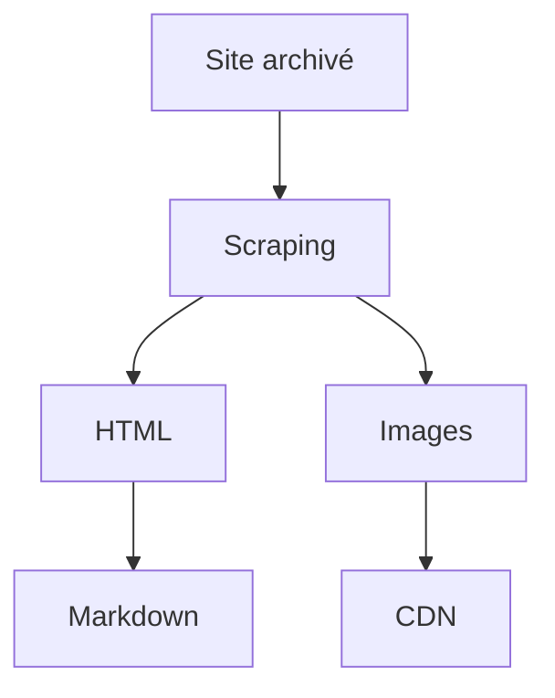

# Histoire de Geotribu : vie, mort et renaissance.

:calendar: Date de publication initiale : 9 août 2020

**Mots-clés :** Geotribu | histoire

## Introduction

En juillet dernier, j'ai été invité par [IDGEO](https://www.idgeo.fr/) à faire un retour d'expérience sur l'aventure Geotribu auprès des participant/es au [CQP GEOM](https://www.idgeo.fr/formation/cqp-geom-geomaticien-developpeur-dapplications-spatiales/) dans le cadre du bloc dédié à la veille et à l'implication dans l'écosystème.

Autant partager ici notre petite histoire ou du moins ma façon de la raconter : naissance, jeunesse, vie, mort... et renaissance en 2020 avec un peu de [Scrapy] et d'[Internet Archive].

[{: .img-center width="500" }](https://cdn.geotribu.fr/img/articles-blog-rdp/divers/foss4g-geotribu.JPG){: data-mediabox="history" data-title="Une partie de l'équipe Geotribu au FOSS4G-FR 2016" }

Souvenirs, souvenirs et avenir !

## Geotribu, c'est quoi ?

D'un point de vue strictement formel, Geotribu c'est un nom de domaine. Et deux suffixes (.net et .fr, le [.com étant squatté depuis longtemps](https://www.whois.com/whois/geotribu.com) en attendant qu'on devienne [riche](https://www.hugedomains.com/domain_profile.cfm?d=Geotribu&e=com)). Il n'y a pas de structure : ni entrepreneuriale, ni associative, ni contrat de sang dans un tipi. D'ailleurs, la convention encadrant le prêt du serveur par GeoRezo est à mon nom et le [domaine appartient à Fabien](https://www.whois.com/whois/geotribu.net).

C'est donc un regroupement spontané de personnes autour de leur intérêt pour leur dénominateur commun professionnel : la dimension géographique des métiers de chacun/e. Vient ensuite la ligne "éditoriale" imprimée dès les débuts que je présente comme les deux faces d'une même pièce :

- pile, la technique : l'informatique nous désignant ainsi comme "geo-geeks", convaincus que la maîtrise d'outils sert le travail thématique.

- face, le libre : une philosophie en cohérence naturelle avec la démarche de partage inhérente au site (avez-vous noté le [copyleft](https://fr.wikipedia.org/wiki/Copyleft) qui orne le pied de page ?). Au-delà de nos propres convictions que le libre, l'_open_ et le commun sont des leviers vertueux, il ne s'agit pas de dire que nous n'utilisons jamais de briques propriétaires ou que nous les dénigrons, mais nous considérons que les éditeurs de briques propriétaires ont généralement les moyens d'assurer leur propre publicité.

Bref, on vit le site [à pile ou face](https://fr.wikipedia.org/wiki/Pile_ou_face_(chanson)) ! L'occasion d'un petit intermède musical dans un article fleuve :

<iframe width="560" height="315" src="https://www.youtube.com/embed/-l70OKXjg98" frameborder="0" allow="accelerometer; autoplay; encrypted-media; gyroscope; picture-in-picture" allowfullscreen></iframe>

> ou la [version d'Emmanuelle Béart dans 8 Femmes](https://www.youtube.com/watch?v=rTL1FSv9ldw)

## Un peu d'histoire

| 2006 | 2008 | 2010-2012 | 2013-2017 | 2017 | 2017-2020 | 2020 |
| :--: | :--: | :-------: | :-------: | :--: | :-------: | :--: |
| [{: width=200px loading=lazy }](https://cdn.geotribu.fr/img/articles-blog-rdp/geotribu/history/toulouse_quartiers_vide.svg){: data-mediabox="historic-captures" data-title="Geotribu s'appelait alors Catalogue SIG - J'ai pas de capture, alors j'ai mis une carte vide des quartiers de Toulouse. Crédits : Wikimedia Commons." } | [{: width=200px loading=lazy }](https://cdn.geotribu.fr/img/articles-blog-rdp/geotribu/history/web_timemachine_geotribu_2008.png){: data-mediabox="historic-captures" data-title="Lancement du premier site Geotribu. La charte graphique semble ne pas avoir été archivée. Crédits : Internet Archive." } | [{: width=200px loading=lazy }](https://cdn.geotribu.fr/img/articles-blog-rdp/geotribu/history/web_timemachine_geotribu_2012.png){: data-mediabox="historic-captures" data-title="2012 - Le coeur du site : articles et tutoriaux. Crédits : Internet Archive." } | [{: width=200px loading=lazy }](https://cdn.geotribu.fr/img/articles-blog-rdp/geotribu/history/web_timemachine_geotribu_2013.png){: data-mediabox="historic-captures" data-title="2013 - La belle époque : aspect collaboratif central et revues de presse hebdomadaires. Crédits : Internet Archive." } | [{: width=200px loading=lazy }](https://cdn.geotribu.fr/img/articles-blog-rdp/geotribu/history/web_timemachine_geotribu_2017.png){: data-mediabox="historic-captures" data-title="2017 - Le rythme baisse mais les contenus sont encore riches. Le serveur tousse régulièrement. Crédits : Internet Archive." } | [{: width=200px loading=lazy }](https://cdn.geotribu.fr/img/articles-blog-rdp/geotribu/history/web_timemachine_geotribu_2018.png){: data-mediabox="historic-captures" data-title="Eté 2017 --> hiver 2020 : depuis le crash, la page de Geotribu fait honneur à la page par défaut d'Apache. Crédits : Internet Archive." } | [{: width=200px loading=lazy }](https://cdn.geotribu.fr/img/articles-blog-rdp/geotribu/history/geotribu_2020-04-30.png){: data-mediabox="historic-captures" data-title="Hiver 2020 : résurrection sous forme d'un site statique de documentation." } |

----

## Renaissance

### Plein d'envie, pas de temps


### Le web-scraping à la rescousse


### Du HTML au Markdown

Une fois le HTML et les ressources liées (images...) récupérés, j'ai opté pour un stockage sous forme de Markdown. Pour cela, j'ai utilisé le package [markdowinify](https://github.com/matthewwithanm/python-markdownify) qui permet de transformer du HTML en Markdown.

#### Rendons lisible un article du CNIG

L'usage de _markdownify_ est simple. Pour s'en rendre compte, testons cela rapidement avec un petit objectif pour l'occasion : transformer en markdown [le dernier article du site du CNIG](http://cnig.gouv.fr/?p=23807) pour le lire sans saigner des yeux.

Au passage, on en profite pour essayer deux autres bibliothèques pour ce genre de cas de figure :

- [Beautifulsoup](https://www.crummy.com/software/BeautifulSoup/) : pour le parsing du HTML
- [urllib3](https://urllib3.readthedocs.io/) : pour facilement faire des requêtes HTTP ; _requests_ ou _httpx_ étant surdimensionnés pour notre besoin, mais avec la flemme de gérer les détails (décodage, etc.)

#### Structure

En regardant [les sources de l'article](view-source:http://cnig.gouv.fr/?p=23807), on sait que le contenu intéressant est dans la div de class `post-content` :

{: .img-center loading=lazy data-mediabox="scraping" data-title="Sources d'un article du site du CNIG."}

Avant de commencer, on installe ce qu'il nous manque :

```bash
python -m pip install beautifulsoup4==4.9.* markdownify==0.5.* urllib3==1.25.*
```

Puis cela tient en quelques lignes dûment commentées :

```python
#! python3

# -- Imports

# Bibliothèque standard
from pathlib import Path

# Packages tiers
import urllib3
from bs4 import BeautifulSoup
from markdownify import markdownify

# -- Variables

in_url = "http://cnig.gouv.fr/?p=23807"
out_filepath = Path("./cnig_23807.md")

# -- Programme principal

# d'abord on télécharge la page
http = urllib3.PoolManager()
page = http.request('GET', in_url)

# on parse le html
soup = BeautifulSoup(page.data, "html.parser")

# on extrait ce qu'il y a dans la classe post-content
post_content = soup.find("div", {"class": "post-content"})

# on transforme en markdown en spécifiant le style de titre avec des '#'
out_md = markdownify(post_content, heading_style="ATX", autolinks=False)

# on écrit notre fichier
with out_filepath.open("w", encoding="UTF8") as fifi:
    fifi.write(out_md)
```

Le résultat, ainsi que le code, sont disponibles dans [ce gist](https://gist.github.com/Guts/a77e9e378b7157f568077ab47937a9d9).

### Conclusion

Evidemment, le résultat est loin d'être parfait et cela demande quelques ajustements et améliorations : déterminer le nom du fichier selon le titre de la page, nettoyer les espacements avant les paragraphes, etc.

Mais cela démontre bien la faisabilité du traitement automatisé :



!!! tip "Cliffhanger"

    Que faire ensuite de tous ces fichiers markdown ? C'est ici que commence un autre chapitre de l'histoire : le site statique !

----

## Auteur

--8<--
content/team/jmou.md
--8<--

<!-- Hyperlinks reference -->
[Scrapy]: https://scrapy.org/
[internet Archive]: https://archive.org
