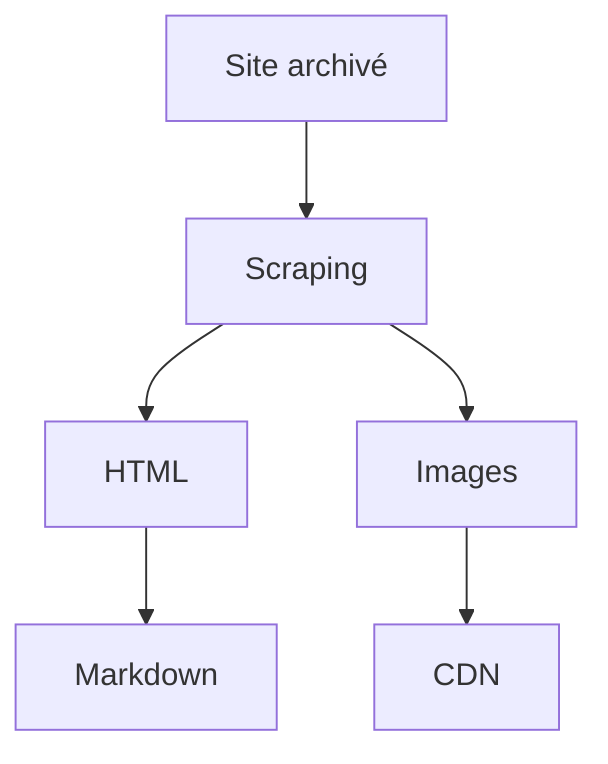

# Récupérer les anciens contenus : le web-scraping à la rescousse

:calendar: Date de publication initiale : 7 septembre 2020

**Mots-clés :** Geotribu | histoire | Scrapy | Python | web-scraping

## Introduction

Après avoir disserté sur [la petite histoire de Geotribu](../2020-08-31_geotribu_histoire/), il est désormais temps de se pencher sur la méthode retenue pour récupérer les anciens contenus.

Pendant un temps, on a eu l'espoir de remonter le site depuis une ancienne sauvegarde, quitte à faire le deuil des contenus les plus récents. Techniquement faisable, l'idée de repartir sur un Drupal vieillot et difficile à maintenir n'a pas séduit grand monde.

Lorsque que le moment est venu, j'ai donc opté pour le web-scraping. Dans cet article, 2 volets :

1. comment cela a permis de récupérer les anciens contenus de Geotribu - [raccourci](#aspirons-lancien-geotribu)
2. les convertir en Markdown avec un petit exercice pratique avec le site du CNIG :wink: - [raccourci](#du-html-au-markdown).

## Le web-scraping, c'est quoi

C'est une technique visant à aspirer le contenu d'un site web pour le stocker dans un format pivot en vue d'une réutilisation, prévue ou non par l'éditeur initial. Pour plus de détails, [la page Wikipédia sera certainement plus complète](https://fr.wikipedia.org/wiki/Web_scraping).

Si le nom ne vous dit rien, c'est pourtant une technique qui est largement utilisée de façon sous-jacente à de nombreux services : référencement automatisé des sites par les moteurs de recherche, tests automatisés d'applications webs (_headless_), comparateurs de prix, agrégateurs de contenus (actualités par exemple) etc.

[{: .img-center loading=lazy }](https://cdn.geotribu.fr/img/tuto/webscraping/web_scraping.png){: data-mediabox="scraping" data-title="Le web-scraping schématisé. Crédits Web Harvy"}

----

## Aspirons l'ancien Geotribu

Si on en croit la simplification du schéma, on a donc besoin de 3 ingrédients :

- un site web qui tourne
- un logiciel (ou un service) de web-scraping
- un/des formats de destination

### Le site : local et Internet Archive

Pour ce premier point, je suis d'abord parti de la dernière sauvegarde dont disposait Fabien mais qui datait. Après quelques batailles homme-machine, je gagnai la guerre et déployais l'ancien Geotribu en local. Travaillant alors sur Windows, j'ai même eu le toupet de faire tourner le site sur [WAMP](https://fr.wikipedia.org/wiki/WampServer) !

Pour les contenus les plus récents, je me suis tourné vers l'[Internet Archive] sur les conseils de [Vincent Picavet](https://www.linkedin.com/in/vincentpicavet/) (merci à lui !), d'où j'ai tiré les captures d'écran du précédent article.

Le projet permet bien un accès via des [APIs REST](https://archive.org/services/docs/api/) et ne se prête pas trop au web-scraping intensif pour qui souhaite respecter le [_fair-use_](https://fr.wikipedia.org/wiki/Fair_use), mais cela aurait demandé de faire du développement spécifique et _one-shot_ qui plus est.

L'une des difficultés étant que l'archivage (qui utilise lui-même du web-scraping) n'est ni régulier, ni exhaustif ; un contenu étant donc potentiellement absent ou présent selon les dates d'archives. Après quelques manipulations, j'ai donc retenu : [l'archive du 22 février 2017](https://web.archive.org/web/20170222060359/http://www.geotribu.net/).

[{: .img-center loading=lazy }](https://cdn.geotribu.fr/img/tuto/webscraping/internet_archive_server.jpg){: data-mediabox="scraping" data-title="Serveurs de l'Internet Archive"}

### Le logiciel : Scrapy

Python étant à la fois mon langage de prédilection et l'un de ceux tout indiqués pour le web-scraping, j'ai donc opté pour [Scrapy]. En avant pour l'installation dans un joli environnement virtuel avec Python 3.8 :

```bash
python -m pip install scrapy==2.3.*
```

Une fois installé, Scrapy permet de générer rapidement une structure de projet et aussi un shell interactif qui permet de "jouer" avec le site web visé : `scrapy shell`.

#### Scrapy shell

Un site web c'est un ensemble plus ou moins organisé de pages parmi lesquelles on navigue à la souris ou au clavier. La première étape du web-scraping est donc de reproduire ce comportement sans interaction : naviguer dans le site web. Dans notre cas, on souhaite savoir parcourir la liste des revues de presse et déterminer comment on "ouvre" une revue de presse.

On passe donc notre URL cible au Scrapy shell :

```bash
scrapy shell "https://web.archive.org/web/20170222025421/http://www.geotribu.net/revues-de-presse"
```

Scrapy réalise alors déjà un gros travail de requêtes, mise en cache, etc. qui se traduit par un bon paquet de messages. La page est stockée dans un objet attaché à la variable `response` :

```python
>>> response
<200 https://web.archive.org/web/20170222025421/http://www.geotribu.net/revues-de-presse>

>>> dir(response)
[... 'body', 'body_as_unicode', 'cb_kwargs', 'certificate', 'copy', 'css', 'encoding', 'flags', 'follow', 'follow_all', 'headers', 'ip_address', 'json', 'meta', 'replace', 'request', 'selector', 'status', 'text', 'url', 'urljoin', 'xpath']
```

Parmi les méthodes de `response`, 2 en particulier nous intéressent pour se balader dans la structure de la page : `css` et `xpath`. Il s'agit des deux langages que Scrapy appelle les `selectors`. Le premier, CSS, est donc la façon dont une page est présentée/rendue ; le second, [XPath](https://fr.wikipedia.org/wiki/XPath), moins connu, est conçu spécifiquement pour se balader dans les documents XML et consorts (donc HTML par extension).

Si j'ai déjà eu à faire à XPath (ô joie des métadonnées mal formatées...), il est plus facile de repérer la structure cible avec le CSS. Surtout quand on a contribué au site web cible.

#### Parcourir le site web

On garde en tête notre objectif : parcourir la page des revues de presse pour extraire les informations de chaque revue de presse à explorer séparément par la suite. Pour y parvenir, pas de secret : il faut identifier et suffisamment discriminer les styles CSS souhaités. Et Drupal 6 ne nous a pas vraiment préparé à cela...

[{: .img-center loading=lazy }](https://cdn.geotribu.fr/img/tuto/webscraping/scraping_geotribu_css.png){: data-mediabox="scraping" data-title="La cascade de styles dans l'ancien site : un passage obligé"}

Après quelques litres de collyre en lisant le HTML/CSS et les messages d'erreur de Scrapy, voici ce à quoi on arrive :

```python
# titre de la page
>>> response.css('title::text').getall()[0]
'GeoTribu | Revues de presse'

# première rdp de la liste
>>> t = response.css('div.title-and-meta')[0]

# titre
>>> rdp_title_section = t.css("div.title-and-meta")
>>> rdp_title = rdp_title_section.css("h2.node__title a::text").get()
>>> rdp_title
'Revue de presse du 27 janvier'

# url
>>> rdp_url_rel = rdp_title_section.css("h2.node__title a::attr(href)").get()
>>> rdp_url_rel
'/web/20170222025421/http://www.geotribu.net/GeoRDP/20170127'
```

On a donc compris comment isoler l'url relative de chaque revue de presse :victory: !

#### Décortiquer les contenus

Une fois la navigation résolue, on peut alors procéder de même avec le contenu des pages ciblées :

```python
# -- Parcourir la revue de presse choisie
fetch("https://web.archive.org/" + rdp_url_rel)

# contenu de la rdp
rdp = response.css('article')[0]

# sections
>>> rdp_sections
['Client', 'Serveur', 'Représentation Cartographique', 'Conférences', 'Divers']
```

Inutile de détailler davantage, je pense que tout le monde a compris et cet article est déjà trop long !


!!! info "Aller plus loin"

    Pour consulter la partie consolidée du web-scraping :

    - [le code source](https://github.com/geotribu/scraping_old_site/)
    - [la documentation](https://geotribu-web-scraping-resurrection.readthedocs.io/)

----

## Conclusion

Evidemment, le résultat est loin d'être parfait et cela demande quelques ajustements et améliorations : déterminer le nom du fichier selon le titre de la page, nettoyer les espacements avant les paragraphes, etc. D'ailleurs, ce nettoyage manuel est toujours en cours pour une partie des contenus de Geotribu.

Cela démontre bien à la fois la faisabilité et les limitations du traitement automatisé, qu'on peut résumer ainsi :



[A suivre (14 septembre) : les sites statiques :fontawesome-solid-step-forward:](#){: .md-button }
{: align=middle }

----

## Auteur

--8<--
content/team/jmou.md
--8<--

<!-- Hyperlinks reference -->
[Scrapy]: https://scrapy.org/
[Internet Archive]: https://archive.org
