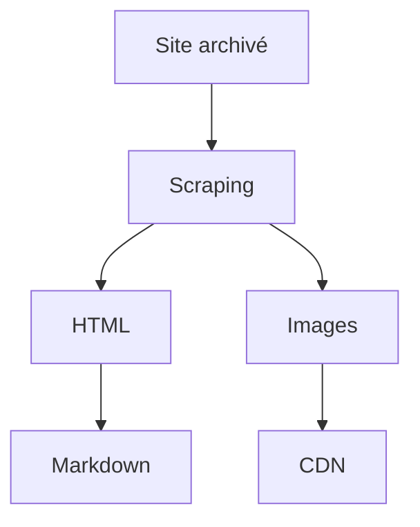

# Vers la simplification de la contribution : le choix du Markdown

:calendar: Date de publication initiale : 11 septembre 2020

**Mots-clés :** Python | Markdown | Beautifulsoup

## Introduction

Dans le cadre de la série d'articles sur la renaissance de Geotribu (lire la [petite histoire de Geotribu](../2020-08-31_geotribu_histoire/)), on a vu comment [utiliser le web-scraping pour récupérer les anciens contenus](../2020-09-08_web-scraping_scrapy_geotribu/) depuis une sauvegarde locale ou l'[Internet Archive].

Après tout cela, on a donc un beau cocktail *Web on The Beach* : HTML + CSS + JavaScript :cocktail:. C'est bien mais ce qui nous intéresse c'est de récupérer le contenu : le texte et les images. or, la structure, les scripts et les mécanismes de rendu (CSS...) sont encore trop intimement liés.

Dans cet article, on va voir pourquoi et comment on a choisi de passer sur une rédaction en Markdown. Au passage, on se refait un coup de web-scraping histoire d'enfoncer le clou :hammer:.

----

## Markdown, lingua frinca du contenu éditorial en ligne

Surensemble de HTML, la syntaxe [Markdown] initialement très répandue pour
Au revoir les bbcodes, rst, etc.

----

## Du HTML au Markdown

Une fois le HTML et les ressources liées (images...) récupérés, j'ai opté pour un stockage sous forme de Markdown. Pour cela, j'ai utilisé le package [markdowinify](https://github.com/matthewwithanm/python-markdownify) qui permet de transformer du HTML en Markdown.

## La conversion par l'exemple : rendre lisible un article du CNIG

L'usage de _markdownify_ est simple. Pour s'en rendre compte, testons cela rapidement avec un petit objectif pour l'occasion : transformer en markdown [le dernier article du site du CNIG](http://cnig.gouv.fr/?p=23807) pour le lire sans saigner des yeux.

Au passage, on en profite pour essayer deux autres bibliothèques pour ce genre de cas de figure :

- [Beautifulsoup](https://www.crummy.com/software/BeautifulSoup/) : pour le parsing du HTML
- [urllib3](https://urllib3.readthedocs.io/) : pour facilement faire des requêtes HTTP ; _requests_ ou _httpx_ étant surdimensionnés pour notre besoin, mais avec la flemme de gérer les détails (décodage, etc.)

### Structure

En regardant [les sources de l'article](view-source:http://cnig.gouv.fr/?p=23807), on sait que le contenu intéressant est dans la div de class `post-content` :

[{: .img-center loading=lazy }](https://cdn.geotribu.fr/img/tuto/webscraping/scraping_cnig_art_source.png){: data-mediabox="scraping" data-title="Sources d'un article du site du CNIG."}

### Prérequis

Avant de commencer, on installe ce qu'il nous manque :

```bash
python -m pip install beautifulsoup4==4.9.* markdownify==0.5.* urllib3==1.25.*
```

### Scraping et conversion à la volée

Puis cela tient en quelques lignes dûment commentées :

```python
#! python3

# -- Imports

# Bibliothèque standard
from pathlib import Path

# Packages tiers
import urllib3
from bs4 import BeautifulSoup
from markdownify import markdownify

# -- Variables

in_url = "http://cnig.gouv.fr/?p=23807"
out_filepath = Path("./cnig_23807.md")

# -- Programme principal

# d'abord on télécharge la page
http = urllib3.PoolManager()
page = http.request('GET', in_url)

# on parse le html
soup = BeautifulSoup(page.data, "html.parser")

# on extrait ce qu'il y a dans la classe post-content
post_content = soup.find("div", {"class": "post-content"})

# on transforme en markdown en spécifiant le style de titre avec des '#'
out_md = markdownify(post_content, heading_style="ATX", autolinks=False)

# on écrit notre fichier
with out_filepath.open("w", encoding="UTF8") as fifi:
    fifi.write(out_md)
```

Le résultat, ainsi que le code, sont disponibles dans [ce gist](https://gist.github.com/Guts/a77e9e378b7157f568077ab47937a9d9).

----

## Conclusion

Evidemment, le résultat est loin d'être parfait et cela demande quelques ajustements et améliorations : déterminer le nom du fichier selon le titre de la page, nettoyer les espacements avant les paragraphes, etc. D'ailleurs, ce nettoyage manuel est toujours en cours pour une partie des contenus de Geotribu.

Cela démontre bien à la fois la faisabilité et les limitations du traitement automatisé, qu'on peut résumer ainsi :



[A suivre : les sites statiques :fontawesome-solid-step-forward:](#){: .md-button }
{: align=middle }

----

## Auteur

--8<--
content/team/jmou.md
--8<--

<!-- Hyperlinks reference -->
[Markdown]: https://fr.wikipedia.org/wiki/Markdown
[Internet Archive]: https://archive.org
[Scrapy]: https://scrapy.org/
