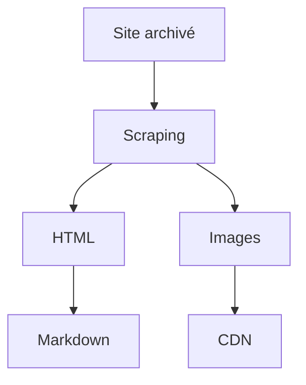

# Vers la simplification de la contribution : le choix du Markdown

:calendar: Date de publication initiale : 14 septembre 2020

## Introduction

Dans le cadre de la série d'articles sur la renaissance de Geotribu (lire la [petite histoire de Geotribu](./2020-08-31_geotribu_histoire.md)), on a vu comment [utiliser le web-scraping pour récupérer les anciens contenus](./2020-09-08_web-scraping_scrapy_geotribu.md) depuis une sauvegarde locale ou l'[Internet Archive].

Après cela, on a donc un beau cocktail *Web on The Beach* : HTML + CSS + JavaScript :cocktail:.

{: loading=lazy }
{: align=middle }

C'est bien beau mais, à part réinstaller un Drupal avec le bon modèle de BDD, on en tirera pas grand chose. Et puis ce qui nous intéresse vraiment, le nectar de Geotribu c'est le contenu rédactionnel : le texte, les images, les bouts de code, les vidéos, etc. Or, la structure, les scripts et les mécanismes de rendu (CSS...) sont encore trop intimement liés.

Dans cet article, on va voir pourquoi et comment on a choisi de passer sur une rédaction en Markdown. Au passage, on se refait un coup de web-scraping histoire d'enfoncer le clou :hammer:.

----

## Markdown, lingua franca du contenu éditorial en ligne

{: .img-thumbnail-left }

Inspiré par le *plain-text email* ([texte brut dans un courriel en bon français](https://fr.wikipedia.org/wiki/Texte_brut#Texte_brut_dans_un_courriel)) ou encore le [ReStructuredText](https://fr.wikipedia.org/wiki/) (RST), la syntaxe [Markdown] est conçue pour être facile à lire, à écrire et à convertir, tout en prenant soin de ne pas casser les balises du HTML.

Cette dernière caractéristique est essentielle puisque cela a facilité l'intégration de la syntaxe dans de nombreux formulaires webs ou services. Très utilisée par les développeurs pour les documentations, elle est désormais très intégrée dans les milieux professionnels et y compris grand public : Slack, WordPress, etc.
Certains services, tels [Markdown Here](https://markdown-here.com/features.html), allant jusqu'à proposer de l'utiliser pour améliorer la rédaction des emails. Du côté universitaire, la syntaxe est également très répandue :

- d'une part en étant quasiment un pré-requis pour les [notebooks Jupyter](https://jupyter.org/)
- d'autre part car elle permet d'intégrer LateX et les syntaxes scientifiques. Exemple : <https://upmath.me/>.

Bref, au revoir [BBCode](https://fr.wikipedia.org/wiki/BBCode), DokuWiki, [WikiTexte](https://fr.wikipedia.org/wiki/Wikitexte), etc. Bonjour [Markdown] :

{: .img-center loading=lazy }

### Une syntaxe, des rendus

A l'instar de n'importe quelle langue, qui plus est non standardisée, le rendu HTML du Markdown dépend de l'implémentation qui en est faite : technologie, finalité et philosophie du processus de conversion, etc. Ainsi, il y aura des différences à l'affichage ou au traitement.

!!! tip
    Pour ne pas dupliquer ici du contenu existant, je vous renvoie vers l'article [Comprendre et tester le moteur de rendu du site]({{ config.extra.url_contribuer }}internal/markdown_engine/).

----

## Du HTML au Markdown

{: .img-thumbnail-left }

Revenons à nos géo-moutons.

Une fois le HTML et les ressources liées (images...) récupérés de Geotribu, j'ai opté pour un stockage sous forme de Markdown. Pour cela, j'ai utilisé le package [markdownify](https://github.com/matthewwithanm/python-markdownify) qui permet de transformer du HTML en Markdown.

Vu qu'on a déjà passé un article sur le projet [Scrapy] utilisé pour récupérer les anciens contenus depuis l'Internet Archive, je ne vais pas de nouveau détailler le [*pipeline*](2020-09-08_web-scraping_scrapy_geotribu.md) mais plutôt démontrer comment appliquer la même mécanique facilement :

1. aspirer un site web avec du web-scraping
2. traiter le HTML pour décortiquer le contenu :
    - extraire le texte et les styles du HTML --> transformer en Markdown
    - extraire les medias statiques (images, etc.) pour les stocker dans un espace tiers (CDN)

## La conversion par l'exemple : rendre lisible un article du CNIG

L'usage de *markdownify* est simple. Pour s'en rendre compte, testons cela rapidement avec un petit objectif pour l'occasion : transformer en markdown [le dernier article du site du CNIG](http://cnig.gouv.fr/?p=23807) pour le lire sans saigner des yeux.

Au passage, on en profite pour essayer deux autres bibliothèques pour ce genre de cas de figure :

- [Beautifulsoup](https://www.crummy.com/software/BeautifulSoup/) : pour le parsing du HTML
- [urllib3](https://urllib3.readthedocs.io/) : pour facilement faire des requêtes HTTP ; *requests* ou *httpx* étant surdimensionnés pour notre besoin, mais avec la flemme de gérer les détails (décodage, etc.)

### Structure

En regardant [les sources de l'article](view-source:<http://cnig.gouv.fr/?p=23807)>, on sait que le contenu intéressant est dans la `div` de class `post-content` :

{: .img-center loading=lazy }

### Prérequis

Avant de commencer, on installe ce qu'il nous manque :

```bash
python -m pip install beautifulsoup4==4.9.* markdownify==0.5.2 urllib3==1.25.*
```

### Scraping et conversion à la volée

Puis cela tient en quelques lignes dûment commentées :

```python
#! python3

# -- Imports

# Bibliothèque standard
from pathlib import Path

# Packages tiers
import urllib3
from bs4 import BeautifulSoup
from markdownify import markdownify

# -- Variables

in_url = "http://cnig.gouv.fr/?p=23807"
out_filepath = Path("./cnig_23807.md")

# -- Programme principal

# d'abord on télécharge la page
http = urllib3.PoolManager()
page = http.request('GET', in_url)

# on parse le html
soup = BeautifulSoup(page.data, "html.parser")

# on extrait ce qu'il y a dans la classe post-content
post_content = soup.find("div", {"class": "post-content"})

# on transforme en markdown en spécifiant le style de titre avec des '#'
out_md = markdownify(post_content, heading_style="ATX", autolinks=False)

# on écrit notre fichier
with out_filepath.open("w", encoding="UTF8") as fifi:
    fifi.write(out_md)
```

Le résultat, ainsi que le code, sont disponibles dans [ce gist](https://gist.github.com/Guts/a77e9e378b7157f568077ab47937a9d9).

----

## Conclusion

Evidemment, le résultat est loin d'être parfait et cela demande quelques ajustements et améliorations : déterminer le nom du fichier selon le titre de la page, nettoyer les espacements avant les paragraphes, etc. D'ailleurs, ce nettoyage manuel est toujours en cours pour une partie des contenus de Geotribu.

Cela démontre bien à la fois la faisabilité et les limitations du traitement automatisé, qu'on peut résumer ainsi :



[Suite : déployer le site de Geotribu sur son ordinateur :fontawesome-solid-forward:](2020-12-30_deployer_geotribu_a_la_maison.md){: .md-button }
{: align=middle }

----

<!-- geotribu:authors-block -->

<!-- Hyperlinks reference -->
[Markdown]: https://fr.wikipedia.org/wiki/Markdown
[Internet Archive]: https://archive.org
[Scrapy]: https://scrapy.org/
