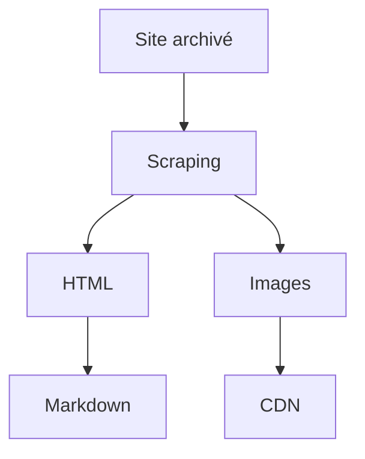

# Aerialod, un logiciel libre, léger et puissant de rendu de cartes 3D

:calendar: Date de publication initiale : 14 septembre 2020

**Mots-clés :** Aerialod | Cartes3D

## Introduction

Lorsqu'on parle de cartographie 3D, des choses m'arrivent pèle mêle en tête.

Un peu de technique, comme la technologie Lidar et sa capacité à générer des modèles numériques de terrain (MNT). GoogleMaps ou bien Maps d'appel qui génère des vues 3D à partir de photo aériennes.
Côté logiciel, QGIS, avec le plug in QGIS2threeJS qui permet depuis un moment de réaliser des blocs 3D et [maintenant nativement dans sa version 3.](https://www.qgis.org/fr/site/forusers/visualchangelog30/index.html#d-features) Ou bien encore [Blender](https://www.blender.org/download/), qui est un logiciel libre de modélisation, d'animation et de rendu 3D. Ou encore pêle-mêle ArcGIS, MapBox ou Kepler.gl pour ne citer qu'eux.

Des noms et leurs visuels me viennent également :

- Sean Conway réalise des cartes visuellement impressionnantes. Il travail pour Quantum Spatial aux Etats-Unis, en tant que spécialiste orthophoto. Et au vu de ses créations, il a clairement un sacré sens artistique ! Il utilise notamment QGIS et Blender pour ses rendus. Vous pourrez aller admirer son travail [sur son profil Twitter.]([https://twitter.com/geo_spatialist?s=20](https://twitter.com/geo_spatialist?s=20))
IMAGE

IMAGE

- Alasdair Rae [https://twitter.com/undertheraedar?s=09](https://twitter.com/undertheraedar?s=09) qui a notamment produit des cartes 3D avec la densité de population comme donnée entrante par exemple

IMAGE
Densité de population globale / [https://twitter.com/undertheraedar/status/1259086700225146881](https://twitter.com/undertheraedar/status/1259086700225146881)

IMAGE
MiniScale raster relief maps of Great Britain / [http://www.statsmapsnpix.com/2019/11/amazing-3d-rendering-with-aerialod.html](http://www.statsmapsnpix.com/2019/11/amazing-3d-rendering-with-aerialod.html)

Il utilise le logiciel libre Aerialod, développé par [ephtracy](https://twitter.com/ephtracy?s=09)

Il est plus connu pour être le créateur de MagicaVoxel, logiciel de création de voxels (pixels 3D) libre et léger.

Ce sont les créations d'Alasdair Rae qui m'ont vraiment donné envie de tester Aerialod, notamment [grâce à ses tutoriels.]([http://www.statsmapsnpix.com/2020/03/making-3d-landscape-and-city-models.html?m=1](http://www.statsmapsnpix.com/2020/03/making-3d-landscape-and-city-models.html?m=1))

Le principe général du logiciel est d'afficher une extrusion s'appuyant sur la valeur des pixels d'une image. On peut naturellement utiliser un MNT pour réaliser cela, mais tout fichier raster peut être utilisé en théorie (même si je n'ai pour l'instant testé que des MNT 😁). 

A la demande générale 🥁 (de Julien Moura...), j'écris cet article afin d'expliquer en quoi ce "petit" logiciel est puissant et très simple d'utilisation, grâce à un côté hyper ludique. On peut rapidement passer du temps à jouer avec des angles de caméra, des couleurs, des ouvertures, des zooms et des rendus différents. Je ne prétends pas en être spécialiste, et ne pourrait donc pas apporter des détails poussés sur chaque fonctionnalité. 
En revanche, cet article a pour but d'être une entrée en matière consistante, permettant de comprendre les principes de fonctionnement généraux de l'application, et vous permettre, j'en suis sûr de créer de beaux visuels !

----

## Markdown, lingua franca du contenu éditorial en ligne

{: .img-rdp-news-thumb }

Inspiré par le *plain-text email* ([texte brut dans un courriel en bon français](https://fr.wikipedia.org/wiki/Texte_brut#Texte_brut_dans_un_courriel)) ou encore le [ReStructuredText](https://fr.wikipedia.org/wiki/) (RST), la syntaxe [Markdown] est conçue pour être facile à lire, à écrire et à convertir, tout en prenant soin de ne pas casser les balises du HTML.

Cette dernière caractéristique est essentielle puisque cela a facilité l'intégration de la syntaxe dans de nombreux formulaires webs ou services. Très utilisée par les développeurs pour les documentations, elle est désormais très intégrée dans les milieux professionnels et y compris grand public : Slack, WordPress, etc.
Certains services, tels [Markdown Here](https://markdown-here.com/features.html), allant jusqu'à proposer de l'utiliser pour améliorer la rédaction des emails. Du côté universitaire, la syntaxe est également très répandue :

- d'une part en étant quasiment un pré-requis pour les [notebooks Jupyter](https://jupyter.org/)
- d'autre part car elle permet d'intégrer LateX et les syntaxes scientifiques. Exemple : <https://upmath.me/>.

Bref, au revoir [BBCode](https://fr.wikipedia.org/wiki/BBCode), DokuWiki, [WikiTexte](https://fr.wikipedia.org/wiki/Wikitexte), etc. Bonjour [Markdown] :

[{: .img-center loading=lazy }](https://cdn.geotribu.fr/img/internal/contribution/markdown_exemple.png){: data-mediabox="ligthbox-gallery" data-title="Exemple basiques de la syntaxe markdown rendue dans StackEdit."}

### Une syntaxe, des rendus

A l'instar de n'importe quelle langue, qui plus est non standardisée, le rendu HTML du Markdown dépend de l'implémentation qui en est faite : technologie, finalité et philosophie du processus de conversion, etc. Ainsi, il y aura des différences à l'affichage ou au traitement.

!!! tip

    Pour ne pas dupliquer ici du contenu existant, je vous renvoie vers l'article [Comprendre et tester le moteur de rendu du site](/contribuer/build_site/markdown_engine/).

----

## Du HTML au Markdown

{: .img-rdp-news-thumb }

Revenons à nos géo-moutons.

Une fois le HTML et les ressources liées (images...) récupérés de Geotribu, j'ai opté pour un stockage sous forme de Markdown. Pour cela, j'ai utilisé le package [markdownify](https://github.com/matthewwithanm/python-markdownify) qui permet de transformer du HTML en Markdown.

Vu qu'on a déjà passé un article sur le projet Scrapy utilisé pour récupérer les anciens contenus depuis l'Internet Archive, je ne vais pas de nouveau détailler le [_pipeline_](/articles/2020/2020-09-08_web-scraping_scrapy_geotribu/) mais plutôt démontrer comment appliquer la même mécanique facilement :

1. aspirer un site web avec du web-scraping
2. traiter le HTML pour décortiquer le contenu :
    - extraire le texte et les styles du HTML --> transformer en Markdown
    - extraire les medias statiques (images, etc.) pour les stocker dans un espace tiers (CDN)

## La conversion par l'exemple : rendre lisible un article du CNIG

L'usage de _markdownify_ est simple. Pour s'en rendre compte, testons cela rapidement avec un petit objectif pour l'occasion : transformer en markdown [le dernier article du site du CNIG](http://cnig.gouv.fr/?p=23807) pour le lire sans saigner des yeux.

Au passage, on en profite pour essayer deux autres bibliothèques pour ce genre de cas de figure :

- [Beautifulsoup](https://www.crummy.com/software/BeautifulSoup/) : pour le parsing du HTML
- [urllib3](https://urllib3.readthedocs.io/) : pour facilement faire des requêtes HTTP ; _requests_ ou _httpx_ étant surdimensionnés pour notre besoin, mais avec la flemme de gérer les détails (décodage, etc.)

### Structure

En regardant [les sources de l'article](view-source:http://cnig.gouv.fr/?p=23807), on sait que le contenu intéressant est dans la div de class `post-content` :

[{: .img-center loading=lazy }](https://cdn.geotribu.fr/img/tuto/webscraping/scraping_cnig_art_source.png){: data-mediabox="scraping" data-title="Sources d'un article du site du CNIG."}

### Prérequis

Avant de commencer, on installe ce qu'il nous manque :

```bash
python -m pip install beautifulsoup4==4.9.* markdownify==0.5.2 urllib3==1.25.*
```

### Scraping et conversion à la volée

Puis cela tient en quelques lignes dûment commentées :

```python
#! python3

# -- Imports

# Bibliothèque standard
from pathlib import Path

# Packages tiers
import urllib3
from bs4 import BeautifulSoup
from markdownify import markdownify

# -- Variables

in_url = "http://cnig.gouv.fr/?p=23807"
out_filepath = Path("./cnig_23807.md")

# -- Programme principal

# d'abord on télécharge la page
http = urllib3.PoolManager()
page = http.request('GET', in_url)

# on parse le html
soup = BeautifulSoup(page.data, "html.parser")

# on extrait ce qu'il y a dans la classe post-content
post_content = soup.find("div", {"class": "post-content"})

# on transforme en markdown en spécifiant le style de titre avec des '#'
out_md = markdownify(post_content, heading_style="ATX", autolinks=False)

# on écrit notre fichier
with out_filepath.open("w", encoding="UTF8") as fifi:
    fifi.write(out_md)
```

Le résultat, ainsi que le code, sont disponibles dans [ce gist](https://gist.github.com/Guts/a77e9e378b7157f568077ab47937a9d9).

----

## Conclusion

Evidemment, le résultat est loin d'être parfait et cela demande quelques ajustements et améliorations : déterminer le nom du fichier selon le titre de la page, nettoyer les espacements avant les paragraphes, etc. D'ailleurs, ce nettoyage manuel est toujours en cours pour une partie des contenus de Geotribu.

Cela démontre bien à la fois la faisabilité et les limitations du traitement automatisé, qu'on peut résumer ainsi :



[A suivre : du Markdown aux sites statiques :fontawesome-solid-step-forward:](#){: .md-button }
{: align=middle }

----

## Auteur

--8<--
content/team/jmou.md
--8<--

<!-- Hyperlinks reference -->
[Markdown]: https://fr.wikipedia.org/wiki/Markdown
[Internet Archive]: https://archive.org
[Scrapy]: https://scrapy.org/
