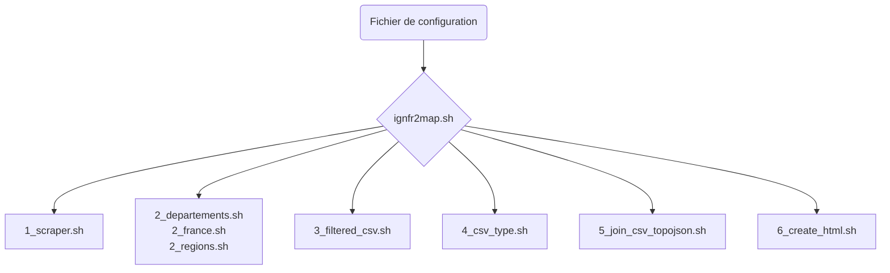

# ign2map : automatisation des scripts et déploiement de la carte

:calendar: Date de publication initiale : 19 Février 2021

Pré-requis :

- l'interpréteur [Bourne-Again shell](https://fr.wikipedia.org/wiki/Bourne-Again_shell)
- une connexion internet qui accède à [la page de l'IGN qui référence les liens des données libres](https://geoservices.ign.fr/documentation/diffusion/telechargement-donnees-libres.html)

## Intro

{: .img-thumbnail-left }

Après avoir présenté la génèse et détaillé la démarche de notre petit projet de carte des liens IGN, voici venir le second volet consacré à l'exécution complètement automatisée et paramétrable des scripts puis du déploiement tout aussi automatique.

[Accéder à la carte :earth_africa:](https://geotribu.github.io/ign-fr-opendata-download-ui/index.html){: .md-button } [Consulter l'article détaillant la démarche :fontawesome-solid-backward:](2021-02-15_ignfr2map_carte_liens_IGN_open-data_7_etapes.md){: .md-button }
{: align=middle }

L'IGN ayant annoncé que l'ouverture des données serait progressive, on anticipe que la page soit donc appelée à s'agrandir (*sic*). Pour que le projet ne soit pas un symbole d'obsolescence programmée (même s'il est certainement éphémère), on choisit donc d'automatiser le processus via [Github Actions] et la publication sur [Github Pages]. Une chaîne de valeurs que l'on connaît bien puisque déjà utilisée pour générer et publier le site actuel de Geotribu à partir des fichiers Markdown.

<!-- markdownlint-disable MD046 -->
!!! tip "Sur Windows ?"
    Vous êtes sur un système Windows et vous vous sentez frustré(e) de ne pas pouvoir expérimenter ce tutoriel ? Deux solutions s'offrent à vous :

    - [adopter un pingouin](https://youtu.be/DRBVUZjrT0k?t=76) et batifoler joyeusement sur la banquise du libre :penguin:
    - utiliser [WSL, le sous-système Linux intégré à Windows 10 en suivant notre article sur le sujet](../2020/2020-10-28_gdal_windows_subsystem_linux_wsl.md) :wink:
<!-- markdownlint-enable MD046 -->

## Travaux préliminaires

### Variables d'environnement et fichier de configuration

{: .img-thumbnail-left }

Avant de pouvoir automatiser toute la chaîne d'exécution sur une plateforme d'intégration et de déploiement continus (CI/CD pour les intimes), il s'agit de rendre nos scripts paramétrables et indépendants de nos machines individuelles.

L'idée est donc de pouvoir passer plusieurs paramètres :

- l'URL source
- gérer les échelles : départements, régions et France entière
- la liste des produits de l'IGN ouverts pour en ajouter, enlever ou renommer selon l'évolution de la dynamique

S'il y a bien un mécanisme multi-plateforme, c'est celui des variables d'environnement. Linux, [Windows](https://devblogs.microsoft.com/commandline/share-environment-vars-between-wsl-and-windows/), [Android](https://developer.android.com/studio/command-line/variables), [Docker](https://docs.docker.com/compose/environment-variables/), ...

Une variable d'environnement est donc un simple couple clé=valeur, qu'il est possible de stocker également dans des fichiers dont l'extension conventionnelle est `.env`. [Celui de notre script est sous ce lien](https://github.com/geotribu/ign-fr-opendata-download-ui/blob/main/example.env) mais en voici un extrait pour vous montrer à quoi ça ressemble :

```ini
# SOURCE
SOURCE_URL="https://geoservices.ign.fr/documentation/diffusion/telechargement-donnees-libres.html"

# CHEMINS LOCAUX
LOG_FILE="/var/log/geotribu/ign2map.log"
RESULT_FOLDER="final"
TEMP_FOLDER="/tmp/"
TEMPLATES_FOLDER="templates"

# PRODUITS IGN
LI_PRODUITS_DEPARTEMENTS="BDFORET,ORTHOHR_1-0_IRC,BDORTHO_2-0_IRC"
[...]
```

### Paramètres et arguments

Dans un script Bash, le moyen le plus simple est d'utiliser [les paramètres positionnels](https://www.commentcamarche.net/faq/5444-bash-les-arguments-parametres#parametres-positionnels)... enfin les paramètres passés dans un ordre précis quoi.

Par exemple pour [le quatrième script](https://github.com/geotribu/ign-fr-opendata-download-ui/blob/main/scripts/4_csv_type.sh) :

```bash
# Arguments
SCALE=$1
SOURCE_FILE=$2
OUTPUT_DIR=$3
IFS="," read -a ARRAY_PRODUITS <<< $4
```

On devra donc lancer le script avec 4 arguments :

1. l'échelle : soit `departements`, soit `regions`, soit `france`
2. le chemin du fichier en entrée (ici le fichier de sortie du précédent script)
3. le chemin du dossier où stocker le fichier en sortie
4. la liste des produits de l'IGN

Ce qui donne par exemple :

```bash
source scripts/4_csv_type.sh "departements" \
  /tmp/3_filtered_csv/3_liens_par_dep_clean_ext.csv \
  /tmp/4_csv_type \
  "BDFORET,ORTHOHR_1-0_IRC,BDORTHO_2-0_IRC"
```

### Un script pour les gouverner tous

Une fois les 6 scripts rendus paramétrables, autant se faciliter la vie et permettre de les exécuter tous à la suite d'un coup.  
On crée donc un script "orchestrateur" qui va lire le fichier de configuration (ou les variables d'environnement) et lancer les scripts dans le bon ordre en s'assurant de leur passer les bons paramètres à chaque fois : [ignfr2map.sh](https://github.com/geotribu/ign-fr-opendata-download-ui/blob/main/ignfr2map.sh).

{: loading=lazy }
{: align=middle }

### Pour schématiser

Grosso modo, voilà ce que ça donne (*désolé les flèches ne s'affichent pas bien avec le mode sombre*) :



> [Voir le schéma en grand](https://mermaid.ink/svg/eyJjb2RlIjoiZ3JhcGggVERcbiAgICBBKEZpY2hpZXIgZGUgY29uZmlndXJhdGlvbilcbiAgICBBIC0tPiBDe2lnbmZyMm1hcC5zaH1cbiAgICBDIC0tPiBEWzFfc2NyYXBlci5zaF1cbiAgICBDIC0tPiBFWzJfZGVwYXJ0ZW1lbnRzLnNoPGJyPjJfZnJhbmNlLnNoPGJyPjJfcmVnaW9ucy5zaF1cbiAgICBDIC0tPiBGWzNfZmlsdGVyZWRfY3N2LnNoXSBcbiAgICBDIC0tPiBHWzRfY3N2X3R5cGUuc2hdIFxuICAgIEMgLS0-IEhbNV9qb2luX2Nzdl90b3BvanNvbi5zaF0gXG4gICAgQyAtLT4gSVs2X2NyZWF0ZV9odG1sLnNoXSIsIm1lcm1haWQiOnsidGhlbWUiOiJkZWZhdWx0In0sInVwZGF0ZUVkaXRvciI6ZmFsc2V9)

----

## Le déploiement

{: .img-thumbnail-left }

A l'instar de la plupart des autres, [GitHub Actions] consiste à décrire le processus (*workflow* dans la terminologie GitHub) dans la syntaxe [YAML].

Le [fichier complet est dans le dépôt](https://github.com/geotribu/ign-fr-opendata-download-ui/blob/main/.github/workflows/run_n_publish.yml) mais prenons ici le temps de détailler les étapes.  

### Conditions d'exécution

Tout d'abord, on indique les critères de déclenchement du processus. On a choisi de concilier deux cas de figure :

- une exécution récurrente sur une base mensuelle, le premier jour de chaque mois
- une exécution manuelle pour nos tests ou quand l'envie nous prend

On souhaite également déclencher l'exécution uniquement lorsque des modifications sont appliquées sur la branche principale du projet.

Voici ce que cela donne :

```yaml
on:
  schedule:
    - cron: "0 0 1 * *"  # exécution planifiée le premier jour de chaque mois
  workflow_dispatch:     # permet de déclencher manuellement (ici sans passer aucun paramètre particulier)
  push:
    branches: [ main ]
    paths:
      - '.github/workflows/run_n_publish.yml'  # on déclenche aussi quand le fichier du workflow est lui-même modifié
```

### L'environnement d'exécution

Une fois les règles de déclenchement en place, passons aux tâches (*jobs*) qui doivent être exécutées. On commence par indiquer dans quel environnement on travaille.  
Vu que notre outil est écrit en bash, une surcouche au shell Linux, on opte pour Ubuntu :

```yaml
jobs:
  run:
    runs-on: ubuntu-latest
```

### Les étapes

Puis, on décrit pas à pas (*steps*) les différentes tâches.

#### Récupération du code

On commence par récupérer le contenu du dépôt Git (= `git fetch` ou `clone` pour les intimes) :

```yaml
steps:
  - name: Checkout
    uses: actions/checkout@master
```

#### Paramétrage des options

On utilise les variables d'environnement définies dans le fichier example et on le renomme. Notez que c'est la solution de facilité et qu'il aurait été préférable d'utiliser des variables d'environnement :

- soit définies en haut du fichier (voir [doc sur `env:`](https://docs.github.com/en/actions/reference/workflow-syntax-for-github-actions#env)),
- soit via [la définition d'un environnement](https://docs.github.com/en/actions/reference/environments) ou [les Actions Secrets](https://docs.github.com/en/actions/reference/encrypted-secrets)

```yaml
- name: Rename env file
  run: mv example.env .env
```

#### Exécution

Sommairement[^1], cela donne donc :

```yaml
- name: Run it
  run: bash ./ignfr2map.sh
```

Vu qu'on utilise les paramètres par défaut, les fichiers en sortie sont donc stockés dans le dossier `final`. Histoire de se faciliter le debug, on peut lister les fichiers temporaires et finaux :

```yaml
- name: List temp
  run: ls -R _temp/

- name: List final output
  run: ls -R final/
```

#### Déploiement

Enfin, il s'agit de pousser le dossier final sur la branche `gh-pages` publiée sur [Github Pages]. Pour cela, j'ai pris l'habitude d'utiliser l'outil [ghp-import], notamment inclus dans [MkDocs] (l'outil qu'on utilise pour notre site). C'est par flemme car dans l'idéal il aurait fallu rester avec la seule ligne de commande et ainsi ne pas avoir besoin d'installer Python.  
Disons qu'on donne ainsi une chance à une contribution externe de briller :sparkler: :wink:.

Voici ce que ça donne :

```yaml
- name: Set up Python
  uses: actions/setup-python@v2.2.1
  with:
    python-version: 3.8

- name: Deploy to GitHub Pages
  run: |
    python -m pip install ghp-import
    ghp-import --force --no-jekyll --push final
```

----

## Conclusion

Ce travail semble long mais c'est surtout que j'ai tenu à le détailler car en réalité, l'exécution complète de toute la chaîne de valeur prend moins d'une minute :

{: .img-center loading=lazy }

----

<!-- geotribu:authors-block -->

<!-- Footnotes -->
[^1]: oui, j'ai osé ce jeu de mots avec le titre du paragraphe :wink:

<!-- Hyperlinks reference -->
[ghp-import]: https://pypi.org/project/ghp-import/
[GitHub Actions]: https://github.com/features/actions
[GitHub Pages]: https://guides.github.com/features/pages/
[YAML]: https://fr.wikipedia.org/wiki/YAML
