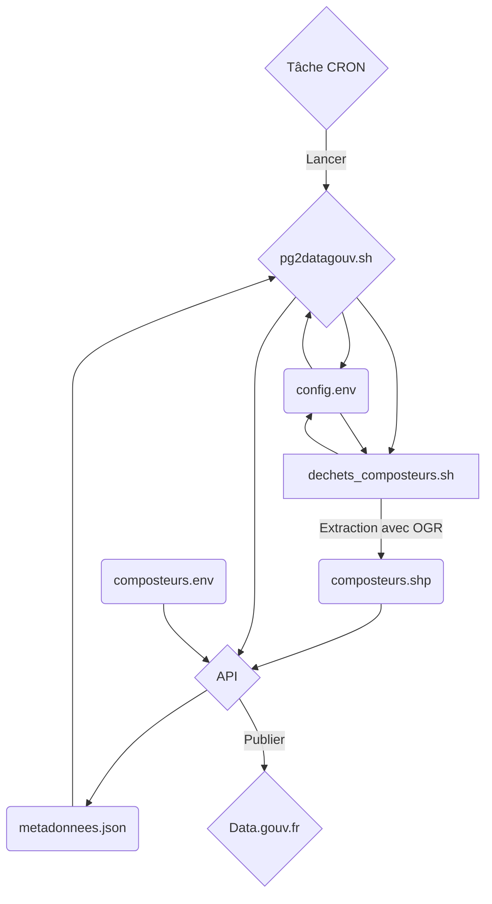

# Automatiser la publication et la mise à jour de données de PostgreSQL vers Data.gouv.fr

:calendar: Date de publication initiale : 31 Aout 2021

## Prérequis

- l'interpréteur [Bourne-Again shell](https://fr.wikipedia.org/wiki/Bourne-Again_shell)
- [jq](https://stedolan.github.io/jq/), [cURL](https://curl.se) et [GDAL](https://gdal.org) doivent être installés
- une connexion internet pour publier vos données

## Intro

{: .img-thumbnail-left }

Être géomaticien dans un petit EPCI c'est souvent être multitâche et cela implique également d'intervenir sur une diversité de sujets. D'ailleurs celui qui va nous intéresser aujourd'hui, c'est l'Open Data !

Je ne vais pas vous faire un rappel sur l'ouverture des données publiques mais si ça ne vous parle pas, je vous recommande l'introduction de l'[article proposé par le Parc national des Écrins (Cendrine HOARAU / Juin 2021)](https://si.ecrins-parcnational.com/blog/2021-06-publier-opendata-continu.html) qui propose également une solution pour publier des données en open data sur son propre serveur.

{: .img-center loading=lazy }

En ce qui me concerne et contrairement au Parc national des Écrins, je n'ai pas de serveur à disposition pour y déposer mes données, j'ai donc développé un processus en Bash qui s'appuie sur [OGR](https://gdal.org/programs/ogr2ogr.html) pour extraire des données stockées dans une base [PostgreSQL](https://www.postgresql.org) et les publier directement sur le portail [data.gouv.fr](https://www.data.gouv.fr/fr/) à travers l'[API dédiée](https://doc.data.gouv.fr/api/intro/).

[Commenter cet article :fontawesome-solid-comments:](#__comments "Aller aux commentaires"){: .md-button }
{: align=middle }

## pg2datagouv

Avant de démarrer, voici une représentation schématique du fonctionnement de pg2datagouv.



[Accéder à pg2datagouv :fontawesome-regular-file-code:](https://github.com/igeofr/pg2datagouvfr){: .md-button }
{: align=middle }

!!! info
    Je rappelle que pg2datagouv repose sur l'utilisation de [jq](https://curl.se) , [cURL](https://curl.se) et [GDAL](https://gdal.org) et que vous devez les installer avant de vous lancer.

Dans la suite de ce tutoriel, je vais détailler les étapes à prendre en compte pour pouvoir adapter le projet à votre structure/infrastructure après l'avoir récupéré depuis [Github](https://github.com/igeofr/pg2datagouvfr).

## Adapter et utiliser pg2datagouv

### 1. Configurer l'environnement de travail

Avant de se lancer, il est bon de paramétrer le fichier de configuration que vous devrez adapter à votre organisation et qui sera utilisé par les différents scripts présentés ci-après. On y définit notamment les différents répertoires de travail ainsi que les variables permettant d'accéder au portail national et à la base de données.

Voici le fichier `config.env` à adapter :

```ini title="Environnement de travail" linenums="1"
# REPERTOIRE DE TRAVAIL
REPER='/Users/'

# REPERTOIRE DE SORTIE
REPER_OUT='data_out'

# REPERTOIRE TEMPORAIRE
REPER_TEMP='data_temp'

# REPERTOIRE PARAMETRES DATAGOUV
REPER_CONFIG_JSON='data_config_json'

# REPERTOIRE DESCRIPTION JEU DE DONNEES
REPER_DESC='description'

# PARAMETRES OGR
LINK_OGR=ogr2ogr
ENCODAGE=UTF-8

# VARIABLES DATA-GOUV.FR
API='https://www.data.gouv.fr/api/1'
API_KEY='XXXXXXXXXXXXXXXXXXXXXXXXXX'
ORG='XXXXXXXXXXXXXXXXXXXXXXXXXX'

# CONNEXION A LA BASE DE DONNEES
C_HOST='localhost'
C_USER='user'
C_PASSWORD='pass'
C_DBNAME='database'
```

[Consulter le fichier :fontawesome-regular-file-code:](https://github.com/igeofr/pg2datagouvfr/blob/main/config.env){: .md-button }
{: align=middle }

### 2. Un script d'extraction par donnée à publier

Dans le répertoire *scripts*, vous devez y placer un script Bash pour chaque donnée à extraire. Chacun des scripts va permettre de personnaliser la mise en forme de la donnée extraite depuis la base PosgreSQL et de gérer les différents formats en sortie (shp, json, sql, csv, ods, gpkg,..).

Voici un exemple d'extraction des informations liées aux composteurs au format shapefile.

```bash title="Extraction des données" linenums="1"
# Lecture du fichier de configuration
. ./config.env
# ------------------------------------------------------------------------------------------------------------
var_group=DECHETS
var_file=COMPOSTEURS
schema=dechet # Définir le schéma dans lequel se trouve la donnée

# ------------------------------------------------------------------------------------------------------------
# ------------------------------------ COMPOSTEURS -----------------------------------------------------------
# ------------------------------------------------------------------------------------------------------------
# Définir la requête SQL permettant la mise en forme de la donnée à extraire.
export requete="SELECT
-----------------------------------------
ST_X(geom) AS x,
-----------------------------------------
ST_Y(geom) AS y,
-----------------------------------------
geom as geometry,
-----------------------------------------
id_com,
-----------------------------------------
type,
-----------------------------------------
adresse,
-----------------------------------------
'Communauté de Communes ...' as source
-----------------------------------------
FROM composteurs WHERE ST_IsValid(geom)"

# ------------------------------------------------------------------------------------------------------------
# ------------------------------------------------------------------------------------------------------------
# ------------------------------------------------------------------------------------------------------------

if [ "$FORMAT_SIG" = "SHP" ]
then
  echo "Debut : $var_group > $var_file.shp"
  $LINK_OGR -progress -s_srs EPSG:2154 -t_srs EPSG:$OUT_EPSG -f 'ESRI Shapefile' $REPER_TEMP'/'$DONNEE'/'$OUT_EPSG'/'$DATE_T'_'$DONNEE'_'$FORMAT_SIG$NZ'.shp' PG:"host='$C_HOST' user='$C_USER' dbname='$C_DBNAME' password='$C_PASSWORD' active_schema='$schema' schemas='$schema'" -dialect SQLITE -sql "SELECT * FROM ($(echo $requete | sed -e 's/-//g'))" -nlt point -lco ENCODING=$ENCODAGE -lco SPATIAL_INDEX=YES --debug ON -skipfailures
  echo "Fin : $var_group > $var_file.shp"
fi
```

[Consulter l'exemple des composteurs :fontawesome-regular-file-code:](https://github.com/igeofr/pg2datagouvfr/blob/main/scripts/dechets_composteurs.sh){: .md-button }
{: align=middle }

### 3. Intégrer le script d'extraction dans le script parent : pg2datagouv.sh

Afin d'appeler le script enfant préalablement créé vous devez l'ajouter au script parent qui sera exécuté ([*un script pour les gouverner tous*](2021-02-19_ignfr2map_automatisation_deploiement.md#un-script-pour-les-gouverner-tous)). De plus, en ajoutant le script enfant vous pouvez également décider d'ajouter un fichier associé comme par exemple une licence qui sera intégrée dans le zip final publié.

!!! info
    Nota les fichiers annexes sont rangés dans le répertoire *attachment*.

Voici un exemple correspondant toujours à la donnée des composteurs.

Premièrement, ajouter la variable correspondant à la donnée définie

```bash title="Ajout de la variable" linenums="1"
if [ "$#" -ge 1 ]; then
  if [ "$1" = "COMPOSTEURS" ];
  then
    a_DONNEE=$1
  else
  IFS= read -p "DONNEE : " p_DONNEE
  if [ "$p_DONNEE" = "COMPOSTEURS" ];
  then
    export a_DONNEE=$p_DONNEE
  else
    echo "Erreur de paramètre"
    exit 0
  fi
fi
else
  IFS= read -p "DONNEE : " p_DONNEE
  if [ "$p_DONNEE" = "COMPOSTEURS" ];
  then
    export a_DONNEE=$p_DONNEE
  else
    echo "Erreur de paramètre"
    exit 0
  fi
fi
```

Deuxièmement, définir le script d'extraction de la donnée ainsi que les actions associées.

```bash title="Définir les actions" linenums="1"
if [ "$DONNEE" = "COMPOSTEURS" ]; then
  # LANCEMENT DE L'EXTRACTION
  sh scripts/dechets_composteurs.sh | tee $REPER_TEMP'/'$DONNEE'/'$OUT_EPSG'/dechets_composteurs.txt'
  # AJOUT DE LA LICENCE
  cp attachment/Z_Licence.txt $REPER_TEMP'/'$DONNEE'/'$OUT_EPSG'/Z_Licence.txt'
```

[Consulter le fichier :fontawesome-regular-file-code:](https://github.com/igeofr/pg2datagouvfr/blob/main/pg2datagouv.sh){: .md-button }
{: align=middle }

### 4. Renseigner les métadonnées du jeu de données

Comme pour le script d'extraction des données, il faut créer un fichier définissant les paramètres de chaque jeu de données publié (titre, licence, description, tags,...) et qui seront utilisés par le site data.gouv.fr pour générer la fiche associée au jeu de données.

```ini title="Métadonnées" linenums="1"
TITLE='Composteurs collectifs'
DESCRIPTION='Points localisant les sites de compostage partagé. Ces aires de compostage partagé sont mises en place par Communauté de Communes du ... dans le cadre de sa politique de réduction des déchets.'
TAG='dechet,composteurs,compostage,compost,CCPL'
FREQUENCY='monthly'
LICENSE='lov2'
SPATIAL='{"geom": null, "granularity": "fr:epci", "zones": ["fr:epci:000000000@2019-01-01"]}'
TEMPORAL_COVERAGE=''
```

[Consulter le fichier :fontawesome-regular-file-code:](https://github.com/igeofr/pg2datagouvfr/blob/main/description/COMPOSTEURS.env){: .md-button }
{: align=middle }

### 5. Exécution

Une fois que tout est configuré, il est possible de lancer manuellement la publication d'une donnée en passant les paramètres `nom_table` `code_ EPSG` `format` :

```bash title="Exécution" linenums="1"
pg2datagouv.sh COMPOSTEURS 2154 CSV
```

Les données seront alors directement publiées sur data.gouv.fr à l'aide de l'API et vous pourrez ensuite voir votre jeu de données dans l'interface de gestion du site.

{: .img-center loading=lazy }

[Découvrir l'API :fontawesome-regular-file-code:](https://doc.data.gouv.fr/api/dataset-workflow/#mise-à-jour-des-metadonnées-de-la-fiche){: .md-button }
{: align=middle }

!!! info
    Une fois le processus d'extraction validé, il est également recommandé d'automatiser la publication à l'aide de tâches [cron](https://fr.wikipedia.org/wiki/Cron) en définissant la fréquence d'actualisation des ressources.

### 6. Et après

Une fois qu'une ressource est publiée pour un jeu de données, leurs métadonnées respectives sont stockées dans le répertoire : *data_config_json*. Ces fichiers contiennent notamment un identifiant unique exploité pour leurs mises à jour à suivre.

!!! important
    Il est important de ne pas supprimer ces fichiers une fois le jeu de données ou la ressource publiés.

----

## Conclusion

La solution que je vous propose nécessite un peu de temps de mise en oeuvre et quelques connaissances en bash mais elle permet ensuite de simplifier la publication et surtout l'actualisation de données sur le portail [data.gouv.fr](https://www.data.gouv.fr/fr/).

----

<!-- geotribu:authors-block -->


