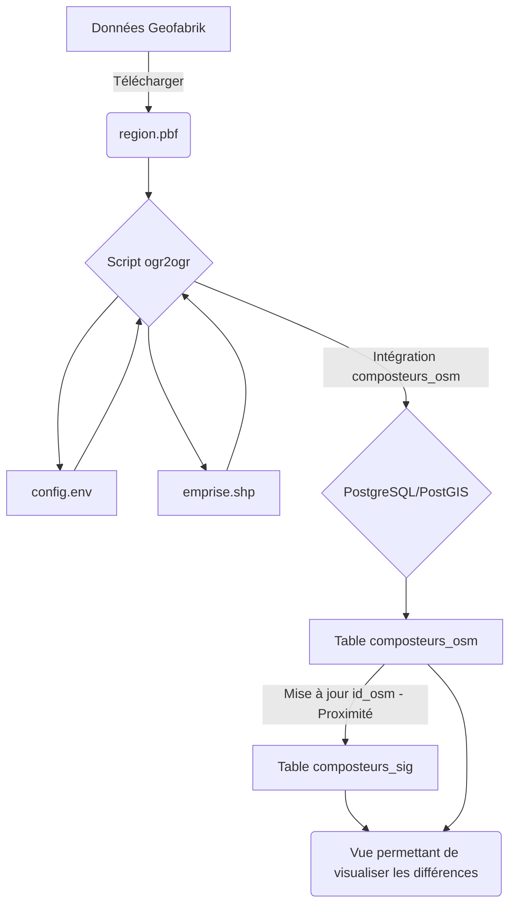

# Intégrer les données OpenStreetMap dans son SIG pour s'engager dans un processus de contribution réciproque

:calendar: Date de publication initiale : 01 Octobre 2021

**Mots-clés :** PostgreSQL | OpenStreetMap | Data | Bash | OGR | SQL | cURL

## Prérequis

- l'interpréteur [Bourne-Again shell](https://fr.wikipedia.org/wiki/Bourne-Again_shell)
- l'outil de convertion [ogr2ogr](https://gdal.org/programs/ogr2ogr.html)
- [psql](https://docs.postgresql.fr/13/app-psql.html) et nécessairement le SQL associé
- [cURL](https://curl.se)

## Intro

{: .img-rdp-news-thumb }

A COMPLETER

[Commenter cet article :fontawesome-solid-comments:](#__comments){: .md-button }
{: align=middle }

## Schéma de principe



### 1. Télécharger les données OpenStreetMap

Pour télécharger les données OpenStreetMap depuis le site [Geofabrik](https://download.geofabrik.de/europe/france.html), j'utilise cURL :

```bash
# SUPPRESSION DU FICHIER SI IL EXISTE
rm './data_in/LANGUEDOC_ROUSSILLON.pbf'
# TELECHARMENT ET RENOMMAGE
curl --limit-rate 1G https://download.geofabrik.de/europe/france/languedoc-roussillon'-latest.osm.pbf' > './data_in/LANGUEDOC_ROUSSILLON.pbf'
```

### 2. Configurer l'environnement de travail : config.env

Avant de se lancer, il est bon de paramétrer le fichier de configuration que vous devrez adapter à votre organisation et qui sera utilisé par les scripts qui vont vous servir à intégrer les données OpenStreeMap préalablement structurées dans votre base de données. On y définit les différents répertoires de travail ainsi que les variables permettant d'accéder à la base de données.

Voici le fichier config.env à adapter :

```ini
# REPERTOIRE DE TRAVAIL
REPER='/Users/'

# REPERTOIRE DE SORTIE
REPER_OUT='data_out'

# REPERTOIRE TEMPORAIRE
REPER_TEMP='data_temp'

# PARAMETRES OGR
LINK_OGR=ogr2ogr
ENCODAGE=UTF-8

# EMPRISE
EMPRISE='emprise.shp'

# CONNEXION A LA BASE DE DONNEES
C_HOST='localhost'
C_USER='user'
C_PASSWORD='pass'
C_DBNAME='database'
```

### 3. Un fichier shp pour définir l'emprise

Afin de restreindre l'extraction des données OpenStreetMap à notre périmètre d'étude, il est préférable d'utiliser un fichier d'emprise que je stocke au format .shp dans mon répertoire de travail.

### 4. Un script par donnée à extraire et à intégrer dans PostgreSQL

Pour la suite des opérations, j'utilise ogr2ogr pour lire le fichier OpenStreetMap (.pbf) préalablement téléchargé afin d'intégrer une information structurée dans PostgreSQL. Si je reprends l'exemple de mes composteurs, je commence par parcourir le [wiki OpenStreetMap](https://wiki.openstreetmap.org/wiki/Main_Page) pour identifier les tags qui vont nous permettre de les extraire facilement et je les ajoute dans le [fichier osmconf.ini](https://github.com/OSGeo/gdal/blob/master/gdal/data/osmconf.ini) utilisé par ogr.

[Récupérer des données OpenStreetMap via GDAL/OGR :fontawesome-solid-book:](https://portailsig.org/content/recuperer-des-donnees-openstreetmap-gdalogr.html){: .md-button }
{: align=middle }

Voici les tags à ajouter pour les composteurs :

```ini
# keys to report as OGR fields
attributes=amenity,recycling:organic
```

[Consulter le fichier osmconf.ini :fontawesome-regular-file-code:](https://github.com/OSGeo/gdal/blob/master/gdal/data/osmconf.ini){: .md-button }
{: align=middle }

Maintenant que le fichier de configuration est paramétré, on va passer au script qui va nous permettre d'extraire la donnée d'OpenStreetMap pour ensuite le mettre en forme et l'intégrer dans PostgreSQL :

```bash
# LECTURE DU FICHIER DE CONFIGURATION
. ./config.env
#------------------------------------------------------------------------------------------------------------
var_group=OSM_POI
var_sub_group=DECHETS
var_schema=dechet
var_table=composteurs_osm
#------------------------------------------------------------------------------------------------------------
#------------------------------------ COMPOSTEURS -----------------------------------------------------------
#------------------------------------------------------------------------------------------------------------
export requete="SELECT
-----------------------------------------
'n'|| osm_id AS ID_OSM,
-----------------------------------------
GEOMETRY AS "GEOMETRY",
-----------------------------------------
'Composteur' AS "NATURE",
-----------------------------------------
'OpenStreetMap' AS "SOURCE",
-----------------------------------------
SUBSTR(osm_timestamp, 1, 10) AS "DATE_MAJ"
-----------------------------------------
FROM points WHERE amenity='recycling' AND recycling_organic='yes' AND ST_IsValid(GEOMETRY)"
#------------------------------------------------------------------------------------------------------------
#------------------------------------------------------------------------------------------------------------
#------------------------------------------------------------------------------------------------------------

ogr2ogr -append -clipsrc $REPER'/'$EMPRISE -f "PostgreSQL" PG:"host=$C_HOST user=$C_USER dbname=$C_DBNAME password=$C_PASSWORD schemas=$var_schema" -dialect SQLITE -sql "SELECT * FROM ($(echo $requete | sed -e 's/-//g'))" $REPER'/'$REPER_IN'/'$F_PBF -s_srs EPSG:4326 -t_srs EPSG:2154 -nln $var_table -lco SCHEMA=$var_schema --config OGR_TRUNCATE YES --debug ON --config CPL_TMPDIR $REPER'/data_tmp/' --config OSM_MAX_TMPFILE_SIZE 4096 -oo CONFIG_FILE=$REPER'/scripts/'$var_sub_group'_osmconf.ini'
```

!!! tip
    Une fois le fichier configuré, vous pouvez lancer l'intégration des données dans la base PostgreSQL et l'automatiser pour qu'elle soit réalisée chaque nuit par exemple.

### 5. Un script SQL pour associer les composteurs OSM à nos données SIG

Après avoir intégré les données OpenStreetMap dans la base de données, il est maintenant possible de les visualiser dans QGIS pour faire une comparaison visuelle avec nos données mais cela n'est pas suffisant car cela s'apparente à chercher des aiguilles dans une meule de foin. On va donc créer une petite requête pour associser spatialement l'entité OpenStreetMap la plus proche de notre donnée si elle se trouve dans un rayon de 20m (choix purement arbitraire).

La requête va donc renseigner l'id_osm dans la table des composteurs et le stocker en dur.

```sql
ALTER TABLE dechet.composteurs DISABLE TRIGGER set_timestamp_update;

UPDATE dechet.composteurs
SET id_osm = NULL;

UPDATE dechet.composteurs
SET id_osm = a.id_osm
FROM (SELECT
  g.id,
  g.id_osm
   FROM (  SELECT a.id,
            c.id_osm as id_osm,
            round(st_distance(a.geom, c.geom)::numeric) AS distance
           FROM dechet.composteurs_osm c,
            dechet.composteurs a
          WHERE st_dwithin(a.geom, c.geom, 20::double precision)) g
  ORDER BY g.distance LIMIT 1) a
WHERE composteurs.id = a.id AND composteurs.type='Site en coeur de village';

ALTER TABLE dechet.composteurs ENABLE TRIGGER set_timestamp_update;
```

A ce stade, on peut d'ores et déjà :

- visualiser les composteurs associés ou non à nos données
- identifier les contributions que nous devrions réaliser pour enrichir la carte collaborative

!!! tip
    Comme pour le script d'intégration de comporteurs OpenStreetMap, vous pouvez l'automatiser en lançant une commande psql pour que la mise à jour de l'identifiant soit réalisée juste après l'intégration de la donnée.

### 6. Visualiser les différences entre la donnée OpenStreetMap et les données du SIG

Afin de visualiser plus rapidement, les lacunes de notre SIG et celles d'OpenStreetMap, il est possible de créer une vue dans PostgreSQL afin de catégoriser les actions à réaliser.

```sql
AJOUTER LA VUE
```

AJOUTER UNE IMAGE

- En vert : la donnée existe à la fois dans OpenStreetMap et dans notre SIG
- En orange : une contribution est nécessaire pour enrichir OpenStreetMap
- En rouge : La donnée n'existe que dans OpenStreetMap, il faut éventuellemeent aller la contrôler pour l'ajouter à nos données ou la supprimer d'OpenStreetMap si elle n'a plus d'intérêt.

### 7. Edition de la donnée et récupération de l'id_osm à travers un trigger

Vous l'avez compris la mise à jour de notre id_osm ne se fait qu'une fois par jour après l'intégration de la mise à jour de la donnée OpenStreetMap mais pour gérer les actions réalisées sur notre donnée interne nous utilisons un trigger pour mettre à jour l'id_osm si une action est réalisée. Ce trigger utlise la même définition que la requête SQL lancée chaque nuit.

```sql
AJOUTER LE TRIGGER
```

----

## Conclusion

A COMPLETER

----

## Auteur

--8<-- "content/team/fbor.md"


