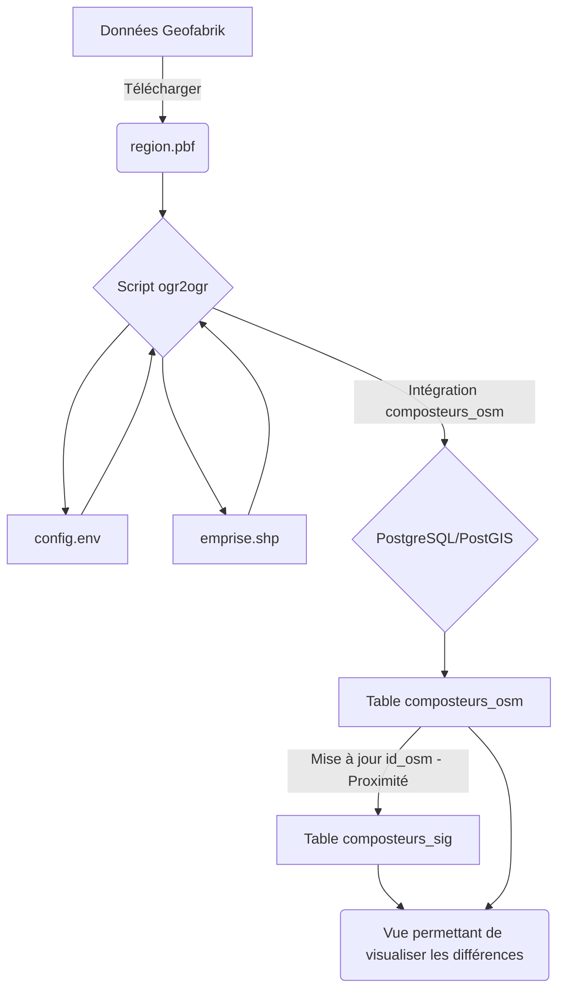

# Intégrer les données OpenStreetMap dans son SIG pour s'engager dans un processus de contribution réciproque

:calendar: Date de publication initiale : 05 Octobre 2021

## Prérequis

- l'interpréteur [Bourne-Again shell](https://fr.wikipedia.org/wiki/Bourne-Again_shell)
- l'outil de conversion [ogr2ogr](https://gdal.org/programs/ogr2ogr.html)
- [psql](https://docs.postgresql.fr/13/app-psql.html) et nécessairement le SQL associé
- [cURL](https://curl.se)

## Intro

{: .img-thumbnail-left }

Après cette première année bien remplie à la Communauté de Communes, j'ai profité du calme estival pour travailler sur la possibilité de créer des liens entre les informations renseignées dans OpenStreetMap et les données que nous produisons en interne avec pour objectif de consolider les deux bases de données de manière réciproque. Pour l'instant, la solution proposée a été uniquement utilisée pour valider nos données ponctuelles mais n'hésitez pas à partager vos expériences avec d'autres types de données ainsi que vos adaptations éventuelles.

[Commenter cet article :fontawesome-solid-comments:](#__comments "Aller aux commentaires"){: .md-button }
{: align=middle }

----

## Fonctionnement et processus



### 1. Télécharger les données OpenStreetMap

Pour télécharger les données OpenStreetMap depuis le site [Geofabrik](https://download.geofabrik.de/europe/france.html), j'utilise cURL :

```bash title="Télécharger les données OpenStreetMap" linenums="1"
# SUPPRESSION DU FICHIER SI IL EXISTE
rm './data_in/LANGUEDOC_ROUSSILLON.pbf'
# TELECHARGEMENT ET RENOMMAGE
curl --limit-rate 1G https://download.geofabrik.de/europe/france/languedoc-roussillon'-latest.osm.pbf' > './data_in/LANGUEDOC_ROUSSILLON.pbf'
```

### 2. Configurer l'environnement de travail : config.env

Avant de se lancer, il est bon de paramétrer le fichier de configuration que vous devrez adapter à votre organisation et qui sera utilisé par les scripts qui vont vous servir à intégrer les données OpenStreeMap préalablement structurées dans votre base de données. On y définit les différents répertoires de travail ainsi que les variables permettant d'accéder à la base de données.

Voici le fichier `config.env` à adapter :

```ini title="Environnement de travail" linenums="1"
# REPERTOIRE DE TRAVAIL
REPER='/Users/'

# FICHIER PBF
F_PBF='LANGUEDOC_ROUSSILLON.pbf'

# REPERTOIRE DES DONNEES
REPER_IN='data_in'

# PARAMETRES OGR
LINK_OGR=ogr2ogr
ENCODAGE=UTF-8

# EMPRISE
EMPRISE='emprise.shp'

# CONNEXION A LA BASE DE DONNEES
C_HOST='localhost'
C_USER='user'
C_PASSWORD='pass'
C_DBNAME='database'
```

### 3. Un fichier shp pour définir l'emprise

Afin de restreindre l'extraction des données OpenStreetMap à notre périmètre d'étude, il est préférable d'utiliser un fichier d'emprise que je stocke au format .shp dans mon répertoire de travail.

{: loading=lazy width=200px }
{: align=middle }

### 4. Un script par donnée à extraire et à intégrer dans PostgreSQL

{: .img-thumbnail-left }

Pour la suite des opérations, j'utilise [ogr2ogr](https://gdal.org/programs/ogr2ogr.html) pour lire le fichier OpenStreetMap (.pbf) préalablement téléchargé afin d'intégrer une information structurée dans PostgreSQL. Si je reprends l'exemple de mes composteurs, je commence par parcourir le [wiki OpenStreetMap](https://wiki.openstreetmap.org/wiki/Main_Page) pour identifier les tags qui vont me permettre de les extraire facilement et je les ajoute dans le [fichier osmconf.ini](https://github.com/OSGeo/gdal/blob/master/data/osmconf.ini) utilisé par ogr2ogr.

[Récupérer des données OpenStreetMap via GDAL/OGR :fontawesome-solid-book:](https://portailsig.org/content/recuperer-des-donnees-openstreetmap-gdalogr.html){: .md-button }
{: align=middle }

Voici les [tags à ajouter pour les composteurs](https://wiki.openstreetmap.org/wiki/Tag:amenity%3Drecycling) :

```ini title="osmconf.ini" linenums="1"
# keys to report as OGR fields
attributes=amenity,recycling:organic
```

[Consulter le fichier osmconf.ini par defaut :fontawesome-regular-file-code:](https://github.com/OSGeo/gdal/blob/master/data/osmconf.ini){: .md-button }
{: align=middle }

Maintenant que le fichier de configuration est paramétré, on va passer au script qui va nous permettre d'extraire la donnée d'OpenStreetMap pour ensuite le mettre en forme et l'intégrer dans PostgreSQL :

```bash title="Extraction des données" linenums="1"
# LECTURE DU FICHIER DE CONFIGURATION
. ./config.env
#------------------------------------------------------------------------------------------------------------
# NOM DU FICHIER _osmconf.ini
var_osm_conf=DECHETS
# NOM DU SCHEMA DANS LEQUEL EST STOCKEE L'INFORMATION
var_schema=dechet
# NOM DE LA TABLE CORRESPONDANT AUX COMPOSTEURS OSM
var_table=composteurs_osm
#------------------------------------------------------------------------------------------------------------
#------------------------------------ COMPOSTEURS -----------------------------------------------------------
#------------------------------------------------------------------------------------------------------------
export requete="SELECT
-----------------------------------------
'n'|| osm_id AS ID_OSM,
-----------------------------------------
GEOMETRY AS "GEOMETRY",
-----------------------------------------
'Composteur' AS "NATURE",
-----------------------------------------
'OpenStreetMap' AS "SOURCE",
-----------------------------------------
SUBSTR(osm_timestamp, 1, 10) AS "DATE_MAJ"
-----------------------------------------
FROM points WHERE amenity='recycling' AND recycling_organic='yes' AND ST_IsValid(GEOMETRY)"
#------------------------------------------------------------------------------------------------------------
#------------------------------------------------------------------------------------------------------------
#------------------------------------------------------------------------------------------------------------

ogr2ogr -append -clipsrc $REPER'/'$EMPRISE -f "PostgreSQL" PG:"host=$C_HOST user=$C_USER dbname=$C_DBNAME password=$C_PASSWORD schemas=$var_schema" -dialect SQLITE -sql "SELECT * FROM ($(echo $requete | sed -e 's/-//g'))" $REPER'/'$REPER_IN'/'$F_PBF -s_srs EPSG:4326 -t_srs EPSG:2154 -nln $var_table -lco SCHEMA=$var_schema --config OGR_TRUNCATE YES --debug ON --config CPL_TMPDIR $REPER'/data_tmp/' --config OSM_MAX_TMPFILE_SIZE 4096 -oo CONFIG_FILE=$REPER'/scripts/'$var_osm_conf'_osmconf.ini'
```

!!! tip
    Une fois le fichier configuré, vous pouvez lancer l'intégration des données dans la base PostgreSQL et l'automatiser à l'aide d'une tâche [cron](https://fr.wikipedia.org/wiki/Cron) pour qu'elle soit réalisée chaque nuit par exemple.

### 5. Un script SQL pour associer les composteurs OSM à nos données SIG

Après avoir intégré les données OpenStreetMap dans PostgreSQL, il est maintenant possible de les visualiser avec QGIS pour notamment faire une comparaison visuelle avec les données internes mais cela s'apparente à chercher des aiguilles dans une meule de foin. Je vous propose donc de créer une requête pour associer spatialement l'entité OpenStreetMap la plus proche de notre donnée si elle se trouve dans un rayon de 20m (choix purement arbitraire).

Après avoir créé une colonne `id_osm` dans ma table des composteurs, on va lancer la requête pour renseigner l'identifiant OSM dans la table des composteurs, il sera donc stocké en dur.

```sql title="Association OSM et données SIG" linenums="1"
-- On désactive le trigger permettant de renseigner la date de mise à jour
ALTER TABLE dechet.composteurs DISABLE TRIGGER set_timestamp_update;

UPDATE dechet.composteurs
SET id_osm = NULL;

UPDATE dechet.composteurs
SET id_osm = a.id_osm
FROM (SELECT
  g.id,
  g.id_osm
   FROM (  SELECT a.id,
            c.id_osm as id_osm,
            round(st_distance(a.geom, c.geom)::numeric) AS distance
           FROM dechet.composteurs_osm c,
            dechet.composteurs a
          WHERE st_dwithin(a.geom, c.geom, 20::double precision)) g
  ORDER BY g.distance LIMIT 1) a
WHERE composteurs.id = a.id AND composteurs.type='Site en coeur de village';

-- On réactive le trigger permettant de renseigner la date de mise à jour
ALTER TABLE dechet.composteurs ENABLE TRIGGER set_timestamp_update;
```

A ce stade, on peut d'ores et déjà :

- visualiser les composteurs associés ou non à nos données
- identifier les contributions que nous devrions réaliser pour enrichir la carte collaborative

!!! tip
    Comme pour le script d'intégration des composteurs OpenStreetMap, vous pouvez l'automatiser en lançant une commande psql pour que la mise à jour de l'identifiant soit réalisée juste après l'intégration de la donnée dans la base (cron est notre ami :smile:).

### 6. Visualiser les différences entre la donnée OpenStreetMap et les données du SIG

Afin de visualiser plus rapidement, les lacunes de notre SIG et celles d'OpenStreetMap, il est possible de créer une vue dans PostgreSQL pour catégoriser les actions à réaliser à la fois en interne et dans OpenStreetMap.

```sql title="Différences entre les données" linenums="1"
CREATE OR REPLACE VIEW dechet.v_composteurs_comparaison_osm
 AS
 SELECT row_number() OVER () AS id,
    g.geom,
    g.statut,
    g.type
   FROM ( SELECT c.geom,
            'A valider'::text AS statut,
            a.type
           FROM dechet.composteurs_osm c
             LEFT JOIN dechet.composteurs a ON c.id_osm::text = a.id_osm::text
          WHERE a.id_osm IS NULL
        UNION ALL
         SELECT r.geom,
            'Contribuer'::text AS statut,
            r.type
           FROM dechet.composteurs r
          WHERE r.id_osm IS NULL
        UNION ALL
         SELECT c.geom,
            'Ok'::text AS statut,
            c.type
           FROM dechet.composteurs c
             LEFT JOIN dechet.composteurs_osm a ON c.id_osm::text = a.id_osm::text
          WHERE c.id_osm IS NOT NULL) g;
```

{: .img-center loading=lazy }

- Contour vert : la donnée existe à la fois dans OpenStreetMap et dans notre SIG
- Contour orange : une contribution est nécessaire pour enrichir OpenStreetMap
- Contour rouge : La donnée n'existe que dans OpenStreetMap, il faut éventuellement aller la contrôler pour l'ajouter à nos données ou la supprimer d'OpenStreetMap si elle n'a plus d'intérêt.

Voici un autre exemple avec des données sur le patrimoine :

{: .img-center loading=lazy }

### 7. Edition de la donnée et récupération de l'id_osm à travers un trigger

Vous l'avez compris la mise à jour de notre `id_osm` ne se fait qu'après l'intégration des données OpenStreetMap actualisées mais pour gérer les actions réalisées par les utilisateurs de notre base de données interne nous utilisons un *trigger* afin de mettre à jour l'`id_osm` à une entité modifiée ou ajoutée. Ce *trigger* utilise la même définition que la requête SQL lancée après l'intégration des données OSM.

```sql title="Récupération de l'id_osm" linenums="1"
CREATE OR REPLACE FUNCTION dechet.trigger_set_openstreetmap_composteurs()
RETURNS TRIGGER AS $$
BEGIN

  NEW.id_osm = (SELECT
    g.id_osm
   FROM (  SELECT
            c.id_osm as id_osm,
            round(st_distance(NEW.geom, c.geom)::numeric) AS distance
           FROM dechet.composteurs_osm c
   WHERE st_dwithin(NEW.geom, c.geom, 20::double precision)) g
  ORDER BY g.distance );
  RETURN NEW;
END;
$$ LANGUAGE plpgsql;

CREATE TRIGGER trigger_set_openstreetmap_composteurs
BEFORE INSERT OR UPDATE ON dechet.composteurs
FOR EACH ROW
EXECUTE PROCEDURE dechet.trigger_set_openstreetmap_composteurs();
```

----

## Conclusion

Avec cette solution "low cost" nous pouvons identifier rapidement des évolutions ou des différences entre nos données et les informations saisies dans OpenStreetMap ce qui nous permet d'une part d'améliorer l'information que nous apportons à nos utilisateurs et d'autre part de contribuer pleinement au projet collaboratif.

Après la phase de mise en œuvre et d'état des lieux sur le territoire, nous allons maintenant entrer dans la phase longue d'harmonisation de l'information mais ce travail s'inscrit pleinement dans notre participation aux géo-communs.

----

<!-- geotribu:authors-block -->


