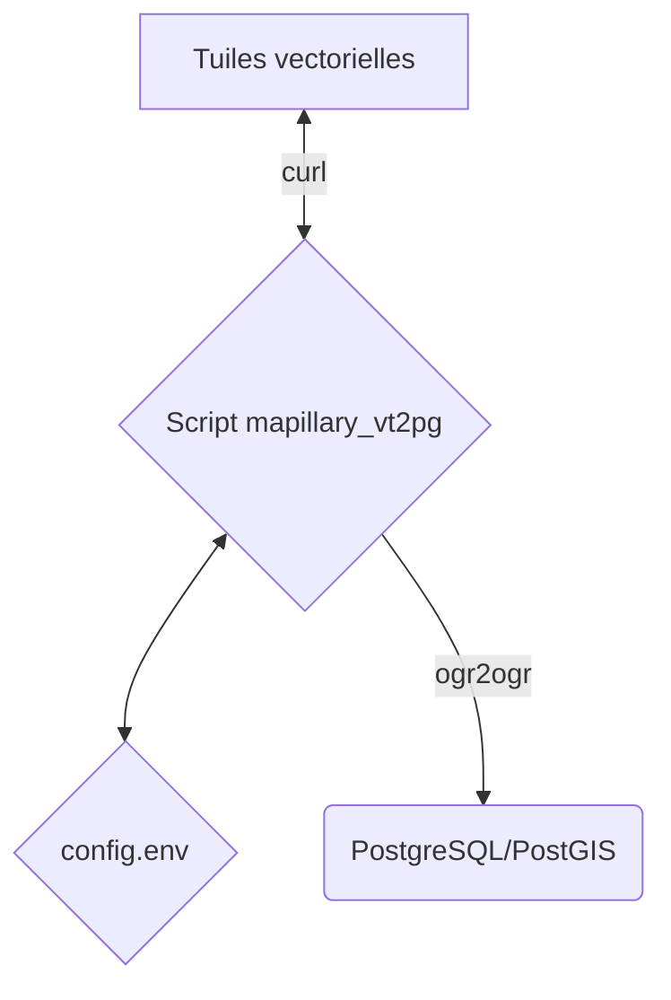

# Accéder aux données de Mapillary et les intégrer dans son SIG

:calendar: Date de publication initiale : 31 Mai 2022

## Prérequis

- un [jeton Mapillary](https://www.mapillary.com/dashboard/developers)
- l'interpréteur [Bourne-Again shell](https://fr.wikipedia.org/wiki/Bourne-Again_shell)
- l'outil de conversion [ogr2ogr](https://gdal.org/programs/ogr2ogr.html)
- [cURL](https://curl.se)

## Intro

{: .img-thumbnail-left }

Aujourd'hui, je vais vous présenter différentes manières d'accéder aux données identifiées à partir des prises de vue publiées sur Mapillary et qui pourront peut-être vous permettre d'enrichir votre SIG sur certaines thématiques. Pour ce faire nous allons nous appuyer sur les différents services proposés par la [4ème version de l'API](https://www.mapillary.com/developer/api-documentation/).

[Commenter cet article :fontawesome-solid-comments:](#__comments "Aller aux commentaires"){: .md-button }
{: align=middle }

<!-- markdownlint-disable MD046 -->
!!! warning
    L'utilisation des données et services de Mapillary sont autorisés dans le respect des [conditions d'utilisation](https://www.mapillary.com/terms) définies par Mapillary notamment aux sections :

    - 3 Les licences,
    - 11 Conditions supplémentaires pour les développeurs,
    - 12 Utilisation des Services Mapillary à des fins commerciales
    - 13 Informations sur OpenStreetMap.
<!-- markdownlint-enable MD046 -->

----

## 1. Les tuiles vectorielles Mapillary dans QGIS

{: .img-thumbnail-left }

Lorsqu'on épluche la documentation, on peut voir que Mapillary propose un service d'accès à ses données basé sur des services de [tuiles vectorielles](https://docs.qgis.org/3.22/fr/docs/user_manual/working_with_vector_tiles/vector_tiles_properties.html). Ils ont l'avantage d'offrir une solution assez souple et légère permettant de visualiser de grandes quantités d'informations. Les tuiles vectorielles de Mapillary suivent les [spécifications des tuiles Mapbox (MVT)](https://docs.mapbox.com/data/tilesets/guides/vector-tiles-standards/) et offrent la possbilité :

- de réaliser des filtrages et des rendus spécifiques
- d'interroger la donnée

Il existe trois URL permettant d'accéder aux tuiles vectorielles de Mapillary :

1. [Tuiles de couverture](https://www.mapillary.com/developer/api-documentation/#coverage-tiles) : qui permettent de visualiser les séquences (traces) et la position des prises de vue :  `https://tiles.mapillary.com/maps/vtp/mly1_computed_public/2/{z}/{x}/{y}?access_token=XXX`
2. [Tuiles de points](https://www.mapillary.com/developer/api-documentation/#point-tiles) : qui permettent de visualiser la position des [objets détectés par les algorithmes de mapillary (autres que des panneaux de signalisation)](https://www.mapillary.com/developer/api-documentation/points) : `https://tiles.mapillary.com/maps/vtp/mly_map_feature_point/2/{z}/{x}/{y}?access_token=XXX`
3. [Tuiles de panneaux de signalisation](https://www.mapillary.com/developer/api-documentation/#traffic-sign-tiles) : qui permettent de visualiser la position des [panneaux de signalisation détectés par les algorithmes de Mapillary](https://www.mapillary.com/developer/api-documentation/traffic-signs) : `https://tiles.mapillary.com/maps/vtp/mly_map_feature_traffic_sign/2/{z}/{x}/{y}?access_token=XXX`

### Ajout des tuiles vectorielles

Dans l'explorateur du Gestionnaire de données de QGIS, ajouter une couche de tuiles vectorielles.

{: .img-center loading=lazy }

Nommer proprement la couche vectorielle à ajouter et renseigner l'URL de la couche vectorielle qui vous intéresse en n'oubliant pas de modifier le jeton Mapillary qui vous permet de vous identifier.

{: .img-center loading=lazy }

Ajouter la nouvelle couche de tuiles dans QGIS (pour visualiser l'information, vous devrez zoomer au niveau 14 ou +).

### Interrogation des tuiles vectorielles

Les tuiles vectorielles sont interrogeables et permettent une consultation des différents champs publiés. Si l'on prend l'exemple du flux lié à la signalisation, il est possible d'accéder au type de panneau detecté ainsi qu'aux dates auxquelles il a été vu pour la première et la dernière fois.

{: .img-center loading=lazy }

### Personnalisation des tuiles vectorielles

Par défaut lors de l'ajout, les données présentent dans les tuiles vectorielles sont automatiquement réparties en :

- Polygones
- Lignes
- Points

{: .img-center loading=lazy }

Il est possible d'enrichir ce rendu par défaut en ajoutant de nouveaux styles, en définissant la couche sur laquelle vous souhaitez travailler, exemple : `traffic_signs` et en jouant avec les filtres, exemple : `(geometry_type($geometry)='Point') AND ("value" IS 'information--general-directions--g1')`

!!! info
    Il y a aussi la possibilité d'importer un style déjà configuré au format QML ou MapBox GL Json.

## 2. Extraire les données vectorielles des tuiles vectorielles

Mainteant qu'on s'est bien amusé sur le tunning des tuiles vectorielles :race_car:, il pourrait être intéressant de récupérer l'information vectorielle pour la stocker. Dans cette partie, je vais vous présenter un script qui me permet :

1. de récupérer de données vecteurs à partir des différents flux des tuiles vectorielles,
2. d'intégrer les données dans une base de données PosgreSQL/PostGIS.

### Fonctionnement global



### Un environnement de travail : config.env

Avant de se lancer, il est bon de paramétrer le fichier de configuration que vous devrez adapter à votre organisation et qui sera utilisé pour intégrer les données Mapillary dans votre base de données. On y définit les différents répertoires de travail ainsi que les variables permettant d'accéder à la base de données (connexion par [pg_service.conf](http://archives.postgresql.fr/v2/index9215.html?q=node/1388)).

Voici le fichier `config.env` à adapter :

```ini title="Environnement de travail" linenums="1"
# REPERTOIRE DE TRAVAIL
REPER='/mapillary'

#REPERTOIRE DE STOCKAGE DES LOGS
REPER_LOGS='logs'

#MAPILLARY
TOKEN='MLY|XXXXXXXXXXXXXXXXXXXXXX|XXXXXXXXXXXXXXXXXXXXXX'

V_LONG_MIN='3.96440'
V_LONG_MAX='4.20430'
V_LAT_MIN='43.57840'
V_LAT_MAX='43.81890'
V_ZOOM='14'

# PERMET DE DEFINIR UNE DATE DE DEBUT
DATE_DEBUT='2021-01-01T00:00:00-00:00'

# PARAMETRES OGR
ENCODAGE='UTF-8'

# CONNEXION A LA BASE DE DONNEES : https://gdal.org/drivers/vector/pg.html#connecting-to-a-database
C_SERVICE='XXXXXXXXXXXXXXXXXXXXXX'
C_SCHEMA='ref_mapillary'
```

[Consulter le fichier de configuration :fontawesome-regular-file-code:](https://github.com/igeofr/mapillary2pg/blob/main/config.env){: .md-button }
{: align=middle }

### Convertir l'emprise lat/long dans le système de numérotation des tuiles

Les tuiles ne sont pas définies par une longitude/latitude mais par une numérotation spécifique, il nous faut donc identifier les numéros des tuiles qui croisent notre emprise de travail et pour cela, je me suis appuyé sur une [solution proposée sur le wiki d'OpenStreetMap](https://wiki.openstreetmap.org/wiki/Slippy_map_tilenames#Bourne_shell_with_Awk).

```bash title="Identification des tuiles" linenums="1"
# BBOX ET IDENTIFICATION DES TUILES
long2xtile(){
 long=$1
 zoom=$2
 echo -n "${long} ${zoom}" | awk '{ xtile = ($1 + 180.0) / 360 * 2.0^$2;
  xtile+=xtile<0?-0.5:0.5;
  printf("%d", xtile ) }'
}
lat2ytile() {
 lat=$1;
 zoom=$2;
 ytile=`echo "${lat} ${zoom}" | awk -v PI=3.14159265358979323846 '{
   tan_x=sin($1 * PI / 180.0)/cos($1 * PI / 180.0);
   ytile = (1 - log(tan_x + 1/cos($1 * PI/ 180))/PI)/2 * 2.0^$2;
   ytile+=ytile<0?-0.5:0.5;
   printf("%d", ytile ) }'`;
 echo -n "${ytile}";
}

XMIN=$(long2xtile $(echo $V_LONG_MIN | sed -e 's/\./,/g') $V_ZOOM)
XMAX=$(long2xtile $(echo $V_LONG_MAX | sed -e 's/\./,/g') $V_ZOOM)
YMIN=$(lat2ytile $(echo $V_LAT_MIN | sed -e 's/\./,/g') $V_ZOOM)
YMAX=$(lat2ytile $(echo $V_LAT_MAX | sed -e 's/\./,/g') $V_ZOOM)
echo $XMIN $YMIN $XMAX $YMAX
```

### Téléchargement des tuiles et création de GPKG

Ensuite, à l'aide de `curl` on va pouvoir télécharger chacune des tuiles en local et en extraire l'information pour l'intégrer dans un Géopackage (que l'on pourra archiver facilement).

``` bash title="Téléchargement des tuiles et création de GPKG" linenums="1"
Z=$V_ZOOM
for X in $(seq $XMIN $XMAX);do
   for Y in $(seq $YMAX $YMIN);do

      MVT_FILE=${Z}'_'${X}'_'${Y}'.mvt'

      #-------------------------------------------------------------------------------
      URL="https://tiles.mapillary.com/maps/vtp/$VAR_URL/2/$Z/$X/$Y?access_token=$TOKEN"
      #echo "https://tiles.mapillary.com/maps/vtp/$VAR_URL/2/$Z/$X/$Y?access_token=$TOKEN"

      mkdir $REPER'/tuiles/tuiles_'$L_TYPE'/'${DATE_YMD}
      mkdir $REPER'/tuiles/tuiles_'$L_TYPE'/'${DATE_YMD}'/'${Z}
      mkdir $REPER'/tuiles/tuiles_'$L_TYPE'/'${DATE_YMD}'/'${Z}'/'${X}
      mkdir $REPER'/tuiles/tuiles_'$L_TYPE'/'${DATE_YMD}'/'${Z}'/'${X}'/'${Y}

      # TELECHARGEMENT DES TUILES
      curl -w "%{http_code}" $URL --max-time 120 --connect-timeout 60 -o $REPER'/tuiles/tuiles_'$L_TYPE'/'${DATE_YMD}'/'${Z}'/'${X}'/'${Y}'/'$MVT_FILE

      # FUSION EN GPKG
      ogr2ogr \
      -progress \
      -f 'GPKG' \
      -update -append \
      --debug ON \
      -lco SPATIAL_INDEX=YES \
      $file \
      $REPER'/tuiles/tuiles_'$L_TYPE'/'${DATE_YMD}'/'${Z}'/'${X}'/'${Y}'/'$MVT_FILE $LAYER \
      -nlt PROMOTE_TO_MULTI \
      -oo x=${X} -oo y=${Y} -oo z=${Z}

   done
done
```

### Import dans une base de données PostgreSQL/PostGIS

Après avoir extrait les données vectorielles des tuiles vectorielles, il ne nous reste plus qu'à les intégrer dans notre base de données PostgreSQL/PostGIS à l'aide d'`ogr2ogr`.

``` bash title="Import PostgreSQL/PostGIS" linenums="1"
ogr2ogr \
    -append \
    -f "PostgreSQL" PG:"service='$C_SERVICE' schemas='$C_SCHEMA'" \
    -nln 'mapillary_vt_signalisation' \
    -s_srs 'EPSG:3857' \
    -t_srs 'EPSG:2154' \
    $file 'traffic_sign' \
    -where "last_seen_at>$DATE_EPOCH" \
    -dialect SQLITE \
    --config OGR_TRUNCATE YES \
    --debug ON \
    --config CPL_LOG './'$REPER_LOGS'/'$DATE_YMD'_mapillary_vt_signalisation.log'
```

[Accéder au script complet :fontawesome-regular-file-code:](https://github.com/igeofr/mapillary2pg/blob/main/mapillary_vt2pg.sh){: .md-button }
{: align=middle }

### Exécution

Maintenant que le fichier de configuration est complété et que vous avez bien compris le principe du script `mapillary_vt2pg.sh`, vous allez pouvoir lancer le script de cette manière pour récupérer les données qui vous intéressent dans PostgreSQL/PostGIS.

```bash title="Exécution" linenums="1"
sh mapillary_vt2pg.sh image
sh mapillary_vt2pg.sh point
sh mapillary_vt2pg.sh signalisation
```

### Rendu

Pour terminer, on peut charger la donnée dans QGIS et créer un style en s'appuyant sur les [symboles partagés par Mapillary](https://github.com/mapillary/mapillary_sprite_source).

{: .img-center loading=lazy }

----

## Conclusion

Grâce aux capacités de rendu des tuiles vectorielles de QGIS, il est possible de filtrer et personnaliser les données de Mapillary en fonction des besoins, tout en ayant accès à l'information en quasi temps réel.

En parallèle et pour d'autres usages, le script de téléchargement des données va vous permettre de stocker l'information dans votre base de données afin qu'elle puisse :

1. bénéficier à vos services concernés (services techniques, voirie...),
2. contribuer à améliorer la qualité de vos données.

----

## Références

- Un article de Morgan Hite sur son blog : [QGIS 3 and Vector map tiles](https://wanderingcartographer.wordpress.com/2021/01/09/qgis-3-and-vector-map-tiles/)
- [De l'intérêt de mettre en place un "streetview" libre](https://prezi.com/p/ufcelyteyqzc/n-street-view-libre_retour_experience_grandmontauban_aitf/) par J. Sidgwick, CA du Grand Montauban

----

<!-- geotribu:authors-block -->


