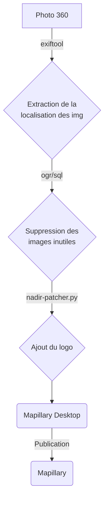

# Contribution Mapillary et retour d'expérience

:calendar: Date de publication initiale : 25 Novembre 2022

## Prérequis

- l'interpréteur [Bourne-Again shell](https://fr.wikipedia.org/wiki/Bourne-Again_shell)
- l'outil de conversion [ogr2ogr](https://gdal.org/programs/ogr2ogr.html)
- Python > 3.6
- [Imagemagick](https://imagemagick.org/index.php)
- [ffmpeg / ffprobe](https://ffmpeg.org)

## Intro

{: .img-rdp-news-thumb }

Cet article s'inscrit dans la continuité de mon article que j'avais intitulé [accéder aux données Mapillary et les intégrer dans son SIG](/articles/2022/2022-05-31_donnees_mapillary/). En effet, au moment où celui-ci avait été rédigé, je n'étais pas encore équipé pour réaliser des vues immersives mais c'est maintenant chose faite et je vous propose un retour d'expérience qui je l'espère permettra d'alimenter discussions et réflexions sur le sujet.

[Commenter cet article :fontawesome-solid-comments:](#__comments){: .md-button }
{: align=middle }

----

## Le matériel

### Le point de départ

{: .img-rdp-news-thumb }

J'interviens dans une petite Communauté de Communes et comme chacun le sait nos finances sont particulièrement contraintes. L'idée n'était donc pas de réinventer la poudre mais de s'appuyer sur des solutions éprouvées et mises en places dans différentes structures comme la [CA du Grand Montauban](https://prezi.com/p/ufcelyteyqzc/n-street-view-libre_retour_experience_grandmontauban_aitf/), l'Agglomération Val Parisis et [Carto'Cité](https://peertube.openstreetmap.fr/w/fG36XBt2iYYN5XbkUTtqLR). Je suis donc parti sur :

- une GoPro Max 360° livrée avec une batterie : environ 430 €
- un support triple ventouse Ram Mount (ref. RAP-B-365-224-202AU) : environ 90€
- un adpatateur GoPro à visser : environ 3€

{: .img-center loading=lazy }

### Une erreur qui aurait pu me coûter une GoPro

J'avais acheté un adapteur GoPro en plastique a 3€ pour limiter les coûts mais cette "chinoiserie" a bien failli me coûter la caméra!

En effet, le lendemain de ma première matinée de test, la caméra était posée sur le bureau quand sans action extérieure, elle s'est retrouvée sans prévenir sur le sol, gloups! L'adapteur en plastique avait complètement explosé.

{: .img-center loading=lazy }

Un défaut de fabrication, la pièce trop serrée,... je ne sais pas mais toujours est-il que ça m'a bien refroidi!

Après avoir partagé ma mésaventure sur Twitter, [Stéphane Péneau](https://twitter.com/stfmani) de [Carto'Cité](https://cartocite.fr) me conseille d'acheter un adaptateur Ram Mount (ref. RAP-B-202U-GOP1), certes plus cher mais aussi d'une tout autre qualité et 100% compatible avec le support triple ventouse du même fabriquant.

{: .img-center loading=lazy }

### Sécuriser le système

Et pour sécuriser encore un peu plus un éventuel décrochement, j'ai ajouté deux éléments "basiques" pour assurer la caméra et me rassurer :

1. une ficelle et un mousqueton que j'ai fixé au support triple ventouse et que je viens attacher à l'intérieur de l'habitacle (poignée ou pare soleil suivant les véhicules).
2. un bas de ligne acier (normalement utilisé pour la pêche au carnassier) pour relier cette ficelle à la GoPro pour ne pas la perdre en cas de détachement éventuel ou de rupture de l'adaptateur.

### L'autonomie

Avec une batterie neuve, on arrive à faire une demi-journée de prises de vue. Si on veut aller plus loin, il faut faire l'acquisition de plusieurs batteries et d'un chargeur multiple.

----

## Prises de vue

### Configuration

La caméra installée et démarrée, j'utilise l'application [GoPro Quik](https://gopro.com/fr/fr/shop/quik-app-video-photo-editor) pour lancer ou stopper les prises de vues tout en étant dans la voiture.

`AJOUTER UNE CAPTURE`

### L'intervalle

La GoPro est paramétrée pour prendre des prises de vue 360° avec un intervalle de deux secondes (intervalle minimum avec cette caméra) ce qui représente pour vous donner un ordre d'idée, une distance de :

- 17 mètres à 30km/h
- 28 mètres à 50km/h

Dans les secteurs urbains assez dense, il est pertinent de limiter sa vitesse pour obtenir une bonne densité d'images.

### Une équipe de photographes

La réalisation des prises de vue est réalisée par :

- notre équipe de gardes champêtres/ASVP qui sont en permanences sur le terrain et que j'oriente pour capter certaines "zones blanches",
- moi même lors de mes déplacements sur le territoire (réunions, formations, collectes,...).

### Des conditions et quelques chiffres

Pour vous donner quelques chiffres, la caméra a été réceptionnée début Août et après la phase de test, nous avons réalisé des prises de vue de manière aléatoire en terme de durée jusqu'à fin Septembre. A ce jour, nous avons publié un peu plus de 14000 images et parcouru près de 160km.

A partir du mois d'Octobre, le soleil étant plus bas et la luminosité plus faible, les images sont moins nettes et le soleil peut plus facilement éblouir le capteur. Nous avons donc décidé de stopper la campagne de prises de vue jusqu'au printemps privilégiant la qualité des prises de vue.

----

## Traitement des photos

Passées ces péripéties matérielles, je me suis penché sur le traitement des photos.

### Processus global

Le processus que je vous présente mélange du bash, de l'OGR, du SQL et du python.



### Un environnement de travail : config.env

Avant de se lancer, il est bon de paramétrer le fichier de configuration que vous devrez adapter à votre organisation et qui sera utilisé pour traiter les photos. On y définit le répertoire de travail et différentes variables nécessaires à la bonne éxécution du script.

Voici le fichier `config.env` à adapter :

```ini
# REPERTOIRE DE TRAVAIL
REPER='/mapillary_traitement_images'

# REPERTOIRE DE STOCKAGE DES LOGS
REPER_LOGS='logs'

# PARAMETRES OGR
ENCODAGE='UTF-8'
```

[Consulter le fichier de configuration :fontawesome-regular-file-code:](https://github.com/igeofr/gopromax2mapillary/blob/main/config.env){: .md-button }
{: align=middle }

### Nettoyer les photos "inutiles"

Après mes premiers tests, lorsque je chargeais mes photos dans l'application [Mapillary Desktop Uploader](https://www.mapillary.com/desktop-uploader), je me rendais compte que j'avais une redondance de photos "identiques" lorsque je marquais un point d'arrêt, notamment aux Stop. Cette redondance est peu pertinente pour l'utilisateur et d'un point de vue environnemental, elle vient inutilement charger les serveurs de Mapillary. Je vous explique ci-dessous quelle solution a été mise en place pour réaliser ce "nettoyage".

[Accéder au script complet  :fontawesome-regular-file-code:](https://github.com/igeofr/gopromax2mapillary/blob/main/gopromax2mapillary.sh){: .md-button }
{: align=middle }

#### Extraire la localisation des images

Pour la première étape, j'ai utilisé `exiftool` pour lire chacune des images afin d'en extraire leur localisation ainsi que la date et l'heure de la prise de vue. En sortie, j'obtiens un fichier csv listant chacune des images ainsi que les paramètres demandés.

```bash
exiftool -filename -gpstimestamp -gpsdatestamp -gpslatitude -gpslongitude -n -csv -r $REPER'/tmp' > './list/'$DATE_YMD'_img.csv'
```

#### Créer un fichier SIG à partir de la localisation des images

La deuxième étape a été de créer un fichier SIG à partir des informations extraites des images.

```bash
for csvfile in *.csv;
do
ogr2ogr \
  -f "SQLite" \
  -dsco SPATIALITE=YES \
  -lco LAUNDER=NO \
  -oo X_POSSIBLE_NAMES=gpslongitude \
  -oo Y_POSSIBLE_NAMES=gpslatitude \
  ${csvfile%.*}.sqlite \
  ${csvfile%.*}.csv
```

#### Identification des images

Vous connaissez mon côté OGR centré! Au départ, j'ai commencé par digérer la localisation des images dans OGR pour supprimer les points des photos dont la distance avec le suivant était inférieure à 2 mètres. C'était un bon début mais perfectible.

Finalement après de nombreux échanges avec [Michaël Galien](https://twitter.com/tetranos), plutôt SQL centré, on est arrivé à une requête récursive sur PostgreSQL permettant de supprimer les photos qui se succèdent si l'écartement entre les photos qui se suivent est inférieur à X mètres (dans le cas présent 3 mètres).

Cette requête a ensuite été adaptée pour tourner avec ogr2ogr de manière autonome (OGR centré, je vous dis!).

```bash
ogr2ogr \
-f CSV \
-dialect sqlite \
-sql 'WITH RECURSIVE clean_sequence as (
  SELECT g.*,
  cast(null as geometry) as aproximite,
  cast(null as integer) as id_ref,
  cast(null as real) AS distance
  FROM (SELECT * FROM conf LIMIT 1) g
  UNION ALL
  SELECT T.*,
    CASE
    WHEN C.aproximite IS NULL AND PtDistWithin(T.geom, C.geom,3) THEN T.geom_prev
    WHEN not (C.aproximite IS NULL) AND PtDistWithin(T.geom, C.aproximite,3) THEN C.aproximite
    ELSE NULL
    END as aproximite,
    CASE
    WHEN C.aproximite IS NULL AND PtDistWithin(T.geom, C.geom,3) THEN t.prev_val
    WHEN not (C.aproximite IS NULL) AND PtDistWithin(T.geom, C.aproximite,3) THEN C.id_ref
    ELSE NULL
    END as id_ref,
    CASE
    WHEN C.aproximite IS NULL AND PtDistWithin(T.geom, C.geom,3) THEN ST_Distance(T.geom, C.geom)
    WHEN not (C.aproximite IS NULL) AND PtDistWithin(T.geom, C.aproximite,3) THEN ST_Distance(T.geom, C.aproximite)
    ELSE NULL
    END as distance
    FROM clean_sequence as C
    INNER JOIN (SELECT * FROM conf) as T
    ON T.id_photo = C.id_photo + 1),
  conf AS (SELECT
    sourcefile,
    filename,
    substr(filename,1,4) as sequence,
    cast(substr(filename,5,4) AS integer) as id_photo,
    CAST(gpslatitude AS REAL) AS gpslatitude,
    CAST(gpslongitude AS REAL) AS gpslongitude,
    ST_Transform(SetSRID(MakePoint(CAST(gpslongitude AS REAL), CAST(gpslatitude AS REAL)), 4326),2154)as geom,
    LEAD(ST_Transform(SetSRID(MakePoint(CAST(gpslongitude AS REAL), CAST(gpslatitude AS REAL)), 4326),2154)) over (order by filename) AS geom_next,
    LAG(ST_Transform(SetSRID(MakePoint(CAST(gpslongitude AS REAL), CAST(gpslatitude AS REAL)), 4326),2154)) over (order by filename) AS geom_prev,
    LAG(cast(substr(filename,5,4) AS integer)) OVER (ORDER BY cast(substr(filename,5,4) AS integer)) AS prev_val,
    LEAD(cast(substr(filename,5,4) AS integer)) OVER (ORDER BY cast(substr(filename,5,4) AS integer)) AS next_val
  FROM "'${csvfile%.*}'" ORDER BY filename)
  SELECT sourcefile
   FROM clean_sequence WHERE NOT (aproximite IS NULL)
  ' \
  ${csvfile%.*}"_a_sup.csv" \
  ${csvfile%.*}".sqlite"
```

#### Suppression des images

Une fois la liste des images à supprimer identifiée, il ne nous reste plus qu'à les effacer.

```bash
# SUPPRESSION DES IMAGES INUTILES
for csvfile_sup in *.csv;
do
    sed 1d ${csvfile_sup} | xargs rm -f | bash
    rm ${csvfile_sup}
done
```

#### Autre piste à explorer

En parallèle des échanges avec M. Galien, [Vincent de Château-Thierry](https://twitter.com/_vdct) nous proposait une solution alternative ne s'appuyant pas sur le recursif et qu'il serait intéressant de creuser :point_down:.

<blockquote class="twitter-tweet tw-align-center" data-conversation="none" data-lang="fr"><p lang="fr" dir="ltr">Une proposition qui oublie le récursif : - composer des lignes avec les points ordonnées via ST_MakeLine(geometrie ORDER BY timestamp) - les simplifier avec ST_RemoveRepeatedPoints en jouant sur la tolérance. En blanc les points supprimés, les rouges restent. A affiner bien sûr <a href="https://t.co/EN8xML4XEt">pic.twitter.com/EN8xML4XEt</a></p>&mdash; user:vincent_95 (@_vdct) <a href="https://twitter.com/_vdct/status/1555122774380879873?ref_src=twsrc%5Etfw">4 août 2022</a></blockquote>

### Intégration du logo

Pour la partie intégration du logo, je suis reparti d'une solution proposée par Cécile Mahé et Christophe Munoz du SIG de l'[Agglomération Val Parisis](https://portailsig.valparisis.fr) et partagée au sein du groupe de l'[AITF SIG et topographie](https://www.aitf.fr/groupe-travail/sig-topographie). Cette solution repose sur le projet et le script python `Nadir Patcher` de [David G](https://github.com/himynamesdave) de [Trek View](https://www.trekview.org).

[Accéder au projet Nadir Patcher :fontawesome-regular-file-code:](https://github.com/trek-view/nadir-patcher){: .md-button }
{: align=middle }

```bash
# Exemple : permet d'intéger un logo couvrant 17% de l'image panoramique
python3 nadir-patcher.py $REPER'/tmp' $REPER'/logo.png' 17 $REPER'/out'
```

{: .img-center loading=lazy }

----

## Publication des photos

Pour la partie de publication des photos, je ne passe pas par `Mapillary Tools`. Je préfère utiliser l'[application bureautique](https://www.mapillary.com/desktop-uploader) car cela me permet de contrôler mon cheminement et éventuellement de supprimer certaines images manuellement avant publication.

----

## Usages

Le territoire n'étant pas encore intégralement couvert, il n'y a pas encore eu de campagne de promotion en interne. Toutefois, l'usage de la GoPro a éveillé la curiosité de certains services ayant l'habitude d'utiliser StreetView et à qui j'ai déjà présenté la démarche :

- le service qui instruit les demandes d'urbanisme pour localiser et visualiser les projets,
- le service déchet pour s'immerger sur site lors d'appels d'usagers,
- les services techniques pour travailler sur des projets d'aménagement.

Dans notre WebSIG, l'utilisateur peut visualiser les voies couvertes et à l'aide d'un outil métier interroger la localisation d'une photo pour ensuite la visualiser dans Mapillary.

!!! Rappel
    Comme expliqué dans l'[article précédent](/articles/2022/2022-05-31_donnees_mapillary/), les données relatives à la couvertures et aux images sont récupérées depuis Mapillary et régulièrement intégrées dans notre base de données.

{: .img-center loading=lazy }

En dehors de Mapillary, j'ai aussi travaillé avec mon service culture pour photographier une exposition de Street Art dans le but de prolonger l'évènement sous la forme d'une balade immersive en m'appuyant sur l'outil [Pannellum](https://pannellum.org).

{: .img-center loading=lazy }

----

## Conclusion

Cet article vous illustre mon retour d'expérience matériel concernant la prise de vues immersives et vous détaille l'enchainement des étapes que je réalise entre la prise de vue et la publication sur Mapillary avec pour objectif d'automatiser au maximum de traitements tout en gardant une forme d'indépendance si nous devions changer de solution à l'avenir (ex. [le Géocommun Panoramax](https://forum.geocommuns.fr/c/panoramax/6)). A noter, que j'ai récemment retravaillé sur une nouvelle version de mon script pour intègrer deux possibilités :

- supprimer les images lorsque je suis passé récemment sur une voie,
- créer des dossiers separés pour chacune des séquences d'images me permettant ainsi de choisir les séquences à publier pour améliorer le maillage sans introduire de redondance d'images.

----

## Auteur {: data-search-exclude }

--8<-- "content/team/fbor.md"


