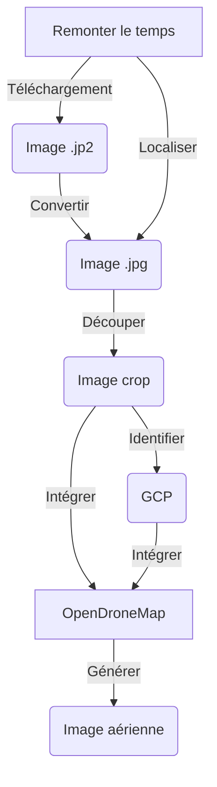

# Reconstitution d'images aériennes historiques

:calendar: Date de publication initiale : 13 janvier 2023

## Prérequis

- [OpenDroneMap](https://opendronemap.org/)
- bash
- [GDAL/OGR](https://gdal.org/) :hugging:
- [ImageMagick](https://imagemagick.org)
- [Exiftool](https://exiftool.org/)

## Intro

Il y a des projets que tu as en tête depuis des mois pour ne pas dire plus. Et puis un jour, c’est le bon moment, un créneau s’ouvre, tu t’engouffres dans la brèche happé par l’envie. Je vous propose donc de découvrir comment j’ai reconstitué des images aériennes historiques sur mon territoire à partir des imagettes disponibles sur le site : [Remonter le temps](https://remonterletemps.ign.fr) de l’IGN.

[Commenter cet article :fontawesome-solid-comments:](#__comments){: .md-button }
{: align=middle }

----

## Processus global

Voici un schéma récapitulatif de la procédure mise en place.



## Un environnement de travail : config.env

Avant de se lancer, il est bon de vous parler du fichier de configuration que vous devrez adapter à votre organisation et qui sera utilisé par la suite pour télécharger et traiter les images. On y définit le répertoire de travail et différentes variables nécessaires à la bonne éxécution des scripts.

Voici le fichier `config.env` à adapter :

```ini
# CLEF IGN
key='x7yv499pbcguxhhxh8syehwe'

# REPERTOIRE DE TRAVAIL
REPER='XXXXXXXX'

# BBOX
bbox='BBOX(the_geom,43.66882,4.12714,43.6801,4.1434)'

# URL MISSIONS
url="https://wxs.ign.fr/search/layers?request=GetFeature&version=1.1.0&typeName=ign:missions&propertyName=jp2,kml_layer_id,pv_date,title&CQL_FILTER=demat_layer_id%20like%20%27%25DEMAT.PVA\$GEOPORTAIL:DEMAT;PHOTOS%25%27%20and%20$bbox&outputFormat=application/json"

# ID MISSIONS
id_mission='XXXXXXXX'

# PARAMETRES OGR
ENCODAGE='UTF-8'
```

[Consulter le fichier de configuration :fontawesome-regular-file-code:](https://github.com/igeofr/remonterletemps2img/blob/main/config.env){: .md-button }
{: align=middle }

## Identifier les missions

### Depuis le site

Les images mises à disposition par l'IGN sur le site Remonter le temps peuvent être consultées par année de prise de vue ce qui dans les faits correspond plutôt aux différentes missions réalisées.

Pour trouver l'identifiant de la mission, il faut :

1. Se rendre dans la section `Télécharger` et renseigner une ville
2. Sélectionner une année et visualiser la localisation des images produites
3. Cliquer sur une image
4. En haut à droite, vous verrez `Identifiant de la mission` mais l'identifiant correspond plutôt aux caractères entre le `C` et le premier `_`. Exemple : `C2844-0561_1937_NP4_1302`, l'identifiant est `2844-0561`

### A travers un script

Si vous préférez une méthode plus automatique pour identifier toutes les missions qui ont été réalisées sur votre territoire, vous pouvez opter pour ce script qui permet après avoir paramétré son environnement de travail de télécharger un fichier `json` des missions et de le convertir au format `csv`.

```bash
#!/bin/bash

# LECTURE DU FICHIER DE CONFIGURATION
. './config.env'

# REPERTOIRE DE TRAVAIL
cd $REPER
echo $REPER

# AFFICHER L'URL
echo $url

# RECUPERER LA LISTE DES MISSIONS CONCERNEES PAR L'EMPRISE
curl "$url" -H 'Host: wxs.ign.fr' --compressed > './1_missions/missions.json'

# CONVERTIR LE FICHIER JSON EN CSV
ogr2ogr -f CSV './1_missions/missions.csv' './1_missions/missions.json'

# TRIER LES MISSIONS PAR DATE
(tail -n +2 './1_missions/missions.csv' | sort -t, -k2n | cat <(head -1 './1_missions/missions.csv') - ) > './1_missions/missions_sort.csv'

# SUPPRESSION DES FICHIERS TEMPORAIRES
rm './1_missions/missions.csv'
rm './1_missions/missions.json'
```

[Consulter le script :fontawesome-regular-file-code:](https://github.com/igeofr/remonterletemps2img/blob/main/1_missions.sh){: .md-button }
{: align=middle }

Voici ce que vous obtiendrez en sortie :

```csv
id,pv_date,kml_layer_id,title,jp2
missions.5575239,1926/01/01,CF0D-3081,1926_CAF_D-308_P_5000,"1"
missions.5555476,1927/01/01,CF0D-1455,1927_CAF_D-145_P_100,"1"
missions.5554558,1937/01/01,N37000911,1937_SGA-LUNEL_P_8000,"1"
missions.5554690,1937/01/01,N37000971,1937_SGA-LUNEL VILLAGE_P_5000,"1"
missions.5575959,1937/01/01,2844-0561,1937_NP4_P_20000,"1"
```

## Identifier, télécharger et mettre en forme les images d'une mission

{: .img-rdp-news-thumb }

On ne peut pas dire que l'IGN nous facilite la tâche sur l'identification et le téléchargement en lot d'images mais on finit toujours par trouver une alternative!

### Identifier les images

Pour identifier les images d'une mission, il faut télécharger un premier fichier `kml` qui sert de point de départ pour chercher une filiation et trouver des enfants, petits enfants et arrières petits enfants de `kml`. Je ne sais pas pour quelle raison l'IGN a procédé ainsi mais pour une mission, les informations sur les images (leur description et leur emprise) sont réparties dans différents fichiers `kml` qu'il faut parcourir.

```bash
# TELECHARGER LE FICHIER DE DEPART DE LA MISSION
curl "https://wxs.ign.fr/$key/dematkml/DEMAT.PVA/$id_mission/t.kml" > $folder_mission'/kml/'$id_mission'.kml'
```

Après avoir télécharger nos `X` fichiers `kml` et pour terminer, on va pouvoir les assembler pour recréer la mosaïque des prises de vue au format `shapefile` pour faciliter la visualisation dans QGIS.

[Consulter le script :fontawesome-regular-file-code:](https://github.com/igeofr/remonterletemps2img/blob/main/2_mission_kml.sh){: .md-button }
{: align=middle }

{: .img-center loading=lazy }

### Télécharger les images et les convertir

Maintenant que l'on a récupéré l'emprise et la liste de toutes les images de la mission, on va devoir :

1. faire encore quelques opérations d'extraction et de mise en forme qui vont nous servir à filtrer les images qui se trouvent dans une BBOX qui aura été préalablement définie dans le fichier de configuration `config.env`,
2. télécharger les images,
3. convertir les images en `jp2` vers `jpg` pour pouvoir les exploiter dans OpenDroneMap par la suite.

```bash
 while IFS="," read -r Name ; do
    echo ">>>>>>>" $Name
    echo "URL de téléchargement : https://wxs.ign.fr/$key/jp2/DEMAT.PVA/$id_mission/$Name.jp2"
    curl "https://wxs.ign.fr/$key/jp2/DEMAT.PVA/$id_mission/$Name.jp2" > $folder_mission'/img_jp2/'$Name'.jp2'
    gdal_translate -of JPEG $folder_mission'/img_jp2/'$Name'.jp2' $folder_mission'/img_jpg/'$Name'.jpg';
  done < <(cut -d "," -f${loc_col_a} -s $folder_mission'/csv_liste_img/liste_img.csv'| awk '{if (NR!=1) {print}}')
```

[Consulter le script :fontawesome-regular-file-code:](https://github.com/igeofr/remonterletemps2img/blob/main/3_mission_download_img.sh){: .md-button }
{: align=middle }

### Intégrer la localisation de l'image dans les données EXIF

{: .img-rdp-news-thumb }

Ensuite, on va calculer le centroïde de toutes celles qui se trouvent dans notre BBOX à partir de l'emprise des images et récupérer les informations sur la date de la prise de vue pour créer un fichier `.csv`. Toutes ces informations vont nous permettre de compléter les données [EXIF](https://fr.wikipedia.org/wiki/Exchangeable_image_file_format) des images.

```bash
# PERMET D'EXTRAIRE LE CENTROIDE ET LES INFORMATIONS DE L'IMAGE
ogr2ogr \
    -f CSV \
    $folder_mission'/csv_exif/list_exif.csv' \
    $folder_mission'/couverture_bbox/captures_join.shp' \
    -dialect sqlite \
    -sql "SELECT '"$folder_mission'/img_jpg/'"'||img||'"'.jpg'"' as SourceFile, y(Centroid(geometry)) as GPSLatitude, x(Centroid(geometry)) as GPSLongitude, replace(date,'-',':')||' 00:00:00' AS DateTimeOriginal FROM captures_join"
```

Après avoir généré le fichier des attributs nécessaires à `Exiftool`, il nous faut simplement lancer la commande permettant d'insérer les attributs dans chacune des images.

```bash
exiftool -csv=$folder_mission'/csv_exif/list_exif.csv' $folder_mission'/img_jpg' -Overwrite_Original -m
```

[Consulter le script :fontawesome-regular-file-code:](https://github.com/igeofr/remonterletemps2img/blob/main/3_mission_download_img.sh){: .md-button }
{: align=middle }

{: .img-center loading=lazy }

!!! info
    Cette étape n'est pas obligatoire puisque par la suite on va positionner des GCP mais les données EXIF sont toujours intéressantes car elles sont associées à l'image.

### Découper le cadre autour des images

{: .img-rdp-news-thumb }

Maintenant que toutes nos images ont été téléchargées, converties, et que leur localisation a été récupérée, il nous faut supprimer le cadre noir périphérique pour ne garder que la partie photographiée.

Pour ce faire, il est possible d'utiliser `ImageMagick` en définissant le nombre de pixels à enlever sur chacun des côtés :

```bash
# DECOUPER UNE IMAGE
# -crop left,top      -crop right,bottom
convert $folder_mission'/img_jpg/'$file'.jpg' -crop +350+1100 -crop -350-375 -colorspace sRGB -type truecolor $folder_mission'/img_jpg_crop/'$file'.jpg'
```

{: .img-center loading=lazy }

!!! info
    Avant de procéder au découpage des images, vous pouvez les faire pivoter en utilisant la commande : `convert $folder_mission'/img_jpg/'$file'.jpg' -rotate -180 $folder_mission'/img_jpg/'$file'.jpg'`

## Reconstituer une image aérienne

### Identifier des GCP

Nos images sont maintenant prêtes, il nous reste une étape manuelle mais néanmoins importante le positionnnement des points de calage entre les images qui permet ensuite à OpenDroneMap d'ajuster la reconstitution dans l'espace.

Dans notre cas comme il s'agit d'images aériennes anciennes, il n'est pas possible de faire le lien direct entre le terrain et l'image. On va donc s'appuyer un référentiel image existant pour positionner des GCP dans l'espace.

Pour ce faire dans WebODM (l'interface web d'OpenDroneMap)

<https://docs.opendronemap.org/gcp/>

{: .img-center loading=lazy }

### La reconstitution avec OpenDroneMap

{: .img-rdp-news-thumb }

#### Via WebODM

1. Créer un projet
2. Sélectionner les images et le fichier GCP
3. Choisir les Options de traitement :

{: .img-center loading=lazy }

#### Via ODM

1. Créer un répertoire de travail
2. Créer un sous répertoire correspondant au projet
3. Dans le répertoire du projet, créer un nouveau répertoire `images`

```
run --project-path C:\XXXXXX\ODM 1996 --fast-orthophoto --min-num-features 30000 --skip-3dmodel --feature-quality high --orthophoto-resolution 70 --skip-report --gcp "C:\XXXX\ODM\1996\images\gcp_list.txt"
```

## Le résultat

Aujourd'hui, j'ai pu recréer une petite dizaine d'images aériennes de 1937 à 1996 couvrant totalement ou partiellement certains secteurs du territoire.

[Consulter nos vues aériennes :fontawesome-solid-image:](https://sig.paysdelunel.fr/vmap/?mode_id=vmap&token=publictoken){: .md-button }
{: align=middle }

A noter qu'il peut persister des décalages par rapport aux images actuelles et pour les réduire, il serait intéressant d'ajouter des GCP et relancer OpenDroneMap.

----

## Conclusion

La méthode mise en place nous a permis à moindre coup et de manière autonome de régénérer des images aériennes anciennes en s'appuyant sur le patrimoine de l'IGN disponible sur le site [Remonter le temps](https://remonterletemps.ign.fr). Les scripts pourraient sans doute être améliorés mais en l'état ils répondent à nos besoins internes.

----

## Auteur {: data-search-exclude }

--8<-- "content/team/fbor.md"


