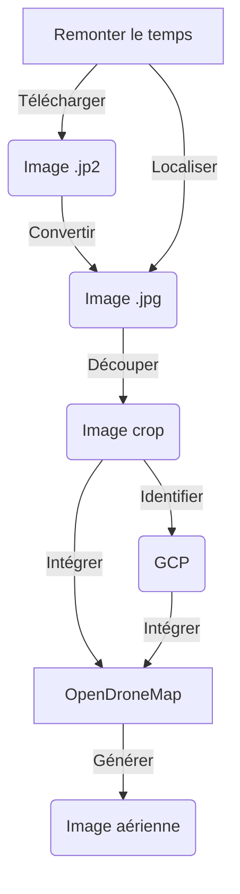

# Reconstitution d'images aériennes historiques

:calendar: Date de publication initiale : 22 mars 2023

## Prérequis

- [OpenDroneMap](https://opendronemap.org/)
- bash
- [GDAL/OGR](https://gdal.org/) :hugging:
- [ImageMagick](https://imagemagick.org)
- [Exiftool](https://exiftool.org/)

## Intro

{: .img-thumbnail-left }

Il y a des projets que tu as en tête depuis des mois pour ne pas dire plus. Et puis un jour, c’est le bon moment, un créneau s’ouvre, tu t’engouffres dans la brèche happé par l’envie. Je vous propose donc de découvrir comment j’ai reconstitué des images aériennes historiques sur mon territoire à partir des imagettes disponibles sur le site : [Remonter le temps](https://remonterletemps.ign.fr) de l’IGN.

[Commenter cet article :fontawesome-solid-comments:](#__comments "Aller aux commentaires"){: .md-button }
{: align=middle }

----

## Processus global

Voici un schéma récapitulatif de la procédure mise en place.



!!! info
    Les scripts présentés ci-après ont été testés sur Linux et MacOS.

## Un environnement de travail : config.env

Avant de se lancer, il est bon de vous parler du fichier de configuration que vous devrez adapter à votre organisation et qui sera utilisé par la suite pour télécharger et traiter les images. On y définit le répertoire de travail et différentes variables nécessaires à la bonne éxécution des scripts.

Voici le fichier `config.env` à adapter :

```ini title="Environnement de travail" linenums="1"
# CLEF IGN PUBLIQUE (VISIBLE DANS L'URL DE TELECHARGEMENT)
key='x7yv499pbcguxhhxh8syehwe'

# REPERTOIRE DE TRAVAIL
REPER='XXXXXXXX'

# BBOX OGR
# CETTE BBOX EST VOLONTAIREMENT RESTREINTE POUR CORRESPONDRE A L'EMPRISE AU TERRITOIRE
bbox_ogr='3.9744519949411927 43.5849775862067048 4.1945462811239604 43.8129227238279171'

# BBOX IGN
# CETTE BBOX EST VOLONTAIREMENT PLUS LARGE POUR CAPTER DES IMAGES EN BORDURE DE TERRITOIRE
bbox_ign='BBOX(the_geom,43.66882,4.12714,43.6801,4.1434)'

# URL MISSIONS
url="https://wxs.ign.fr/search/layers?request=GetFeature&version=1.1.0&typeName=ign:missions&propertyName=jp2,kml_layer_id,pv_date,title&CQL_FILTER=demat_layer_id%20like%20%27%25DEMAT.PVA\$GEOPORTAIL:DEMAT;PHOTOS%25%27%20and%20$bbox&outputFormat=application/json"

# ID MISSIONS
id_mission='XXXXXXXX'

# PARAMETRES OGR
ENCODAGE='UTF-8'
```

[Consulter le fichier de configuration :fontawesome-regular-file-code:](https://github.com/igeofr/remonterletemps2img/blob/main/config.env){: .md-button }
{: align=middle }

## Identifier les missions

### Depuis le site

{: .img-thumbnail-left }

Les images mises à disposition par l'IGN sur le site [Remonter le temps](https://remonterletemps.ign.fr) peuvent être consultées par année de prises de vue, ce qui dans les faits, correspond plutôt aux différentes missions réalisées.

Pour trouver l'identifiant de la mission, il faut :

1. Se rendre dans la section `Télécharger` et renseigner une ville,
2. Sélectionner une année et visualiser la localisation des images produites,
3. Cliquer sur une image,
4. En haut à droite, vous verrez `Identifiant de la mission` mais l'identifiant correspond plutôt aux caractères entre le `C` et le premier `_`. Exemple : `C2844-0561_1937_NP4_1302`, l'identifiant est `2844-0561`.

{: .img-center loading=lazy }

### À travers un script

Si vous préférez une méthode plus automatique pour identifier toutes les missions qui ont été réalisées sur votre territoire, vous pouvez opter pour ce script qui permet après avoir paramétré son environnement de travail de télécharger un fichier `json` des missions et de le convertir au format `csv`.

```bash title="Listing des missions" linenums="1"
#!/usr/bin/env bash

# LECTURE DU FICHIER DE CONFIGURATION
. './config.env'

# REPERTOIRE DE TRAVAIL
cd $REPER
echo $REPER

# AFFICHER L'URL
echo $url

# RECUPERER LA LISTE DES MISSIONS CONCERNEES PAR L'EMPRISE
curl "$url" -H 'Host: wxs.ign.fr' --compressed > './1_missions/missions.json'

# CONVERTIR LE FICHIER JSON EN CSV
ogr2ogr -f CSV './1_missions/missions.csv' './1_missions/missions.json'

# TRIER LES MISSIONS PAR DATE
(tail -n +2 './1_missions/missions.csv' | sort -t, -k2n | cat <(head -1 './1_missions/missions.csv') - ) > './1_missions/missions_sort.csv'

# SUPPRESSION DES FICHIERS TEMPORAIRES
rm './1_missions/missions.csv'
rm './1_missions/missions.json'
```

[Consulter le script :fontawesome-regular-file-code:](https://github.com/igeofr/remonterletemps2img/blob/main/1_missions.sh){: .md-button }
{: align=middle }

Voici ce que vous obtiendrez en sortie :

```csv title="Exemple" linenums="1"
id,pv_date,kml_layer_id,title,jp2
missions.5575239,1926/01/01,CF0D-3081,1926_CAF_D-308_P_5000,"1"
missions.5555476,1927/01/01,CF0D-1455,1927_CAF_D-145_P_100,"1"
missions.5554558,1937/01/01,N37000911,1937_SGA-LUNEL_P_8000,"1"
missions.5554690,1937/01/01,N37000971,1937_SGA-LUNEL VILLAGE_P_5000,"1"
missions.5575959,1937/01/01,2844-0561,1937_NP4_P_20000,"1"
```

L'identifiant des missions correspond à la colonne `kml_layer_id`.

## Identifier, télécharger et mettre en forme les images d'une mission

{: .img-thumbnail-left }

On ne peut pas dire que l'IGN nous facilite la tâche sur l'identification et le téléchargement en lot d'images mais on finit toujours par trouver une alternative.

### Identifier les images

Pour identifier les images d'une mission, il faut télécharger un premier fichier `kml` qui sert de point de départ pour chercher une filiation et trouver des enfants, petits enfants et arrières petits enfants de `kml`. Je ne sais pas pour quelle raison l'IGN a procédé ainsi mais pour une mission, les informations sur les images (leur description et leur emprise) sont réparties dans différents fichiers `kml` qu'il faut parcourir.

```bash title="Télécharger le fichier kml de départ" linenums="1"
# EXTRAIT - CONSULTER LE SCRIPT COMPLET POUR PLUS DE DÉTAILS
# TÉLÉCHARGER LE FICHIER DE DÉPART DE LA MISSION
curl "https://wxs.ign.fr/$key/dematkml/DEMAT.PVA/$id_mission/t.kml" > $folder_mission'/kml/'$id_mission'.kml'
```

[Consulter le script complet :fontawesome-regular-file-code:](https://github.com/igeofr/remonterletemps2img/blob/main/2_mission_kml.sh){: .md-button }
{: align=middle }

Après avoir téléchargé nos `X` fichiers `kml`, on va pouvoir les assembler pour visualiser le tuilage des prises de vue au format `shapefile` afin de faciliter la visualisation dans ArqGIS.

{: .img-center loading=lazy }

### Télécharger les images et les convertir

Maintenant que l'on a récupéré l'emprise et la liste de toutes les images de la mission, on va devoir :

1. faire quelques opérations d'extraction et de mise en forme qui vont nous servir à filtrer les images qui se trouvent dans une BBOX qui aura été préalablement définie dans le fichier de configuration `config.env` (étapes avant le `curl` dans le code complet),
2. télécharger les images,
3. convertir les images en `jp2` vers `jpg` pour pouvoir les exploiter dans OpenDroneMap par la suite.

```bash title="Télécharger les images" linenums="1"
 while IFS="," read -r Name ; do
    echo ">>>>>>>" $Name
    echo "URL de téléchargement : https://wxs.ign.fr/$key/jp2/DEMAT.PVA/$id_mission/$Name.jp2"
    curl "https://wxs.ign.fr/$key/jp2/DEMAT.PVA/$id_mission/$Name.jp2" > $folder_mission'/img_jp2/'$Name'.jp2'
    gdal_translate -of JPEG $folder_mission'/img_jp2/'$Name'.jp2' $folder_mission'/img_jpg/'$Name'.jpg';
  done < <(cut -d "," -f${loc_col_a} -s $folder_mission'/csv_liste_img/liste_img.csv'| awk '{if (NR!=1) {print}}')
```

[Consulter le script complet :fontawesome-regular-file-code:](https://github.com/igeofr/remonterletemps2img/blob/main/3_mission_download_img.sh){: .md-button }
{: align=middle }

### Intégrer la localisation de l'image dans les données EXIF

{: .img-thumbnail-left }

Ensuite à partir de l'emprise des images contenue dans les fichiers `kml`, on va calculer le centroïde de toutes celles qui se trouvent dans notre BBOX et récupérer les informations sur la date de la prise de vue afin de créer un fichier `.csv`. Toutes ces informations vont nous permettre de compléter les données [EXIF](https://fr.wikipedia.org/wiki/Exchangeable_image_file_format) des images.

```bash title="Accès au centroïde et aux informations de l'image" linenums="1"
# PERMET D'EXTRAIRE LE CENTROIDE ET LES INFORMATIONS DE L'IMAGE
ogr2ogr \
    -f CSV \
    $folder_mission'/csv_exif/list_exif.csv' \
    $folder_mission'/couverture_bbox/captures_join.shp' \
    -dialect sqlite \
    -sql "SELECT '"$folder_mission'/img_jpg/'"'||img||'"'.jpg'"' as SourceFile, y(Centroid(geometry)) as GPSLatitude, x(Centroid(geometry)) as GPSLongitude, replace(date,'-',':')||' 00:00:00' AS DateTimeOriginal FROM captures_join"
```

Après avoir généré le fichier des attributs nécessaires à `Exiftool`, il nous faut simplement lancer la commande permettant d'insérer les attributs dans chacune des images.

```bash title="Modification de l'exif" linenums="1"
exiftool -csv=$folder_mission'/csv_exif/list_exif.csv' $folder_mission'/img_jpg' -Overwrite_Original -m
```

[Consulter le script :fontawesome-regular-file-code:](https://github.com/igeofr/remonterletemps2img/blob/main/3_mission_download_img.sh){: .md-button }
{: align=middle }

{: .img-center loading=lazy }

!!! info
    Cette étape n'est pas obligatoire puisque par la suite on va positionner des GCP mais les données EXIF sont toujours intéressantes car elles sont associées à l'image.

### Découper le cadre autour des images

{: .img-thumbnail-left }

Maintenant que toutes nos images ont été téléchargées, converties, et que leur localisation a été récupérée, il nous faut supprimer le cadre noir périphérique pour ne garder que la partie photographiée.

Pour ce faire, il est possible d'utiliser `ImageMagick` en définissant le nombre de pixels à enlever sur chacun des côtés :

```bash  title="Découper une image" linenums="1"
# DECOUPER UNE IMAGE
# -crop left,top      -crop right,bottom
convert $folder_mission'/img_jpg/'$file'.jpg' -crop +350+1100 -crop -350-375 -colorspace sRGB -type truecolor $folder_mission'/img_jpg_crop/'$file'.jpg'
```

{: .img-center loading=lazy }

!!! info
    Avant de procéder au découpage des images, vous pouvez les faire pivoter en utilisant la commande : `convert $folder_mission'/img_jpg/'$file'.jpg' -rotate -180 $folder_mission'/img_jpg/'$file'.jpg'`

## Reconstituer une image aérienne

{: .img-thumbnail-left }

Pour reconstituer une image aérienne historique, j'utilise l'application [WebODM (l'interface web d'OpenDroneMap) installée via Docker sur un serveur Linux](https://docs.opendronemap.org/fr/installation/#linux) que m'a mis à dispostion mon service informatique.

Les spécifications minimums pour couvrir mon territoire : 64Go de Ram et 128Go de stockage.

### Identifier des GCP

{: .img-thumbnail-left }

Nos images sont maintenant prêtes, il nous reste une étape manuelle importante : le positionnnement des points de calage qui permettent à OpenDroneMap d'ajuster la reconstitution dans l'espace.

Dans notre cas comme il s'agit d'images aériennes anciennes, il n'est pas possible de faire le lien direct entre le terrain et l'image. On va donc s'appuyer sur un référentiel d'images existant pour positionner des GCP dans l'espace.

Pour ce faire, je recommande d'utiliser WebODM et le plugin intégré `Ground Control Point Interface` qui est pleinement compatible avec les [spécifications d'OpenDroneMap](https://docs.opendronemap.org/gcp/). Quand vous lancez WebODM sur votre navigateur, vous avez l'onglet `Interface GCP` sur la droite.

{: .img-center loading=lazy }

1. charger toutes vos images
2. sélectionner une image en cliquant dessus
3. à droite, sélectionner le fond `Satellite` et zoomer sur le secteur de vos prises de vues
4. positionner un GCP sur votre image ancienne et sur le fond image de droite en utilisant le symbole `+`
5. répéter l'opération pour toutes vos images historiques

Plusieurs recommandations sur la saisie des GCP :

- un GCP sur l'image historique est déclaré valide lorsqu'il est associé à l'image de référence et qu'il apparait en vert
- une fois un GCP saisi l'image de référence (à droite), il faut essayer de l'associer à plusieurs images historiques (au moins 3)
- positionner au moins 5 GCP par images bien répartis

<iframe width="100%" height="415" src="https://www.youtube-nocookie.com/embed/5CEiyAn2J2s" title="YouTube video player" frameborder="0" allow="accelerometer; autoplay; clipboard-write; encrypted-media; gyroscope; picture-in-picture; web-share" allowfullscreen></iframe>

Une fois la saisie terminée, ce qui peut prendre du temps en fonction du nombre d'images, il vous faut exporter le fichier (en haut à droite) et le renommer `gcp_list.txt` ([le nom du fichier est normé](https://docs.opendronemap.org/gcp/)) et le placer dans le répertoire de vos images.

### La reconstitution avec OpenDroneMap

Pour la partie reconstitution d'image et en fonction de vos envies, il est possible d'utiliser [WebODM](https://github.com/OpenDroneMap/WebODM) ou [ODM en ligne de commande](https://github.com/OpenDroneMap/ODM).

#### Via WebODM

WebODM a l'avantage de proposer une interface qui guide relativement bien l'utilisateur et qui permet de visualiser les données générées une fois le processus de recontruction terminé.

Les étapes à suivre :

1. Créer un projet
2. Sélectionner les images et le fichier GCP
3. Choisir les options de traitement
4. Valider les spécifications
5. Lancer le traitement
6. Surveiller les logs et patienter le temps du traitement.

Mes options de traitement à adapter en fonction des images :

- `min-num-features: 30000` : Nombre de points de correspondances entre les images,
- `orthophoto-resolution: 50` : Resolution minimale de l'image en sortie,
- `skip-3dmodel: true` : Ne pas générer le modèle 3D complet.

{: .img-center loading=lazy }

À la fin du traitement, vous allez pouvoir visualiser les données et télécharger les différentes ressources.

{: .img-center loading=lazy }

#### Via ODM

Pour les fans de la ligne de commande sur Windows, vous pouvez utiliser le package ODM ([disponible sur Github pour les dernières Release](https://github.com/OpenDroneMap/ODM/releases)) en suivant les étapes suivantes :

1. Créer un répertoire de travail : `C:\XXXXXX\ODM`
2. Créer un sous répertoire correspondant au projet : `YY_PROJET_YY`
3. Dans le répertoire du projet, créer un nouveau répertoire `images` qui contiendra les images et le fichier GCP
4. Adapter et lancer la commande :

```bash title="Commande ODM pour la reconstitution" linenums="1"
run --project-path C:\XXXXXX\ODM YY_PROJET_YY --min-num-features 30000 --skip-3dmodel --feature-quality high --orthophoto-resolution 50 --gcp "C:\XXXX\ODM\YY_PROJET_YY\images\gcp_list.txt"
```

## Le résultat

Aujourd'hui, j'ai pu recréer une petite dizaine d'images aériennes de 1937 à 1996 couvrant totalement ou partiellement certains secteurs du territoire.

[Consulter nos vues aériennes :fontawesome-solid-image:](https://sig.paysdelunel.fr/vmap/?mode_id=vmap&token=publictoken){: .md-button }
{: align=middle }

A noter qu'il peut persister des décalages par rapport aux images actuelles et pour les réduire, il me faut simplement ajouter des GCP et relancer OpenDroneMap.

Pour vous donner un ordre d'idée, pour générer l'image complète ci-dessous à 60cm de résolution sur 160km² il a fallu environ 3h de traitement et 45 images en entrée.

{: .img-center loading=lazy }

----

## Conclusion

La méthode mise en place nous a permis à moindre coup et de manière autonome de régénérer des images aériennes anciennes en s'appuyant sur le patrimoine de l'IGN disponible sur le site [Remonter le temps](https://remonterletemps.ign.fr). Il y a sans doute des améliorations à faire sur les scripts proposés ici, sentez-vous libre de soumettre vos propositions via [Github](https://github.com/igeofr/remonterletemps2img).

----

<!-- geotribu:authors-block -->
