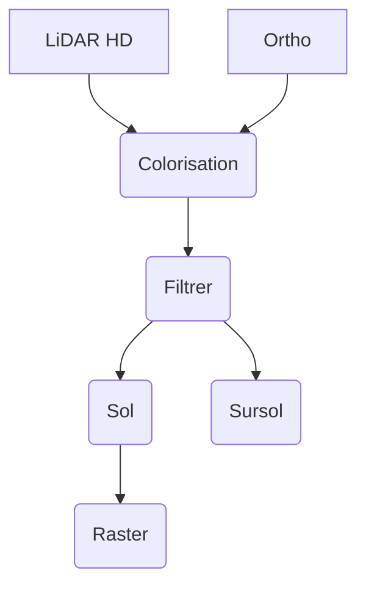

# LiDAR HD (Expérimentation) - Distinguer sol et sursol avec pdal

:calendar: Date de publication initiale : 18 avril 2023

## Prérequis

- [PDAL](https://pdal.io/)
- bash
- [GDAL/OGR](https://gdal.org/) :hugging:

## Intro

{: .img-rdp-news-thumb }

A ce jour le programme [LiDAR HD](https://geoservices.ign.fr/lidarhd) a permis de fournir des données d'une très grande précision sur une partie du territoire mais en attendant la production des données classifiées (des échantillons de test sont disponibles) seul les données "brutes" sont disponibles. Je vous propose donc un retour d'expérience sur la distinction du sol et du sursol à l'aide de PDAL.

[Commenter cet article :fontawesome-solid-comments:](#__comments){: .md-button }
{: align=middle }

----

## Processus global

Voici un schéma récapitulatif de la procédure mise en place.



## Un environnement de travail : config.env

Avant de se lancer, il est bon de vous parler du fichier de configuration que vous devrez adapter à votre organisation et qui sera utilisé par la suite pour télécharger et traiter les images. On y définit le répertoire de travail et différentes variables nécessaires à la bonne éxécution des scripts.

Voici le fichier `config.env` à adapter :

```ini
# REPERTOIRE DE TRAVAIL
REPER='/home/....'

# REPERTOIRE DE STOCKAGE DES LOGS
REPER_LOGS='logs'

# REPERTOIRE D ENTREE
REPER_IN='data_in'

# REPERTOIRE TEMPORAIRE
REPER_TMP='data_tmp'

# REPERTOIRE DE SORTIE
REPER_OUT='data_out'

# PARAMETRES OGR
ENCODAGE='UTF-8'
```

[Consulter le fichier de configuration :fontawesome-regular-file-code:](https://github.com/igeofr/lidarhd_pdal/blob/main/config.env){: .md-button }
{: align=middle }

## Un script pour orchestrer les différentes étapes

[Consulter le fichier :fontawesome-regular-file-code:](https://github.com/igeofr/lidarhd_pdal/blob/main/LIDAR.sh){: .md-button }
{: align=middle }

### Colorisation des images

```json
{
  "pipeline":[
    "input.laz",
      {
        "type":"filters.colorization",
        "raster":"ortho.jp2"
      },
      "output.laz"
  ]
}
```

[Consulter le fichier :fontawesome-regular-file-code:](https://github.com/igeofr/lidarhd_pdal/blob/main/1_colorize.json){: .md-button }
{: align=middle }

### Distinguer le sol et le sursol

#### Identifier les bâtiments

```json
{
  "pipeline":[
  "input.laz",
    {
      "type":"filters.assign",
      "assignment":"Classification[:]=0"
    },
    {
        "type":"filters.overlay",
        "dimension":"Classification",
        "datasource":"batiments_classif.shp",
        "layer":"batiments_classif",
        "column":"classif"
    },
    "output.laz"
  ]
}
```

[Consulter le fichier :fontawesome-regular-file-code:](https://github.com/igeofr/lidarhd_pdal/blob/main/2_pipeline.json){: .md-button }
{: align=middle }

#### Identifier le sol

```json
{
  "pipeline":[
    "input.laz",
    {
        "type":"filters.range",
        "limits":"Classification![7:7]"
    },
    {
        "type":"filters.smrf",
        "returns":"only",
        "cell":1,
        "slope":0.15,
        "scalar":1.2,
        "threshold":0.2,
        "window":22.0,
        "ignore":"Classification[7:7]"
    },
    {
        "type":"filters.range",
        "limits":"Classification[2:2]"
    },
    "output.laz"
  ]
}
```

[Consulter le fichier :fontawesome-regular-file-code:](https://github.com/igeofr/lidarhd_pdal/blob/main/3_ground.json){: .md-button }
{: align=middle }

#### Identifier le sursol

```json
{
  "pipeline":[
    "input.laz",
    {
        "type":"filters.assign",
        "assignment":"Classification[7:7]=6"
    },
    {
        "type":"filters.smrf",
        "cell":1,
        "slope":0.15,
        "scalar":1.2,
        "threshold":0.45,
        "window":22.0,
        "ignore":"Classification[6:6]"
    },
    {
      "type":"filters.range",
      "limits":"Classification![2:2]"
    },
    {
        "type":"filters.assign",
        "assignment":"Classification[0:1]=1"
    },
    "output.laz"
  ]
}
```

[Consulter le fichier :fontawesome-regular-file-code:](https://github.com/igeofr/lidarhd_pdal/blob/main/4_non_ground.json){: .md-button }
{: align=middle }

#### Fusionner les dalles

```json
{
  "pipeline":[
        {
            "tag" : "las1",
            "type" : "readers.las"
        },
        {
            "tag" : "las2",
            "type" : "readers.las"
        }
        ,
        {
            "tag" : "las3",
            "type" : "readers.las"
        }
        ,
        {
            "tag" : "las4",
            "type" : "readers.las"
        },
        {
            "type" : "filters.merge"
        },
        "placeholder.laz"
  ]
}
```

[Consulter le fichier :fontawesome-regular-file-code:](https://github.com/igeofr/lidarhd_pdal/blob/main/5_merge.json){: .md-button }
{: align=middle }

#### Créer un rasteur du sol ou du sursol

```json
{
  "pipeline":[
    "input.laz",
      {
        "gdaldriver":"GTiff",
        "output_type":"mean",
        "resolution":"1",
        "type": "writers.gdal",
        "filename":"output.tif"
        }
  ]
}
```

[Consulter le fichier :fontawesome-regular-file-code:](https://github.com/igeofr/lidarhd_pdal/blob/main/6_ground_raster.json){: .md-button }
{: align=middle }

----

## Conclusion

----

## Auteur {: data-search-exclude }

--8<-- "content/team/fbor.md"
