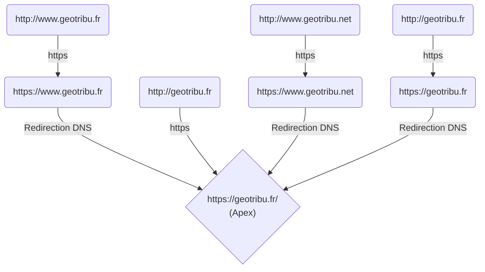

# Changement d'URL du site Geotribu cet été

:calendar: Date de publication initiale : 5 mai 2023

{: .img-rdp-news-thumb loading=lazy }

Voilà 3 ans que Geotribu est de retour après une [coupure de service de... 3 ans](/articles/2020/2020-08-31_geotribu_histoire/).  

3 ans que ce nouveau site est en place.  
3 ans à en améliorer l'ergonomie, les fonctionnalités et surtout à réintégrer et nettoyer les anciens contenus.  
3 ans qu'il est accessible sur <https://geotribu.fr>

Il est temps de rebasculer le site sur l'adresse principale.

Après les sondages sur [Mastodon](https://mapstodon.space/@geotribu/110270184196372019) et [Twitter](https://twitter.com/geotribu/status/1651526470991245312), la nouvelle URL sera donc :

```url
https://geotribu.fr/
```

----

## Toutes ces routes mènent au site Geotribu

On parle bien ici de l'URL principale, celle de référence notamment pour les moteurs d'indexation et qui s'affiche dans la barre de votre navigateur web.
Mais différentes adresses mènent (ou mèneront) à cette URL :



Sans oublier le site miroir sur un autre serveur, quand les services de GitHub toussotent : <https://www2.geotribu.fr/>.

----

## Date effective du changement

Le changement sera effectif **aux alentours du 1er août**. Rien de mieux qu'une canicule et qu'un désert de consultation pour tout péter !

### Check-list pour que tout se passe bien

- [ ] mettre à jour son lecteur RSS avec la nouvelle adresse :
    - les nouveaux contenus : <https://geotribu.fr/feed_rss_created.xml>
    - les contenus mis à jour : <https://geotribu.fr/feed_rss_updated.xml>
- [ ] mettre à jour ses favoris (ou marque-pages) de navigateur

Merci de nous lire !

----

--8<-- "content/toc_nav_ignored/snippets/authors/geotribu.md"
