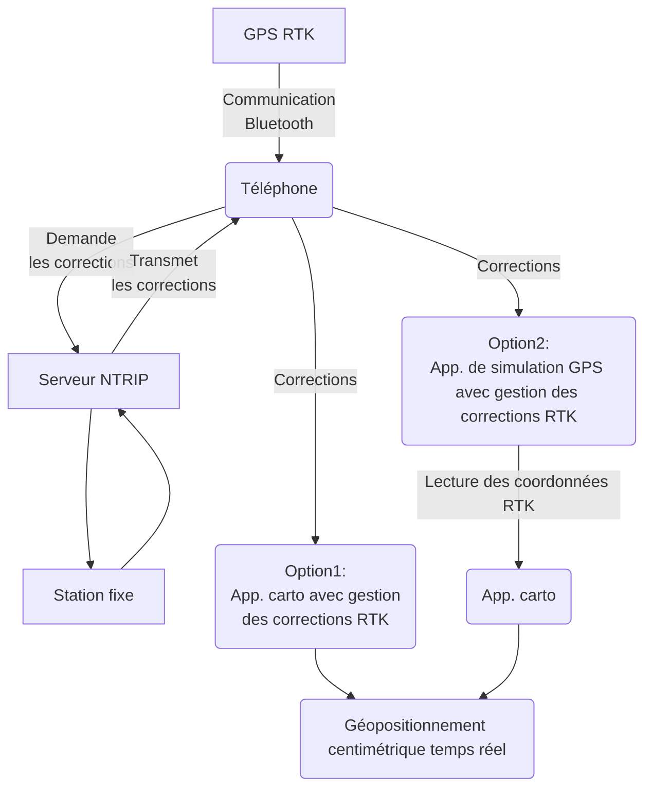

# Tutoriel : monter un kit de géolocalisation à haute précision (mobile/rover RTK)

:calendar: Date de publication initiale : 9 septembre 2023

## Contexte : Le RTK quésaco ?

> **La cinématique temps réel (Real Time Kinematic, en anglais ou RTK) est une technique de positionnement par satellite** basée sur l'utilisation de mesures de la phase des ondes porteuses des signaux émis par les systèmes GPS, GLONASS ou Galileo. Une station de référence fournit des corrections en temps réel permettant d'atteindre une précision de l'ordre du centimètre. [...]

Elle se distingue des méthodes suivantes moins précises mais adaptées à d'autres usages et notamment la navigation :

- GNSS :  Global Navigation Satellite System, la précision est de l’ordre de 5 m.
- DGNSS : Differential GNSS, la précision est de l’ordre de 50 cm .

{: .img-center loading=lazy }

> [...] Les systèmes RTK utilisent un récepteur fixe (station de base dont la position est connue précisément) et un certain nombre de récepteurs mobiles (aussi appelés rover[^1]). La station de base compare la position calculée à partir du signal GPS et la position réelle, puis réémet les corrections à apporter vers les récepteurs mobiles. Cela permet aux unités mobiles de calculer leur position relative avec une précision de quelques millimètres, bien que leur position absolue soit aussi précise que la position de la station de base. La précision nominale typique pour ces systèmes est de 1 cm horizontalement et 2 cm verticalement. [...]

Extraits [Wikipédia](https://fr.wikipedia.org/wiki/Cinématique_temps_réel)

L'utilisation du RTK est une technique parfaitement adaptée à des applications telles que le guidage de précision (travaux publics, agriculture) ou encore la topographie.

----

## Introduction

{: .img-thumbnail-left }

Ce tutoriel présente un kit de géolocalisation permettant de créer un mobile RTK (ou rover[^1]) à coût limité. Il est également expliqué comment le configurer avec un smartphone fonctionnant avec Android.

Il s'agit d'une alternative au [projet de création de rover initié par l'INRAE et ses contributeurs](https://docs.centipede.fr/docs/make_rover/), sans avoir à faire de soudure, et sans production de pièces sur mesure, juste à brancher.

:warning: Je n'ai pas de préférence pour tel ou tel produit / marque / revendeur et j'ignore la fiabilité des solutions matérielles ou logicielles choisies. Cet article a simplement pour but de partager une démarche et eventuellement d'alimenter la réflexion collective sur le sujet.

[Commenter cet article :fontawesome-solid-comments:](#__comments "Aller aux commentaires"){: .md-button }
{: align=middle }

----

## Le matériel

Pour une configuration "standard" :

1. Smartphone fonctionnant sous Android avec un forfait Internet qui permet de télécharger un volume de données (3G/4G/5G).
1. [Kit préconfiguré comprenant le Récepteur RTK ZED F9P avec Bluetooth d'Ardusimple et l'antenne u-blox ANN-MB-00](https://www.ardusimple.com/product/simplertk2blite-bt-case-kit/). Le kit est prêt à l'emploi, les composants (GPS, Bluetooth,...) ont été packagés pour fonctionner ensemble et faciliter leur utilisation.
1. [Batterie externe de 5000 mAh 1 USB-A](https://fr.shopping.rakuten.com/offer/buy/8745966944/batterie-de-secours-5000-mah-1-usb-a-max-series-noire-bleue.html?fbbaid=10776957204&t=180177&gclid=EAIaIQobChMIwPSJ37Tv_wIV1pJoCR2QkAP6EAQYAyABEgKZ5fD_BwE), type recharge pour smartphone, pas trop encombrante pour une alimentation dédiée du récepteur.
1. [Interrupteur](https://m.fr.aliexpress.com/item/1005004055554570.html?pdp_npi=2%40dis%21EUR%215%2C28%E2%82%AC%213%2C59%E2%82%AC%21%21%21%21%21%40211b612816882797560523189ea16c%2112000027880087678%21btf&_t=pvid%3A00fec2bb-2b37-44a1-9765-1ec9059854d9&afTraceInfo=1005004055554570__msite__c_ppc_item_bridge__xxxxxx__1688279756&spm=a2g0n.ppclist.product.0&gatewayAdapt=gloPc2fraMsite) USB avec diode qui a pour but de permettre l'allumage ou l'extinction du kit.
1. [Canne](https://m.fr.aliexpress.com/item/1005004495311018.html?spm=a2g0n.productlist.0.0.60dd6d69RZXJqt&browser_id=16a1a524c6bc47239b3a0e6ec13b3b69&aff_platform=msite&m_page_id=ktanhewysycavbsl18914796bd4b1eeb581d8baa08&gclid=&pdp_npi=3%40dis%21EUR%2135.35%2126.87%21%21%21%21%21%402100bbf516882656491165512d0745%2112000029359608806%21sea%21FR%210&isseo=y&algo_pvid=fccc553b-4c66-483a-80d1-02e03b135c41) télescopique ou à assembler qui permet de prendre un point au sol de manière plus précise.
1. [Platine](https://www.sparkfun.com/products/17519) servant de plan de masse et de support pour l'antenne aimantée.
1. [Réducteur](https://www.amazon.fr/dp/B07QGZHY9Q/ref=sspa_mw_detail_0?ie=UTF8&psc=1&sp_csd=d2lkZ2V0TmFtZT1zcF9waG9uZV9kZXRhaWwp13NParams&th=1) 5/8-20 à 1/4-11 pour pouvoir visser la platine sur la canne.

{: .img-center loading=lazy }

!!! info "Configuration minimale"
    Une configuration "minimale" est possible en faisant l'impasse sur les trois derniers éléments : canne, platine et réducteur.

!!! info "Configuration légère"
    Pour une utilisation plus nomade et légère, une [antenne courte ( hélicoïdale)](https://www.ardusimple.com/product/helical-antenna/) permettra un gain de place. L'antenne se fixant directement au récepteur sans câble. Dans ce cas, la platine, le réducteur et la canne ne sont plus nécessaires.

!!! info "Configuration luxe"
    Pour l'arpentage, l'acquisition d'une [antenne survey](https://www.ardusimple.com/product/survey-gnss-multiband-antenna/) permettra de fiabiliser l'acquisition de données notamment dans des conditions plus difficile de réception. Dans ce cas, la platine et le réducteur ne sont plus nécessaires.

## Le coût global

Pour l'ensemble de la configuration minimale, en juin 2023, la dépense est inférieure à 400€ TTC frais de port inclus.  
Si on ajoute le matériel pour créer une "canne d'arpentage", toujours 400€ en allant chercher les pièces à pied... ou 450€ frais de port compris.

## Les grandes étapes

1. Assembler,
1. brancher le matériel,
1. mettre sous tension,
1. activer le Bluetooth sur le smartphone,
1. associer le récepteur à votre smartphone.

----

## Utilisation du GPS RTK : Deux principes pour gérer les corrections de géopositionnement en temps réel

Pour exploiter les corrections de géopositionnement, 2 options sont envisageables.



### Option 1 avec interface native de gestion des corrections : utilisation de SW Maps

{: .img-thumbnail-left }

[SW Maps](https://play.google.com/store/apps/details?id=np.com.softwel.swmaps) (gratuit) ou Map-it ( add-on NTRIP payant) présente l'avantage d'être gratuite et de gérer les corrections en temps réel du serveur NTRIP.

!!! info "NTRIP"
    Un serveur NTRIP est un serveur qui permet d'accéder aux données de correction à apporter aux récepteurs mobiles.

1. Ajout du fichier [RAF20](https://www-iuem.univ-brest.fr/pops/attachments/2512) dans le smartphone, dans le répertoire :

    ```txt
    Stockage du téléphone/Android/media/np.com.softwel.swmaps/geoids
    ```

    :information_source: [Le fichier RAF20 est une grille de conversion altimétrique](https://geodesie.ign.fr/index.php?page=grilles) qui permet de convertir les hauteurs ellipsoïdales en altitudes pour la France continentale.

1. Installer et démarrer SW Maps
1. Sélectionner du fichier `raf20.gtx` dans `Settings/Geoids`.
1. Mesurer au préalable la hauteur de l'ensemble matériel : hauteur de canne + réducteur + platine + [décalage](https://portal.u-blox.com/s/question/0D52p00009AYzYjCAL/difference-between-cfgtmodeecefz-and-cfgtmodeecefzhp) ARP de [l'antenne](https://www.u-blox.com/sites/default/files/documents/ANN-MB_DataSheet_UBX-18049862.pdf)
1. Renseigner la hauteur d'antenne.
1. Connecter le récepteur à l'application.
1. Sélectionner votre équipement de géolocalisation dans la liste des appareils Bluetooth disponibles. Ex: GNSS-RTK.
1. Se connecter à un réseau de correction NTRIP : [voir plus bas](#ntrip-connexion-a-un-reseau-de-correction).

### Option 2 avec application tierce et utilisation de la localisation simulée

Pour ce deuxième point nous allons vous présenter l'utilisation d'applications de saisie ou de consultation ne prenant pas en charge les corrections en temps réel ([Qfield](https://qfield.org/), [Locus](https://www.locusgis.com/), Map-it sans l'add-on, navigateur web...). Dans ce cas, on utilise une application qui va gérer uniquement les corrections NTRIP sans interface cartographique ainsi que la configuration d'Android pour utiliser le GPS externe avec la correction en temps réel.

L'idéal est de disposer d'une version d'Android relativement récente.

1. Installer une application de géolocalisation prenant en charge les corrections NTRIP. Par exemple : [Lefebure NTRIP client](https://play.google.com/store/apps/details?id=com.lefebure.ntripclient). À noter que SW Maps est également capable de gérer la localisation simulée.
1. Activer la consommation de données en [arrière-plan](https://www.ardusimple.com/question/rtk-fix-location-obtained-in-lefebure-ntrip-client-mock-app-disconnects-when-switching-over-to-mapit-gis-app/) de l'application qui va produire l'information de localisation (NTRIP client, SW Maps). Ceci afin de ne pas avoir le flux de géolocalisation coupé lorsque vous allez basculer sur votre application de saisie ou de consultation.
1. Activer le mode développeur de votre smartphone. Pour cela, il faut rechercher sur Internet comment activer le mode développeur pour le modèle de votre appareil. En effet, il peut y avoir quelques différences entre modèles. Généralement, cela consiste simplement en un appui répété (~ 7 fois) sur un item numéro de build ou de version situé dans les paramètres du téléphone que l'on trouve :
    - Avec Android 10 sans surcouche fabricant : `Paramètres` > `A propos du téléphone` > `Numéro de build`
    - Avec Android 11 avec surcouche Color OS 11 : `Paramètres` > `A propos du téléphone` > `Version` > `Numéro de version`

    :information_source: Le mode développeur permet d'accéder à certains paramètres avancés généralement dissimulés sur la plupart des appareils mobiles car plutôt orientés pour les développeurs. Il n'y a pas de risque particulier à activer ce mode.

1. Activer la position simulée : l'intitulé est variable selon la version d'Android (Sélectionner l'application de positon fictive ou encore `Enable Mock location`) dans le menu `Options développeurs` ( `Paramètres` > `Paramètres avancés` > `Systeme sous Android 10` ) et choisir l'application que vous allez utiliser pour gérer le geo-positionnement corrigé (NTRIP client, Swmaps...).

    {: .img-center loading=lazy }

1. Mettre en route le GPS de votre smartphone.
1. Dans les options de contrôle de positionnement d'Android, désactiver la recherche wifi et la recherche Bluetooth.

    {: .img-center loading=lazy }

1. Désactiver `Améliorer la précision de la localisation` dans l'item `Précision de la localisation de Google`.
1. Connexion du récepteur à l'application : sélection de votre équipement de géolocalisation dans la liste des appareils Bluetooth disponibles. Ex: GNSS-RTK.
1. Mettre en route votre application de gestion des corrections NTRIP.
1. Connecter votre récepteur GPS Bluetooth à l'application de gestion des corrections NTRIP.
1. Configurer avec les informations disponibles dans la partie NTRIP détaillée [plus bas](#ntrip-connexion-a-un-reseau-de-correction) et cocher la case `Mock location` pour les applications NTRIP client le proposant (pas nécessaire dans SW Maps).
1. Mettre en route votre application de consultation ou de saisie de données ( [Qfield](https://qfield.org/), [Locus](https://www.locusgis.com/), navigateur web ...).

!!! Info "A noter pour l'option avec application tierce et utilisation de la localisation simulée uniquement"
    Si l'application vous propose d'utiliser le GPS interne ou le GPS externe, choisissez interne puisqu'il s'agit en réalité de votre GPS Bluetooth + la correction NTRIP. D'où la notion de localisation simulée. Si vous choisissez le GPS Bluetooth, vous utiliserez le GPS externe sans la correction NTRIP.

----

## NTRIP : connexion à un réseau de correction

On vous propose un exemple de [paramétrage NTRIP pour se connecter au réseau collaboratif de bases GNSS RTK centipede](https://docs.centipede.fr/docs/centipede/3_connect_caster.html) qui vise à fournir un signal de correction RTK libre et ouvert afin de disposer d'une précision centimétrique sur un territoire continu :

- Nom du réseau : `crtk.net`
- Identifiant et mot de passe : laisser vide ou `centipede` pour les 2 champs
- Choisir un [point de montage](https://centipede.fr/index.php/view/map/?repository=cent&project=centipede) proche de votre lieu de collecte en consultant la [carte des antennes disponibles](https://centipede.fr/index.php/view/map/?repository=cent&project=centipede).Vous pouvez aussi définir le point de montage NEAR ( qui trouvera la base la plus proche )

A noter qu'en France, il existe d'autres réseaux de correction propriétaires qui nécessitent un abonnement payant comme le réseau [Orphéon](https://reseau-orpheon.fr) ou encore [Téria](https://www.reseau-teria.com).

----

## Conclusion

Votre équipement, assemblé et configuré, est prêt pour la collecte de données. Cet ensemble offre une très bonne précision dans les meilleures conditions de réception.

Des contraintes sont toutefois à prendre en compte pour avoir un géopositionnement le plus précis possible :

- il est nécessaire d'être dans une zone de réception de data via le téléphone mobile, et d'être le plus proche possible d'une base de correction NTRIP.
- Les limitations habituelles de réception des signaux satellites provoquées par le bâti et le couvert végétal s'appliquent également.

En dehors des conditions optimales d'utilisation, l'ensemble offre tout de même une précision supérieure à la puce GPS d'un téléphone portable.

Ce type de dispositif est vendu comme capable d'obtenir une précision centimétrique. Je n'utilise volontairement pas les termes de précision centimétrique/décimétrique/submétrique pour qualifier la précision des données collectées.

Une évaluation de la qualité du RTK Centipède a été réalisée par la Chambre d'agricultures de la Somme, estimant les résultats similaires à ceux du réseau de correction Oprhéon. ([Lien vers l'article](https://hautsdefrance.chambre-agriculture.fr/fileadmin/user_upload/Hauts-de-France/171_Inst-Hauts-de-France/10-Actualites/2021/Rapport_qualite_Centipede_CA80.pdf))

Suite à une série de relevés d'un unique point sur plusieurs jours de collecte, en étant situé à une dizaine de kilomètres d'une base, je constate une distribution des points relevés sur une emprise de 6 centimètres en latitude et de 3 cm en longitude, et de 10 centimètres en altimétrie. Une campagne de tests plus rigoureux et des comparatifs avec des points relevés par un géomètre permettraient d'affiner les qualificatifs à employer.

{: .img-center loading=lazy }

Je vous invite également à consulter [le site du réseau Centipede](https://docs.centipede.fr) pour comprendre l'excellente démarche initiée par l'[INRAE](https://www.inrae.fr/) et les contributeurs. Vous y trouverez des informations pour comprendre le principe de fonctionnement de la géolocalisation RTK, des informations pour créer votre propre station de diffusion de correction NTRIP pour permettre d'augmenter la couverture sur votre territoire et comment créer votre rover[^1] de façon plus économique si vous souhaitez davantage "mettre les mains dans le cambouis".

Contributions qui pourraient être intéressantes :

- À récepteur et conditions identiques, quelles sont les incidences sur la précision du relevé et les capacités de réception des signaux avec d'autres antennes ?
- À antenne et conditions identiques, quels résultats sur la précision du relevé avec un autre fabricant de récepteurs à bas coût ZED F9P ( Drotek, Sparkfun) ?

L'idée serait de pouvoir évaluer le gain sur un rapport coût/précision.

!!! info "Remerciement"
    Merci à [Florian](../../team/florian-boret.md), pour la contextualisation du tutoriel.

## Sources

- [Centipede](https://docs.centipede.fr/)
- [Ardusimple](https://www.ardusimple.com/documentation/)
- [Université de Brest](https://www-iuem.univ-brest.fr/pops/attachments/2512)
- [Institut Geographique National](https://geodesie.ign.fr/index.php?page=grilles)
- [Parc naturel régional du golfe du Morbihan](https://www.google.com/url?sa=t&source=web&rct=j&opi=89978449&url=https://www.parc-golfe-morbihan.bzh/medias/2023/02/UBO_notice_Centipede-RTKsurveyor-2.pdf&ved=2ahUKEwjTo8nL2u__AhXsVaQEHSYeB3wQFnoECA0QAQ&usg=AOvVaw1WYPlWQZnnqtvwUNTzsix_)
- [U-Blox](https://www.u-blox.com/en/product/ann-mb-series)
- [Lexique GNSS pour le positionnement - Commission GEOPOS - Groupe de travail GNSS](https://www.aftopo.org/wp-content/uploads/2019/06/ouvrage19.pdf)

[^1]: antenne de réception du signal RTK qualifiée aussi de mobile

----

<!-- geotribu:authors-block -->


