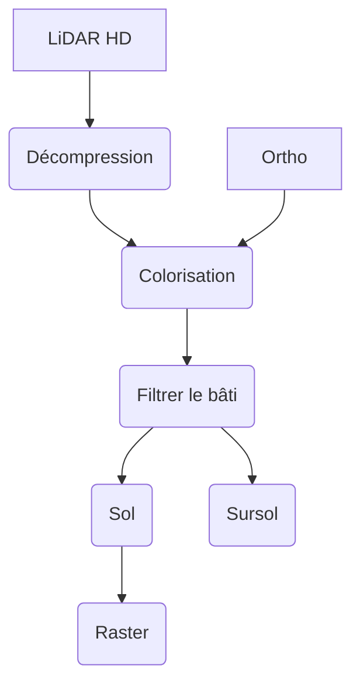

# LiDAR HD brut - Distinguer sol et sursol avec pdal

:calendar: Date de publication initiale : {{ page.meta.date | date_localized }}

## Prérequis

- [PDAL](https://pdal.io/)
- bash
- [GDAL/OGR](https://gdal.org/) :hugging:

## Intro

{: .img-thumbnail-left }

Le relevé LiDAR (Light Detection and Ranging) est une technique de plus en plus utilisée pour la création de modèles numériques de précision. Cependant, les données LiDAR de part leur volumétrie et leurs spécificités, peuvent être difficiles à manipuler et à interpréter, en particulier lorsqu'il s'agit de distinguer le sol et le sursol.

!!! question "Mais dis-moi Jamy"
    Le LiDAR envoie des impulsions dont les échos constituent un nuage de points bruts. Ce nuage de points bruts, donc indistincts, permet de construire un MNE (modèle numérique d'élévation). En différenciant ces échos, il s'agit d'extraire les échos du sol dans un MNT (modèle numérique de terrain) et ce qui en dépasse (le cas échéant) dans un MNS (modèle numérique de surface).

Heureusement, des outils tels que [PDAL](https://pdal.io/) (_Point Data Abstraction Library_) et [GDAL](https://gdal.org/) (_Geospatial Data Abstraction Library_) aident à traiter et à analyser les données LiDAR pour créer des MNT ou des MNS.  
Dans cet article, je vais vous expliquer comment j'ai utilisé ces deux outils pour distinguer le sol et le sursol à partir des données LiDAR brutes de l'IGN, et fournir des exemples de code pour vous aider à démarrer dans la manipulation de ces données.

!!! info
    La rédaction de cette article a été réalisée avant la livraison des données [LiDAR HD](https://geoservices.ign.fr/lidarhd) classifiées par l'IGN. Toutefois, si vous souhaitez vous mettre en condition "données brutes" pour vous amuser, vous pouvez prendre les fichiers classifiés en attribuant la valeur de classification à `0`.

[Commenter cet article :fontawesome-solid-comments:](#__comments){: .md-button }
{: align=middle }

----

## Processus global

Voici un schéma récapitulatif de la procédure mise en place.



## Un environnement de travail : config.env

Avant de se lancer, il est bon de vous parler du fichier de configuration que vous devrez adapter à votre organisation et qui sera utilisé par la suite pour télécharger et traiter les images. On y définit le répertoire de travail et différentes variables nécessaires à la bonne exécution des scripts.

Voici le fichier `config.env` à adapter :

```ini title="Environnement de travail" linenums="1"
# REPERTOIRE DE TRAVAIL
REPER='/home/....'

# REPERTOIRE DE STOCKAGE DES LOGS
REPER_LOGS='logs'

# REPERTOIRE D ENTREE
REPER_IN='data_in'

# REPERTOIRE TEMPORAIRE
REPER_TMP='data_tmp'

# REPERTOIRE DE SORTIE
REPER_OUT='data_out'

# PARAMETRES OGR
ENCODAGE='UTF-8'
```

[Consulter le fichier de configuration :fontawesome-regular-file-code:](https://github.com/igeofr/lidarhd_pdal/blob/main/config.env){: .md-button }
{: align=middle }

## Un script pour orchestrer les différentes étapes

Maintenant, entrons dans le vif du sujet avec la présentation des différentes étapes qui me permettent de traiter les données LiDAR brutes et de distinguer le sol et le sursol. Je vais décrire ici chaque étape et fournir des exemples de code pour vous aider à comprendre le processus de traitement global.

[Consulter le fichier "maître" :fontawesome-regular-file-code:](https://github.com/igeofr/lidarhd_pdal/blob/main/LIDAR.sh){: .md-button }
{: align=middle }

### La décompression

Les fichiers bruts ayant été livrés au format 7-zip, la première étape consiste à extraire les 4 dalles contenues dans chaque fichier 7z.

```bash title="Décompression"
# Installation de p7zip : sudo apt install p7zip
7z x "$REPER/data_in/$base.7z" -o$REPER'/data_tmp/un7z'
```

### Colorisation des images

{: .img-thumbnail-left }

Dans cette étape, nous allons utiliser pdal pour affecter les informations colorimétriques de l'image aérienne sur chaque point LiDAR car cela facilite l'interprétation et améliore le rendu.

!!! warning inline end
    Il est important de noter que l'image aérienne utilisée n'est pas réalisée au même moment que le levé LiDAR, ce qui aura des conséquences sur la justesse de la colorisation. Par exemple : On peut voir le relief d'une voiture mais pas sa couleur, ou l'inverse.
Pour arriver au résultat, nous devons créer un [pipeline de traitement pdal (enchainement des étapes à réaliser)](https://pdal.io/en/latest/pipeline.html) au format `json` que l'on pourra ensuite appeler pour lancer une commande `pdal pipeline`.

Ici on définit :

1. une variable d'entrée générique : `input.laz`
2. le filtre de colorisation qui va nous permettre de récupérer la valeur RGB des pixels sur chacun des points du nuage : [filters.colorization](https://pdal.io/en/latest/stages/filters.colorization.html) auquel on va ajouter la variable de l'image à utiliser
3. une variable de sortie `output.laz`

```json title="Pipeline de colorisation" linenums="1"
{
  "pipeline":[
    "input.laz",
      {
        "type":"filters.colorization",
        "raster":"ortho.jp2"
      },
      "output.laz"
  ]
}
```

[Consulter le fichier :fontawesome-regular-file-code:](https://github.com/igeofr/lidarhd_pdal/blob/main/1_colorize.json){: .md-button }
{: align=middle }

Ensuite dans le script "maître", je vais appeler mon pipeline au format `json` pour lancer la commande en définissant les variables correspondant aux fichiers à utiliser :

- `readers.las.filename` : correspond au fichier en entrée qui est associé au `input.laz` du pipeline
- `filters.colorization.raster` : correspond à l'image à utiliser pour la colorisation qui est associée au `ortho.jp2` du pipeline
- `writers.las.filename` : correspond au fichier en sortie qui est associé au `output.laz` du pipeline

```bash title="Colorisation du nuage" linenums="1"
pdal pipeline 1_colorize.json
  --readers.las.filename=$REPER'/data_tmp/un7z/'${base}'/'$filename_LiDAR \
  --filters.colorization.raster="/home/utilisateur/Documents/traitement_LIDAR/data_ortho/34-2021-0"$ref_ortho_x"-"$ref_ortho_y"-LA93-0M20-E080.jp2" \
  --writers.las.filename=$REPER'/data_tmp/colorisation/'${base}'/'$base_lidar'_color.laz'
```

!!! info
    Le résultat de la colorisation est stocké dans l'attribut `rgb` des points LiDAR.
{: .img-center loading=lazy }

### Distinguer le sol et le sursol

{: .img-thumbnail-left }

Dans l'étape suivante, nous allons procéder à l'identification du sol et du sursol. Nous allons utiliser pdal pour filtrer les points LiDAR en utilisant une donnée vectorielle des bâtiments et différents filtres mathématiques pour isoler le sol et le reste des éléments de sursol.

!!! info
    Nous allons stocker les résultats de la classification dans l'attribut de `classification` des points LiDAR.

#### Identifier les bâtiments

Pour me "faciliter le travail" et pour vous présenter comment l'utilisation d'une donnée vectorielle peut être mobilisée pour classifier un nuage de points, j'ai décidé d'utiliser une couche vectorielle des bâtiments sur laquelle je vais ajouter une colonne où je vais attribuer un attribut de classification pour les distinguer (ici j'ai utilisé la valeur 7).

!!! warning
    La méthode est perfectible car les bâtiments ne sont pas nécessairement bien calés sur le relevé LiDAR, il est donc possible que certains points de sol ou de sursol périphériques au bâtiment soient classifiés comme tels et inversement.  

Voici comment j'utilise gdal pour créer la colonne que j'ai nommé `classif` :

```bash title="Classification des bâtiments" linenums="1"
ogr2ogr \
    -f "ESRI Shapefile" \
    -progress -skipfailures -overwrite \
    -dialect SQLITE \
    -nlt POLYGON \
    -sql "SELECT ST_Union(st_buffer(ST_MakeValid(geometry),0)) as geometry, 7 AS classif FROM batiments_clip WHERE st_IsValid(st_buffer(ST_MakeValid(geometry),0))" \
    batiments_classif.shp batiments_clip.shp
```

Ensuite le même principe que pour la colorisation, on va créer un pipeline de traitement :

1. une variable d'entrée : `input.laz`
2. on va assigner la valeur 0 à l'attribut `classification` de l'ensemble des points du nuage pour s'assurer qu'il n'y ait pas eu d'affectation antérieure
3. on va utiliser un filtre permettant de travailler sur la superposition d'une donnée vectorielle avec des données LiDAR : [filters.overlay](https://pdal.io/en/latest/stages/filters.overlay.html)
   - en définissant notre volonté de classifier `"dimension":"Classification"`
   - en définissant le fichier à utiliser
   - la colonne stockant la valeur de classification à attribuer préalablement définie
4. une variable de sortie `output.laz`

```json title="Pipeline de classification des bâtiments" linenums="1"
{
  "pipeline":[
  "input.laz",
    {
      "type":"filters.assign",
      "assignment":"Classification[:]=0"
    },
    {
        "type":"filters.overlay",
        "dimension":"Classification",
        "datasource":"batiments_classif.shp",
        "layer":"batiments_classif",
        "column":"classif"
    },
    "output.laz"
  ]
}
```

[Consulter le fichier :fontawesome-regular-file-code:](https://github.com/igeofr/lidarhd_pdal/blob/main/2_pipeline.json){: .md-button }
{: align=middle }

On exécute le pipeline en définissant nos données colorisées en entrée sur laquelle devra se faire la classification.

```bash title="Classification des bâtiments" linenums="1"
pdal pipeline 2_pipeline.json \
  --verbose 4
  --readers.las.filename=$REPER'/data_tmp/colorisation/'${base}'/'${filename_lidar%%.*}'_color.laz' \
  --writers.las.filename=$REPER'/data_tmp/filter/'${base}'/'$base_lidar'_filter.laz'
```

!!! info
    L'argument `verbose` : permet d'afficher explicitement toutes les opérations effectuées par la commande pdal. Valeur autorisée de 0 à 8.

#### Identifier le sol

On va maintenant utiliser l'algorithme  de classification _[Simple Morphological Filter (SMRF)](https://pdal.io/en/latest/stages/filters.smrf.html)_  pour distinguer le sol en excluant les points préalablement classifiés comme "bâtiment".

Le pipeline de traitement est défini par :

1. une variable d'entrée : `input.laz`
2. un filtre d'exclusion : [filters.range](https://pdal.io/en/latest/stages/filters.range.html) pour ignorer les points dont l'attribut classification est différent de 7 afin d'ignorer les bâtiments
3. un filtre de classification [filters.smrf](https://pdal.io/en/latest/stages/filters.smrf.html) pour isoler les éléments du sol
4. un filtre de sélection [filters.range](https://pdal.io/en/latest/stages/filters.range.html) pour conserver tous les points ayant été classifiés comme du sol par l'algorithme SMRF avec la valeur 2 ([valeur conventionnelle utilisée pour le sol](https://www.asprs.org/wp-content/uploads/2010/12/LAS_Specification.pdf#page=6))
5. une variable en sortie `output.laz`

```json title="Pipeline d'identification du sol" linenums="1"
{
  "pipeline":[
    "input.laz",
    {
        "type":"filters.range",
        "limits":"Classification![7:7]"
    },
    {
        "type":"filters.smrf",
        "returns":"only",
        "cell":1,
        "slope":0.15,
        "scalar":1.2,
        "threshold":0.2,
        "window":22.0,
        "ignore":"Classification[7:7]"
    },
    {
        "type":"filters.range",
        "limits":"Classification[2:2]"
    },
    "output.laz"
  ]
}
```

[Consulter le fichier :fontawesome-regular-file-code:](https://github.com/igeofr/lidarhd_pdal/blob/main/3_ground.json){: .md-button }
{: align=middle }

Toujours sur le même principe, on définit les variables d'entrée et de sortie pour la bonne exécution :

```bash title="Extraction du sol" linenums="1"
pdal pipeline 3_ground.json \
  --verbose 4 \
  --readers.las.filename=$REPER'/data_tmp/filter/'${base}'/'${filename_lidar%%.*}'_filter.laz' \
  --writers.las.filename=$REPER'/data_tmp/ground/'${base}'/'$base_lidar'_ground.laz'
```

{: .img-center loading=lazy }

#### Identifier le sursol

Ensuite, on relance l'algorithme de classification _[Simple Morphological Filter (SMRF)](https://pdal.io/en/latest/stages/filters.smrf.html)_ en ajustant les paramètres pour isoler le sursol.

Le pipeline de traitement est défini ainsi :

1. une variable d'entrée : `input.laz`
2. un filtre d'assignation de la valeur 6 pour les bâtiments ([valeur conventionnelle utilisée pour les bâtiments](https://www.asprs.org/wp-content/uploads/2010/12/LAS_Specification.pdf#page=6))
3. un filtre de classification [filters.smrf](https://pdal.io/en/latest/stages/filters.smrf.html) pour isoler les éléments du sursol en ignorant les points classés 6
4. un filtre d'exclusion : [filters.range](https://pdal.io/en/latest/stages/filters.range.html) pour ignorer les points dont l'attribut classification est 2 (points correspondant au sol)
5. un filtre d'assignation de la valeur 1 pour les éléments du sursol ([valeur conventionnelle utilisée pour les éléments non classifiés](https://www.asprs.org/wp-content/uploads/2010/12/LAS_Specification.pdf#page=6))
6. une variable en sortie `output.laz`

```json title="Pipeline d'identification du sursol" linenums="1"
{
  "pipeline":[
    "input.laz",
    {
        "type":"filters.assign",
        "assignment":"Classification[7:7]=6"
    },
    {
        "type":"filters.smrf",
        "cell":1,
        "slope":0.15,
        "scalar":1.2,
        "threshold":0.45,
        "window":22.0,
        "ignore":"Classification[6:6]"
    },
    {
      "type":"filters.range",
      "limits":"Classification![2:2]"
    },
    {
        "type":"filters.assign",
        "assignment":"Classification[0:1]=1"
    },
    "output.laz"
  ]
}
```

[Consulter le fichier :fontawesome-regular-file-code:](https://github.com/igeofr/lidarhd_pdal/blob/main/4_non_ground.json){: .md-button }
{: align=middle }

On appelle le pipeline et on définit les variables :

```bash title="Extraction du sursol" linenums="1"
pdal pipeline 4_non_ground.json
  --readers.las.filename=$REPER'/data_tmp/filter/'${base}'/'${filename_lidar%%.*}'_filter.laz' \
  --writers.las.filename=$REPER'/data_tmp/no_ground/'${base}'/'$base_lidar'_no_ground.laz'
```

{: .img-center loading=lazy }

{: .img-center loading=lazy }

#### Combinaison sol/sursol

Voici le résultat après avoir chargé mon fichier de sol et mon fichier de sursol en leur attribuant une couleur par classe d'affectation ou en jouant avec les valeurs RGB.

{: .img-center loading=lazy }

{: .img-center loading=lazy }

#### Fusionner les dalles

Maintenant que toutes les dalles ont été traitées (4 dalles dans un fichier 7zip), je décide de fusionner séparément les dalles de sol et les dalles de sursol afin de couvrir une zone plus grande et d'avoir deux fichiers distincts.

```json title="Pipeline de fusion" linenums="1"
{
  "pipeline":[
        {
            "tag" : "las1",
            "type" : "readers.las"
        },
        {
            "tag" : "las2",
            "type" : "readers.las"
        }
        ,
        {
            "tag" : "las3",
            "type" : "readers.las"
        }
        ,
        {
            "tag" : "las4",
            "type" : "readers.las"
        },
        {
            "type" : "filters.merge"
        },
        "placeholder.laz"
  ]
}
```

[Consulter le fichier :fontawesome-regular-file-code:](https://github.com/igeofr/lidarhd_pdal/blob/main/5_merge.json){: .md-button }
{: align=middle }

On paramètre maintenant la fusion des différentes dalles.

```bash title="fusion_sol" linenums="1"
pdal pipeline 5_merge.json
  --verbose 4 \
  --writers.las.filename=$REPER'/data_tmp/ground/'${base}'_ground.laz' \
  --stage.las1.filename=$las_ground1 \
  --stage.las2.filename=$las_ground2 \
  --stage.las3.filename=$las_ground3 \
  --stage.las4.filename=$las_ground4
```

{: .img-center loading=lazy }

#### Créer un raster du sol (MNT)

La dernière étape consiste à générer un raster à partir du nuage de points classifié comme du sol en définissant :

1. une variable d'entrée : `input.laz`
2. [les paramètres de création du raster à l'aide de gdal](https://pdal.io/en/2.6.0/stages/writers.gdal.html) :
    - Format : `GTiff`
    - La méthode d'interpolation
    - La résolution
    - le fichier en sortie `output.tif`

```json title="Pipeline de création d'un raster" linenums="1"
{
  "pipeline":[
    "input.laz",
      {
        "type": "writers.gdal",
        "gdaldriver":"GTiff",
        "output_type":"mean",
        "resolution":"1",
        "filename":"output.tif"
        }
  ]
}
```

[Consulter le fichier :fontawesome-regular-file-code:](https://github.com/igeofr/lidarhd_pdal/blob/main/6_ground_raster.json){: .md-button }
{: align=middle }

On appelle le pipeline et on définit les variables :

```bash title="Génération d'un raster" linenums="1"
pdal pipeline 6_ground_raster.json
  --readers.las.filename=$REPER'/data_tmp/ground/'${base}'_ground.laz' \
  --writers.gdal.filename=$REPER'/data_tmp/ground_raster/'${base}'_ground_raster.tif'
```

{: .img-center loading=lazy }

----

## Conclusion

Cet article a vocation à montrer les possibilités et le fonctionnement global de PDAL.

La méthode proposée pour distinguer le sol et le sursol à partir de données LIDAR est à repositionner dans le contexte de la livraison des fichiers bruts. Celle-ci est perfectible si on compare aux fichiers classifiés livrés par l'IGN mais elle a l'avantage d'être facilement adaptable dans un autre contexte et suffisamment robuste pour pouvoir traiter de vastes emprises.

{: .img-center loading=lazy }

<!-- geotribu:authors-block -->


