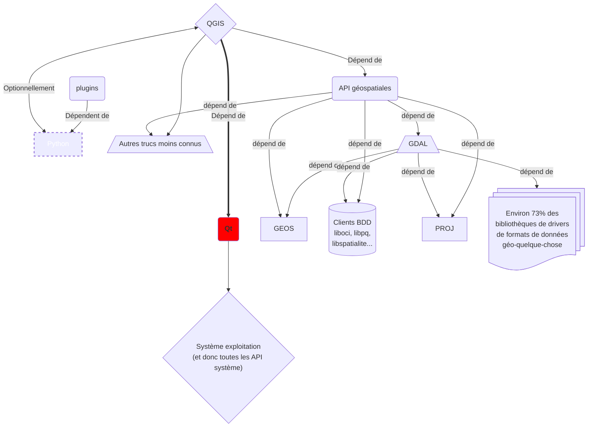

# QGIS 4 : un QGIS basé sur Qt6

:calendar: Date de publication initiale : {{ page.meta.date | date_localized }}

## Introduction

[Commenter cet article :fontawesome-solid-comments:](#__comments "Aller aux commentaires"){: .md-button }
{: align=middle }

----

## Architecture de QGIS



Actuellement, c'est la version 5 de Qt qui est utilisée dans QGIS 3. Il se trouve qu'elle est arrivée en fin de vie en... mai 2025 selon [la documentation officielle](https://doc.qt.io/qt-6/supported-platforms.html#supported-qt-versions).

{: .img-center loading=lazy }

----

## Installer QGIS basé sur Qt6

### Sur Windows

#### Niveau aventurier/ère de l'Arche Perdue : l'autoporteur de vcpkg

[OPENGIS.ch](https://www.opengis.ch/fr/), en tête de pont sur le packaging Windows avec [vcpkg](https://vcpkg.io) diffusait un lien de téléchargement sur leurs réseaux sociaux.

[:material-download: Télécharger un exécutable depuis GitHub Actions :simple-githubactions:](https://github.com/qgis/QGIS/actions/workflows/windows-qt6.yml?query=is%3Asuccess){: .md-button }
{: align=middle }

[:material-download: Télécharger l'exécutable diffusé par OPENGIS.ch :material-folder-zip:](https://download.opengis.ch/qgis-qt6.zip){: .md-button }
{: align=middle }

!!! note "Dans l'ombre de la DSI"
    Notez que cette version téléchargeable et autoporteuse est idéale pour les environnements où les droits d'installation sont limités.
    Si on vous demande d'où ça sort, dites que vous avez lu ça sur [arcOrama](https://www.arcorama.fr/) :zipper_mouth:.

{: .img-center loading=lazy }

#### Niveau aventurier dominical : le package dév de l'OSGeo4W

[Télécharger l'installateur OSGeo4W](https://download.osgeo.org/osgeo4w/v2/osgeo4w-setup.exe){: .md-button }
{: align=middle }

Lancer en mode administrateur puis suivre les étapes :

1. _Advanced Install_
1. Install from Internet
1. All Users

    Choisir un dossier convenable pour l'installation car on n'est pas des bêtes quand même. Par exemple, soyons civilisés et mettons cela dans `%PROGRAMFILES%/QGIS/OSGeo4W`

1. Tant pis pour l'avertissement. Si en 2024 on doit encore s'embêter avec des espaces dans les cehmins de fichiers, c'est qu'on a un souci d'anachronisme. Ignorons et continuons donc.
1. Laissons les valeurs par défaut
1. Dans le champ Search, taper `qt6-dev-full`
1. Dérouler `Desktop`
1. Cliquer sur `Skip` en regard de `qgis-qt6-dev-full` jusqu'à obtenir un numéro de version (probablement impair et supérieur d'un chiffre à la version courante.)
1. suivant, suivant
1. cocher les licences (ERDAS, MrSID, ORacle, SZIP...). Notez qu'il est aussi possible de les imprimer de façon à les étudier en détail.
1. :coffee:
1. Il y aura peut-être des erreurs mais qu'importe, vous êtes arrivés jusqu'ici car vous vouliez un goût d'aventure dans la bouche ? Il n'est plus temps de reculer pour si peu.

En images :

{: .img-center loading=lazy }

----

### Sur Linux

Comment vous dire... c'est moins fluide, c'est plus... Linux quoi !
Donc attachez vos ceintures de lignes de commande, préparez vos merguez électroniques, ça va basher et faire chauffer vos CPU et barrettes de ~~sh~~RAM ! Téléguidé par la bonne fée Cabieces, je vous livre une recette pour Debian/Ubuntu. Je passe les détails car on n'est pas ici sur [le guide pour développeurs barbus](https://github.com/qgis/QGIS/blob/master/INSTALL.md).

#### Prérequis

- make et build essentials
- Git
- 8 Go de RAM mais 12 c'est bien, 16 très bien et 32 c'est mieux
- 6,5 Go d'espace disque. Notez qu'avec un SSD, tu gagnes un bonnus de vitesse.

Globalement, ça doit se régler avec un :

```sh
sudo apt install cmake build-essentials git
```

#### Lancer le jeu de construction

Sur un malentendu, la suite de commandes pourrait bien marcher du premier coup :

```sh title="Builder QGIS avec Qt6 à partir d'une branche"
mkdir -p ~/Git/
cd ~/Git
git clone https://github.com/qgis/QGIS.git -b release-3_38 --single-branch --depth 1
cd QGIS
CXX=clang++-14 && CC=clang-14 && cmakeQGIS -DWITH_QTWEBKIT=FALSE -DWITH_SERVER=FALSE -DBUILD_WITH_QT6=ON -DCMAKE_PREFIX_PATH="$DEPENDS_DIR/qwt/install" -DCMAKE_INSTALL_PREFIX=/usr/local/bin/qgis-build/
```

----

### Sur MacOS

!!! warning ""
    Compte-tenu des coûts associés pour l'obtention d'un [MacBook Pro M3 Max](https://www.apple.com/fr/shop/buy-mac/macbook-pro/14-pouces-m4-pro), forcément indispensable pour ce tutoriel, cette section est réservée aux [abonnés premium de Geotribu](../../about/sponsoring.md). :face_with_hand_over_mouth:

----

## Quoi de neuf dans QGIS Qt 6 ?

Allez, on lance, on prend le temps d'essayer de reconnaître des têtes connues sur le splash screen de dév

et hop !

Alors, qu'est-ce que ça change ?

- le thème de l'interface s'aligne automatiquement sur les paramètres du système (sombre ou clair)
- on peut choisir des couleurs en CMJN et qu'elles soient conservées dans les PDF générés par QGIS, ainsi que le profil d'impression
- peu de plugins sont compatibles et on ne peut pas filtrer dessus donc c'est assez compliqué de savoir
- on peut voter sur un plugin directement depuis l'interface
- on a une sensation de vitesse à l'utilisation mais c'est peut-être lié au fait qu'il n'y a aucun plugin d'installé
- il y a parfois des messages d'erreur mais c'est bon pour le karma d'aventurier
- sur Linux, le système d'affichage Wayland est désormais pleinement supporté

### Je développe ou maintiens un ou plusieurs plugin(s), comment faire pour qu'il soit compatible ?

{: .img-thumbnail-left }

Si votre plugin n'utilise pas ou peu Qt ou vous avez suivi de bonnes pratiques de développement pour votre plugin, notamment l'import de tout ce qui est PyQt via PyQGIS et non directement, il n'y aura pas grand chose à faire. Sinon, il faut prévoir un travail de migration et de tests. Plus tôt vous commencez, mieux ce sera.

Une procédure de migration a été ajoutée il y a quelques semaines dans le ~~cookbook PyQGIS~~ [wiki du projet GitHub de QGIS](https://github.com/qgis/QGIS/wiki/Plugin-migration-to-be-compatible-with-Qt5-and-Qt6/_edit) pour documenter l'usage d'un script de migration et rendre un plugin compatible à la fois avec QGIS Qt5 and Qt6 :

1. Dans votre environnement Python de développement :

  ```sh
  pip install astpretty tokenize-rt
  ```

1. Si vous êtes sur Linux, il faut installer des dépendances supplémentaires :

    ```sh
    sudo apt install python3-pyqt6 python3-pyqt6.qtsvg python3-pyqt6.qsci
    ```

1. Télécharger le [script sur le projet QGIS sur GitHub](https://github.com/qgis/QGIS/blob/master/scripts/pyqt5_to_pyqt6/pyqt5_to_pyqt6.py)
1. L'exécuter en pointant sur le dossier de votre plugin :

    ```sh
    python pyqt5_to_pyqt6.py /path/to/plugin
    ```

1. Tester votre plugin sur une installation de QGIS avec Qt5 **et** sur une installation de QGIS avec Qt6 en faisant les adaptations nécessaires.
1. Éditer le fichier `metadata.txt` et ajouter la ligne :

    ```ini title="metadata.txt d'un plugin explicitement compatible avec Qt6"
    [...]
    supportsQt6=True
    [...]
    ```

Il y a forcément quelques limites au script, notamment :

- la gestion des imports : il recommande souvent d'importer Qt depuis PyQGIS (`from qgis.PyQt.QtCore import Qt`) mais c'est rarement pertinent. Ceci dit, si vous utilisez des outils classiques de contrôle statique du code (flake8, ruff, isort, etc.), ils se chargeront de nettoyer le superflu.
- il ne gère pas bien les imports de PyQt qui sont hors du scope de PyQGIS. Par exemple, si vous utilisez `QtMultimedia` il va forcer l'import via `qgis.PyQt` alors que ce module là de PyQy n'y est pas référencé.

La documentation sur cette migration est inextistante ou très difficile à trouver. Quand on m'a répondu "la seule documentation, à ce jour, hormis le wiki d'Étienne, c'était [la description de la PR de Nyall](https://github.com/qgis/QGIS/pull/55912)", je me suis dit qu'on est proche du délit d'initiés :grin: ! Mais cela n'a finalement rien d'étonnant pour l'instant car cela ne concerne encore que les développeurs actuellement autour duquel gravite l'écosystème QGIS.

----

<!-- geotribu:authors-block -->


