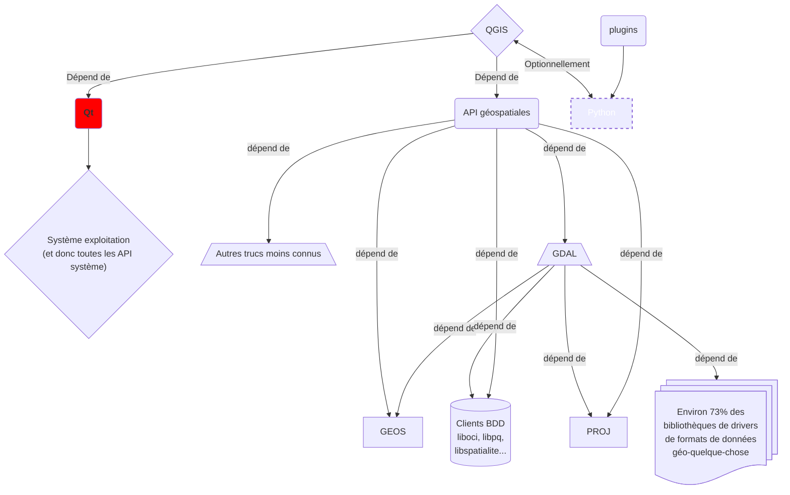

# QGIS 4

:calendar: Date de publication initiale : {{ page.meta.date | date_localized }}

## Introduction

[Commenter cet article :fontawesome-solid-comments:](#__comments "Aller aux commentaires"){: .md-button }
{: align=middle }

----

## Architecture de QGIS



Actuellement, c'est la version 5 de Qt qui est utilisée dans QGIS 3. Il se trouve qu'elle est arrivée en fin de vie en... mai 2025 selon [la documentation officielle](https://doc.qt.io/qt-6/supported-platforms.html#supported-qt-versions).

{: .img-center loading=lazy }

----

## Installer QGIS basé sur Qt6

### Sur Windows

#### Niveau aventurier/ère de l'Arche Perdue : l'autoporteur de vcpkg

[le workflow Windows Qt6](https://github.com/qgis/QGIS/actions/workflows/windows-qt6.yml?query=is%3Asuccess)

Sinon, en mars dernier, OPENGIS.ch, en tête de pont sur le packaging Windows avec vcpkg diffusait un lien de téléchargement sur leurs réseaux sociaux.  <https://download.opengis.ch/qgis-qt6.zip>

!!! note "Dans l'ombre de la DSI"
    Notez que cette version téléchargeable et autoporteuse est idéale pour les environnements où les droits d'installation sont limités.
    Si on vous demande d'où ça sort, dites que vous avez lu ça sur [arcOrama](https://www.arcorama.fr/) :zipper_mouth:.

#### Niveau aventurier dominical : l'OSGeo4W

[Télécharger l'installateur OSGeo4W](https://download.osgeo.org/osgeo4w/v2/osgeo4w-setup.exe){: .md-button }
{: align=middle }

Lancer en mode administrateur puis suivre les étapes :

1. _Advanced Install_
1. Install from Internet
1. All Users

    Choisir un dossier convenable pour l'installation car on n'est pas des bêtes quand même. Par exemple, soyons civilisés et mettons cela dans `%PROGRAMFILES%/QGIS/OSGeo4W`

1. Tant pis pour l'avertissement. Si en 2024 on doit encore s'embêter avec des espaces dans les cehmins de fichiers, c'est qu'on a un souci d'anachronisme. Ignorons et continuons donc.
1. Laissons les valeurs par défaut
1. Dans le champ Search, taper `qt6-dev-full`
1. Dérouler `Desktop`
1. Cliquer sur `Skip` en regard de `qgis-qt6-dev-full` jusqu'à obtenir un numéro de version (probablement impair et supérieur d'un chiffre à la version courante.)
1. suivant, suivant
1. cocher les licences (ERDAS, MrSID, ORacle, SZIP...). Notez qu'il est aussi possible de les imprimer de façon à les étudier en détail.
1. :coffee:
1. Il y aura peut-être des erreurs mais qu'importe, vous êtes arrivés jusqu'ici car vous vouliez un goût d'aventure dans la bouche ? Il n'est plus temps de reculer pour si peu.

----

### Sur Linux

Comment vous dire... c'est moins fluide, c'est plus... Linux quoi !
Donc attachez vos ceintures de lignes de commande, préparez vos merguez électroniques, ça va basher et faire chauffer vos CPU et barrettes de ~~sh~~RAM ! Téléguidé par la bonne fée Cabièces, je vous livre une recette pour Debian/Ubuntu. Je passe les détails car on n'est pas ici sur [le guide pour développeurs barbus](https://github.com/qgis/QGIS/blob/master/INSTALL.md).

#### Prérequis

- make et build essentials
- Git
- 8 Go de RAM mais 12 c'est bien, 16 très bien et 32 c'est mieux
- 6,5 Go d'espace disque. Notez qu'avec un SSD, tu gagnes un bonnus de vitesse.

Globalement, ça doit se régler avec un :

```sh
sudo apt install cmake build-essentials git
```

#### Lancer le jeu de construction

Sur un malentendu, la suite de commandes pourrait bien marcher du premier coup :

```sh title="Builder QGIS avec Qt6 à partir d'une branche"
mkdir -p ~/Git/
cd ~/Git
git clone https://github.com/qgis/QGIS.git -b release-3_38 --single-branch --depth 1
cd QGIS
CXX=clang++-14 && CC=clang-14 && cmakeQGIS -DWITH_QTWEBKIT=FALSE -DWITH_SERVER=TRUE -DBUILD_WITH_QT6=ON -DCMAKE_PREFIX_PATH="$DEPENDS_DIR/qwt/install"
```

----

### Sur MacOS

!!! example ""
    Compte-tenu des coûts associés pour l'obtention d'un Mac M4, cette section est réservée aux abonnés premium de Geotribu. :face_with_hand_over_mouth:

----

## Quoi de neuf dans QGIS Qt 6 ?

Allez, on lance, on prend le temps d'essayer de reconnaître des têtes connues sur le splash screen de dév

et hop !

Alors, qu'est-ce que ça change ?

- le thème de l'interface s'aligne automatiquement sur les paramètres du système (sombre ou clair)
- on peut choisir des couleurs en CMJN et qu'elles soient conservées dans les PDF générés par QGIS, ainsi que le profil d'impression
- peu de plugins sont compatibles et on ne peut pas filtrer dessus donc c'est assez compliqué de savoir
- on peut voter sur un plugin directement depuis l'interface
- on a une sensation de vitesse à l'utilisation mais c'est peut-être lié au fait qu'il n'y a aucun plugin d'installé
- il y a parfois des messages d'erreur mais c'est bon pour le karma d'aventurier
- sur Linux, le système d'affichage Wayland est désormais pleinement supporté

----

<!-- geotribu:authors-block -->


