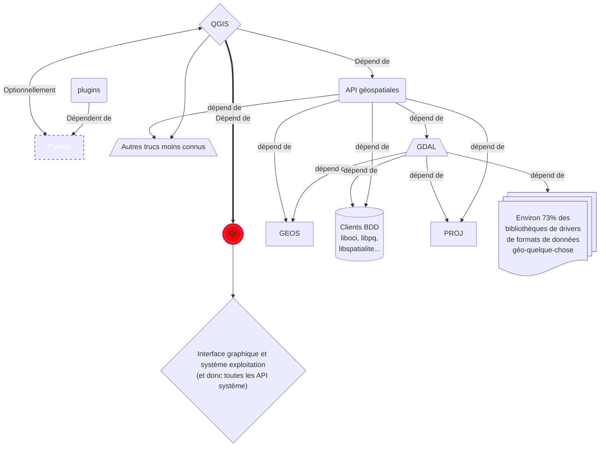

# QGIS 4 : un QGIS basé sur Qt6

:calendar: Date de publication initiale : {{ page.meta.date | date_localized }}

## L'architecture de QGIS pour les nuls

{: .img-thumbnail-left }

Comme tout logiciel, open source ou propriétaire, QGIS repose sur d'autres logiciels ou "bibliothèques" logicielles. Des dépendances dont la principale est Qt.  

On n'est pas là pour trop entrer dans les détails alors je vous ai fait un schéma simplifié de ce qui compose le logiciel QGIS. Oui, oui il est simplifié.



Vous avez remarqué le rond rouge au milieu ? Eh bien c'est le [cadriciel (_framework_) Qt](https://www.qt.io/) (prononcez "kuté" ou comme "_cute_" qui signifie mignon en anglais) retenu par le projet QGIS pour s'interfacer avec les API graphiques et techniques des différents systèmes d'exploitation.

Actuellement, c'est la version 5 de Qt qui est utilisée dans QGIS 3. Il se trouve qu'elle est arrivée en fin de vie en... mai 2025 selon [la documentation officielle](https://doc.qt.io/qt-6/supported-platforms.html#supported-qt-versions).

{: .img-center loading=lazy }

La dernière fois que QGIS a changé de version majeure de Qt et celle de Python, QGIS est aussi passé à la version majeure supérieure. Ce qui nous donne l'équation savante suivante :

$$\begin{array}{l|rcl}
N° majeur version QGIS : & QGIS 2 &= (Qt 4 + Python 2) \\
    & QGIS 3 &= (Qt 5 + Python 3) \\
    & QGIS 4 & \approx (Qt 6 + Python 3)
\end{array}$$

Mais pour l'instant, rien n'est encore décidé sur l'incrémentation du [numéro majeur de version de QGIS](https://semver.org/lang/fr/). Le suspense est à son comble.

Dans cet article, je vous propose donc deux façons de télécharger une version de QGIS 3 basée sur Qt6 afin de vous laisser tester par vous-même, avec un petit détour du côté de la mise à jour de vos plugins.

[Commenter cet article :fontawesome-solid-comments:](#__comments "Aller aux commentaires"){: .md-button }
{: align=middle }

<!-- more -->

----

## Installer QGIS basé sur Qt6 sur Windows

Si vous travaillez sur le principal système d'exploitation des utilisateur/ices de QGIS, vous avez l'embarras du choix pour tester :

- [une installation avec l'OSGeo4W](#aventure-osgeo4w) : relativement classique mais plus risquée pour votre environnement de travail
- la [récupération d'une version autoporteuse génére avec vckpg](#aventure-vcpkg) : plus périlleuse mais plus isolée du reste de votre système. Personnellement, c'est celle que je préfère :cowboy:.

### Niveau aventurier dominical : le package dév de l'OSGeo4W {: #aventure-osgeo4w }

{: .img-thumbnail-left }

On ne présente plus l'installateur "réseau" (_OSGeo4W Network Installer_ comme on dit sur les sites non traduits de projets internationaux) que nous avons mis en avant à plusieurs reprises [ici](../2020/2020-07-03_deploy_qgis_windows.md "Installer QGIS en ligne de commande avec OSGeo4W") et [là](../2021/2021-07-06_qgis_personnaliser_package_osgeo4w.md "Utiliser OSGeo4W pour déployer QGIS en entreprise").

Ce petit coquin d'inspiration linuxienne infiltré derrière les lignes windowsiennes pour permettre une installation de tout ~~et n'importe quoi~~ ce qui a trait ~~aux projets OSGeo~~ à QGIS sur Windows avec une finesse de sélection des dépendances justement.

Allez c'est parti !

[Télécharger l'installateur OSGeo4W](https://download.osgeo.org/osgeo4w/v2/osgeo4w-setup.exe){: .md-button }
{: align=middle }

Lancer en mode administrateur puis suivre les étapes habituelles jusqu'à la fenêtre _Select packages_ :

1. Dans le champ `Search`, taper `qt6-dev-full`
1. Dérouler `Desktop`
1. Cliquer sur `Skip` en regard de `qgis-qt6-dev-full` jusqu'à obtenir un numéro de version (probablement impair et supérieur d'un chiffre à la version courante mais peu importe)

    {: .img-center loading=lazy }

1. suivant, suivant
1. cocher les licences (ERDAS, MrSID, Oracle, SZIP...). Notez qu'il est aussi possible de les imprimer de façon à les étudier en détail :face_with_hand_over_mouth:.
1. :coffee: :hourglass_flowing_sand:

Une fois l'installation terminée, cherchez et ouvrez QGIS depuis le menu démarrer de votre système à fenêtres :

{: .img-center loading=lazy }

Une fois QGIS démarré, aller dans le menu `À propos` pour juger sur pièces de la fraîcheur des dépendances :

{: .img-center loading=lazy }

### Niveau aventurier/ère de l'Arche Perdue : l'autoporteur de vcpkg  {: #aventure-vcpkg }

{: .img-thumbnail-left }

[OPENGIS.ch](https://www.opengis.ch/fr/), en tête de pont sur le packaging multi-plateforme avec [vcpkg](https://vcpkg.io), diffusait un [lien de téléchargement](https://download.opengis.ch/qgis-qt6.zip) pour Windows sur [leurs réseaux sociaux](https://fosstodon.org/@opengisch/112155006378447452) dès mars dernier. Depuis, l'entreprise Suisse à qui l'on doit QField a continué son travail autour d'une chaîne de compilation et packaging plus moderne et multi-plateforme dans le cadre de la [proposition communautaire d'évolution (QEP) n°292](https://github.com/qgis/QGIS-Enhancement-Proposals/issues/292) pour aboutir le mois dernier. Le [compte-rendu dans la liste de mail au PSC](https://lists.osgeo.org/pipermail/qgis-psc/2024-October/010340.html) donne une idée du travail accompli.

Depuis les choses ont bien avancé et QGIS est compilé/packagé avec Qt6 à chaque modification du code source (_commit_) sur GitHub.

1. Se connecter à son compte [GitHub](https://github.com/) (ou en créer un gratuitement pour l'occasion) et cliquer sur le bouton ci-dessous :

    [:simple-githubactions: Aller télécharger un exécutable depuis GitHub](https://github.com/qgis/QGIS/actions/workflows/windows-qt6.yml?query=is%3Asuccess){: .md-button }
    {: align=middle }

1. Cliquer sur la première ligne (cadre vert dans la capture ci-dessous) pour ouvrir les résultats de la dernière exécution. Notez qu'il est possible de filtrer sur une branche en particulier (menu déroulant détouré en bleu dans la capture ci-dessous). Par exemple, pour n'afficher que [les jobs Windows Qt6 pour QGIS 3.40 ayant réussi](https://github.com/qgis/QGIS/actions/workflows/windows-qt6.yml?query=is%3Asuccess+branch%3Arelease-3_40).

    {: .img-center loading=lazy }

1. Dans la page qui s'ouvre, cliquer sur `qgis-windows-qt6` dans la section `Artifacts` en bas (encadré vert dans la capture ci-dessous) :

    

1. Une fois le téléchargement terminé, Dézipper jusqu'à obtenir un dossier `qgis-X.y.z-win64` où `X.y.z` correspond à la version que vous avez sélectionnée
1. Aller dans le dossier `bin` et lancer le fichier `qgis.exe` (pensez à activer l'affichage des extensions de fichiers sur Windows, la vie est plus belle).

    {: .img-center loading=lazy }

Si tout se passe bien, on admire le [splash screen](../2021/2021-06-11_qgis_personnaliser_splash_screen.md "Personnaliser l'image au lancement de QGIS") personnalisé pour l'occasion :

{: .img-center loading=lazy }

!!! note "Dans l'ombre de la DSI"
    Notez que cette version téléchargeable et autoporteuse est idéale pour les environnements où les droits d'installation sont limités.
    Si on vous demande d'où ça sort, dites que vous avez lu ça sur [arcOrama](https://www.arcorama.fr/) :zipper_mouth:.

----

## Sur Linux

{: .img-thumbnail-left }

Comment vous dire... c'est moins fluide, c'est plus... Linux quoi !

Les packages liés à Qt n'ont pas encore tous été portés sur Qt6 ou ne sont pas encore présents dans les dépôts officiels. Il est donc nécessaire de compiler QGIS avec Qt6 soi-même en repartant parfois de loin dans l'arbre des dépendances. Si l'aventure vous motive, vous pouvez suivre [le guide de compilation de QGIS sur le wiki du projet](https://github.com/qgis/QGIS/blob/master/INSTALL.md). Notez que c'est nettement plus simple de le faire sur une distribution comme Fedora qui utilise des packages plus récents plutôt que sur une distribution comme Debian qui privilégie la stabilité.

Attachez vos ceintures de lignes de commande, préparez vos merguez électroniques, ça va basher et faire chauffer vos CPU et barrettes de ~~sh~~ RAM !

----

## Sur MacOS

!!! warning ""
    Compte-tenu des coûts associés pour l'obtention d'un [MacBook Pro M4 Pro](https://www.apple.com/fr/shop/buy-mac/macbook-pro/14-pouces-m4-pro), forcément indispensable pour ce tutoriel, cette section est réservée aux [abonnés premium de Geotribu](../../about/sponsoring.md). :face_with_hand_over_mouth:

----

## Quoi de neuf dans QGIS Qt 6 ?

{: .img-thumbnail-left }

Allez, on lance, on prend le temps d'essayer de reconnaître des têtes connues sur le splash screen de dév

et hop !

Alors, qu'est-ce que ça change ?

- le thème de l'interface s'aligne automatiquement sur les paramètres du système (sombre ou clair)
- on peut choisir des couleurs en CMJN et qu'elles soient conservées dans les PDF générés par QGIS, ainsi que le profil d'impression
- peu de plugins sont compatibles et on ne peut pas filtrer dessus donc c'est assez compliqué de savoir lequel on peut installer
- on peut voter sur un plugin directement depuis l'interface
- on a une sensation de vitesse à l'utilisation mais c'est peut-être lié au fait qu'il n'y a aucun plugin d'installé
- il y a parfois des messages d'erreur et des crashs mais c'est bon pour le karma d'aventurier
- sur Linux, le système d'affichage Wayland est désormais pleinement supporté

{: width=40% loading=lazy } {: width=40% loading=lazy }

### Je maintiens un plugin, comment faire pour qu'il soit compatible ?

{: .img-thumbnail-left }

Si votre plugin n'utilise pas ou peu Qt ou vous avez suivi de bonnes pratiques de développement pour votre plugin, notamment l'import de tout ce qui est PyQt via PyQGIS et non directement, il n'y aura pas grand chose à faire. Sinon, il faut prévoir un travail de migration et de tests. Plus tôt vous commencez, mieux ce sera.

Une procédure de migration a été ajoutée il y a quelques semaines dans le ~~cookbook PyQGIS~~ [wiki du projet GitHub de QGIS](https://github.com/qgis/QGIS/wiki/Plugin-migration-to-be-compatible-with-Qt5-and-Qt6/) pour documenter l'usage d'un script de migration et rendre un plugin compatible à la fois avec QGIS Qt5 and Qt6 :

1. Dans votre environnement Python de développement :

    ```sh
    pip install astpretty tokenize-rt
    ```

1. Si vous êtes sur Linux, il faut installer des dépendances supplémentaires :

    ```sh
    sudo apt install python3-pyqt6 python3-pyqt6.qtsvg python3-pyqt6.qsci
    ```

1. Télécharger le [script sur le projet QGIS sur GitHub](https://github.com/qgis/QGIS/blob/master/scripts/pyqt5_to_pyqt6/pyqt5_to_pyqt6.py)
1. L'exécuter en pointant sur le dossier de votre plugin :

    ```sh
    python pyqt5_to_pyqt6.py /path/to/plugin
    ```

1. Tester votre plugin sur une installation de QGIS avec Qt5 **et** sur une installation de QGIS avec Qt6 en faisant les adaptations nécessaires.
1. Éditer le fichier `metadata.txt` et ajouter la ligne :

    ```ini title="metadata.txt d'un plugin explicitement compatible avec Qt6"
    [...]
    supportsQt6=True
    [...]
    ```

Il y a forcément quelques limites au script, notamment :

- la gestion des imports : il recommande souvent d'importer Qt depuis PyQGIS (`from qgis.PyQt.QtCore import Qt`) mais c'est rarement pertinent. Ceci dit, si vous utilisez des outils classiques de contrôle statique du code (flake8, ruff, isort, etc.), ils se chargeront de nettoyer le superflu. Si vous n'en utilisez pas, pensez à consulter :grimacing:.
- il ne gère pas bien les imports de PyQt qui sont hors du scope de PyQGIS. Par exemple, si vous utilisez `QtMultimedia` il va forcer l'import via `qgis.PyQt` alors que ce module PyQt là n'y est pas référencé. Cela mènera alors à une erreur d'import.

La documentation sur cette migration est inexistante ou très difficile à trouver. Quand on m'a répondu "la seule documentation, à ce jour, hormis le wiki d'[Étienne](https://mapstodon.space/@etrimaille), c'était [la description de la PR de Nyall](https://github.com/qgis/QGIS/pull/55912)", je me suis dit qu'on est proche du délit d'initiés :grin: ! Mais cela n'a finalement rien d'étonnant pour l'instant car cela ne concerne encore que les développeurs actuellement autour duquel gravite l'écosystème QGIS.

----

## Conclusion

Derrière le titre _putaclic_, l'article est l'occasion de glisser quelques éléments de compréhension d'un projet logiciel : dépendances, dynamique communautaire, forge logicielle... et les enjeux de "packaging" pour mettre tout cela à disposition des utilisateurs dans de bonnes conditions de livraison. Il y a plusieurs manières d'empaqueter et distribuer le même code source. Ici, OSGeo4W et vcpkg.

Que QGIS passe en version 4 ou pas, le changement de version majeure de Qt n'est pas une révolution pour les utilisateurs et utilisatrices finaux du logiciel, mais une évolution. D'ailleurs, que cela se fasse sans rupture majeure est le signe de la maturité du projet QGIS qui a tout pour s'imposer dans des parcs informatiques de niveau industriel qui aiment la stabilité.

----

<!-- geotribu:authors-block -->


