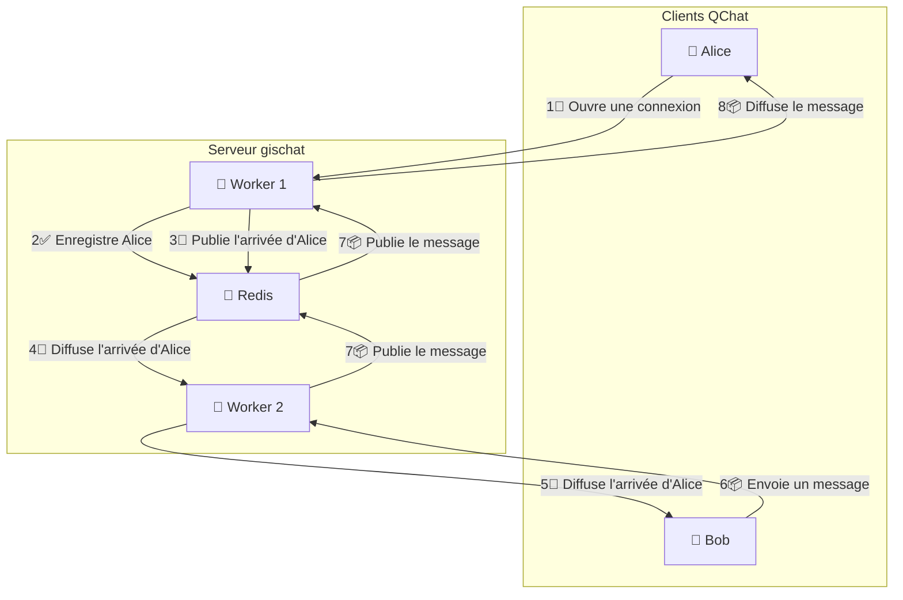

# La Revolución del QChat

:calendar: Date de publication initiale : {{ page.meta.date | date_localized }}

:raised_hands: QChat est mort, vive QChat !

Après [une première version assez bancale](../2024/2024-10-15_qchat.md), Geotribu est content d'annoncer des changements assez profonds et impactants pour QChat, le système de tchat intégré à QGIS.

QChat nouvelle version, c'est un peu comme quand [Com Truise](https://www.youtube.com/watch?v=L4ENAdECytk) monte sur une moto : ça fait de l'air dans les veuch !

{: .img-center loading=lazy }

_Une photo honteusement volée sur mastodon... Si vous connaissez l'auteur/ice, contactez-nous !_

## Pourquoi ?

La première version de QChat était assez rudimentaire, et pas très _scalable_ comme on dit dans les milieux autorisés. Concrètement, du fait de sa conception initiale assez limitée, l'API ne pouvait tourner que sur un seul [_worker uvicorn_](https://fastapi.tiangolo.com/deployment/server-workers/), c'est-à-dire un seul processus. Ce qui pouvait amener à limiter le nombre de gens connectés simultanément.

On s'en est rendu compte [lors des dernières Rencontres QGIS-fr d'Avignon](https://video.osgeo.org/w/cabBYiLUoRAZZbLp2CTRj7), et lors du quizz notamment :cold_sweat:

[Et là, c'est le drame](https://www.arteradio.com/son/et_la_c_est_le_drame)...

Avec plus de 100 personnes connectées, ça commence à souffler... :boom::dash:

Afin d'être en capacité d'accueillir plus de personnes, quand y'a du monde sur la corde à linge, il nous fallait donc revoir la conception et l'implémentation de l'API.

Il y a quelques fonctionnalités supplémentaires, ceci dit la refonte est principalement _sous le capot_.

## Refonte de l'API : `gischat`

Ainsi, le problème de la conception initiale est que côté serveur, on enregistre les utilisateur/ices et leur connexion websocket dans des listes et dictionnaires python. Ce qui a l'avantage de rester simple - c'est là un peu l'idée initiale de QChat :kissing_heart:.

Mais lorsqu'on commence à travailler avec plusieurs _workers_ parallèles, ça devient un souci, car les workers sont des processus séparés, qui ont donc chacun leurs propres listes et dictionnaires python. Impossible par exemple d'insérer un élément depuis un _worker_ et de le récupérer depuis un autre.

Il devient donc inévitable d'utiliser un système de "bases de données" ou équivalent, afin de pouvoir stocker des informations communes et faire communiquer les différents _workers_. Difficile de faire sans pour s'caler.

Dans l'optique de rester [K.I.S.S.](https://fr.wikipedia.org/wiki/Principe_KISS) :kiss:, on s'est tournés vers [redis](https://redis.io/), qui peut tourner sur notre serveur et qui propose une "base de données" très légère : listes, dictionnaires, etc. Soit exactement ce qu'il nous faut pour que QChat ne devienne pas une usine à gaz.

De plus, Redis propose un mécanisme de [publication](https://redis.io/docs/latest/commands/publish/) & [souscription](https://redis.io/docs/latest/commands/subscribe/), qui va permettre à nos différents _workers_ parallèles de communiquer entre eux afin de notifier un channel QChat.

Voici un schéma qui explique le fonctionnement du nouveau serveur QChat, et qui reste le même peu importe le nombre de _workers_ parallèles :

## Création du plugin QGIS officiel: `QChat`

La version initiale de QChat dans QGIS résidait dans une fonctionnalité occulte du plugin [QTribu](https://plugins.qgis.org/plugins/qtribu/). Pas super simple à découvrir ni à retrouver.

Voici donc un nouveau plugin dédié et disponible sur le dépôt officiel : [QChat](https://plugins.qgis.org/plugins/qchat/).

Afin de le générer, c'est [le templater de plugins QGIS](https://oslandia.gitlab.io/qgis/template-qgis-plugin/) qui a été utilisé. Contrairement au [~~Plugin Builder~~](https://plugins.qgis.org/plugins/pluginbuilder/), qui faisait l'objet [d'un article publié sur Geotribu en 2010](../2010/2010-09-23_creer_ses_propres_plugin_qgis.md)... ce templater a le mérite de créer une structure solide et moderne de plugin QGIS :

- une arborescence de fichiers propre.
- un paramétrage customizable pour le plugin, directement dans les paramètres généraux de QGIS.
- un squelette de documentation qu'il est aisé de faire évoluer.
- une [CICD](https://fr.wikipedia.org/wiki/CI/CD) qui permet de publier son plugin automatiquement et selon sa plateforme Git préférée (GitHub ou GitLab sont disponibles).

On a fait tourner le templater, et 24 prompts plus tard on se retrouve avec une structure solide de plugin QGIS !

Voici la sortie de l'opération de génération du plugin, en plus c'est bien ça permet de savoir s'il y a besoin d'aller voir l'ophtalmo en cette rentrée...

!!! warning
    Si vous souhaitez créer un nouveau plugin QGIS à l'avenir, oubliez l'article de 2010 et le ~~Plugin Builder~~, mieux vaut partir sur le templater.

## En extra: un plugin QField pour QChat

En parallèle du développement de l'API et du plugin QChat, il y a aussi maintenant [un plugin QField](https://github.com/geotribu/qchat-qfield-plugin) compatible avec QChat, pour lequel nous remercions [Mathieu Pellerin](https://github.com/nirvn), à l'initiative et qui nous a lancés sur les rails.

À l'heure actuelle, pour l'utiliser il faut ajouter cette URL dans les paramètres "Plugins" de QField : <https://github.com/geotribu/qchat-qfield-plugin/releases/latest/download/qfield-plugin-qchat.zip>

À l'avenir, nous ferons tout pour le rendre disponible sur le dépôt de plugins QField, quand celui-ci sera en place :wink:

## Et maintenant ?

Il y a toujours des idées et des nouveaux trucs à développer dans QChat, on pense à ceux-là notamment :

- Ajout d'un petit formulaire pour lâcher des emojis :joy_cat:
- Partage de modèles graphiques entre plusieurs clients connectés à QChat.
- Partage et exécution de code pyqgis, oui, rien que pour faire plaisir à ton _Responsable Sécurité Informatique_ :smirk:
- Ajout d'un nouveau panneau et fonctionnalité de l'API, pour communiquer avec des serveurs [matrix](https://matrix.org/), un standard de communication décentralisé.

Et d'autres trucs encore ! Si vous avez des idées, n'hésitez pas à nous les partager !
