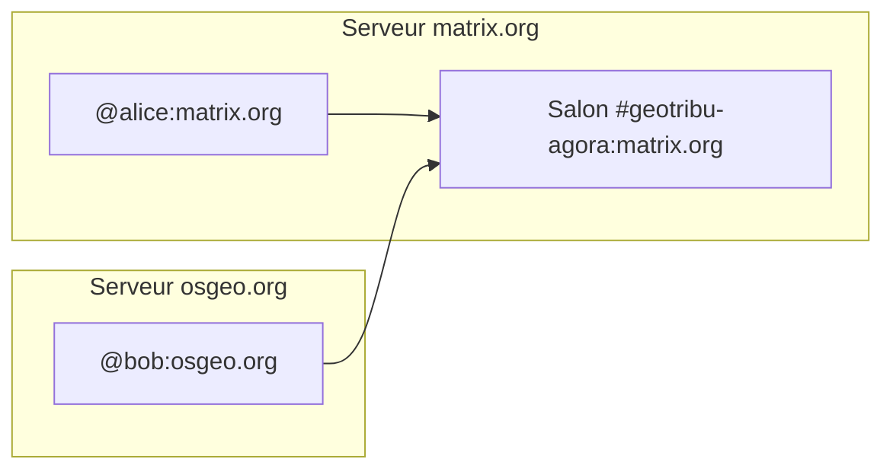

# Entrez dans la Matrix Geotribu !

:calendar: Date de publication initiale : {{ page.meta.date | date_localized }}

Au printemps 2020, lorsque nous [relançions Geotribu après son AVC SQL](../2020/2020-08-31_geotribu_histoire.md#la-difficile-renaissance), nous avons choisi d'ouvrir un espace Slack en lieu et place de la liste de diffusion historique, feue `geotribu@lafrere.org`. Après 4 ans de bons et loyaux services, nous avons décidé de migrer vers [Matrix](https://matrix.org/), un protocole de communication ouvert et décentralisé. Plusieurs raisons à cela :

- Matrix est open source et c'est donc l'occasion de gagner quelques points de cohérence karmique avec [notre ligne éditoriale]({{ config.extra.url_contribuer }}requirements#ligne-editoriale) ;
- l'adoption du protocle est en forte croissance avec notamment l'OSGeo qui dispose de [sa propre instance](https://matrix.osgeo.org/), l'OSGeo-FR ([Loïc et Nicolas vous en parlaient à propos de l'OSGeo-FR dès 2021](../2021/2021-10-15_irc_osgeo.md#via-matrix-méthode-recommandée)), [QGIS](https://matrix.to/#/#qgis:osgeo.org) et d'autres projets anglophones ([OpenStreetMap](https://wiki.openstreetmap.org/wiki/Matrix) bien sûr) comme francophones ([mViewer](https://matrix.to/#/#mviewer:matrix.org), le [plugin IDG pour QGIS](https://matrix.to/#/!DqHgKIoltGIikFRreo:matrix.org?via=matrix.org&via=craig.fr)...) ou bilingues ([Panoramax](https://matrix.to/#/#panoramax_fr:matrix.org), [QDT](https://matrix.to/#/#qdt:matrix.org)...) ;
- il est également sous-jacent aux applications sécurisées de l'État Français comme [Tchap](https://tchap.gouv.fr/) et bénéficie donc de soutiens de poids ;

Bon, par contre, côté ergonomie et facilité d'utilisation... comment dire... eh bien, on a besoin d'écrire un tutoriel pour guider un maxium de personnes, c'est déjà un indicateur ! :grin:

[Commenter cet article :fontawesome-solid-comments:](#__comments "Aller aux commentaires"){: .md-button }
{: align=middle }

----

## J'ai pas le temps de lire

Si vous avez déjà un compte sur Matrix :

[:simple-matrix: Rejoindre l'espace Matrix :fontawesome-solid-comments:](https://matrix.to/#/#geotribu:matrix.org){ .md-button }
{: align=middle }

Sinon pour faire au plus vite :

1. ouvrir l'application web Element qui est le client Matrix le plus utilisé (et qui a aussi une app mobile) : <https://app.element.io/>
1. se créer un compte <https://app.element.io/#/register> (sélectionner matrix.org comme serveur)
1. ensuite c'est assez classique
1. cliquer sur [ce lien](ttps://matrix.to/#/#geotribu:matrix.org), ou chercher `geotribu` dans l'interface (barre en haut ou raccourci clavier ++ctrl+k++ comme dans QGIS :wink: )

----

## Matrix c'est pas un film ?

Nan enfin si mais pas que du coup. Et rien à voir avec la choucroute dans le cas qui nous intéresse.

### Version courte

C'est un outil de tchat un peu comme Slack, Discord ou Teams. Mais open source et décentralisé (comme [Mastodon pour les réseaux sociaux](../2024/2024-02-16_de-twitter-a-mastodon-guide-geo-import-liste-comptes.md) ou [PeerTube](https://joinpeertube.org/fr/) pour les vidéos par exemple).

### Version longue

C'est un protocole de communication décentralisé et ouvert, un peu comme le mail ou le web. Il permet d'échanger des messages textes, des fichiers, de faire des appels audio/vidéo, etc. via des applications clientes (Element est la plus connue). Chaque utilisateur est hébergé sur un serveur (appelé _homeserver_) et peut rejoindre des salons de discussion (appelés _rooms_ ou "salons") qui peuvent être fédérés entre plusieurs serveurs.

## L'espace Geotribu sur Matrix

Nous avons créé 3 salons liés à Geotribu, regroupés dans un "espace" public `#geotribu:matrix.org` (<https://matrix.to/#/#geotribu:matrix.org>) :

- :fr: le salon public **francophone** `#geotribu-agora:matrix.org` (<https://matrix.to/#/#geotribu-agora:matrix.org>) pour discuter de tout ce qui touche à la géomatique, aux SIG, à l'open source, etc. ;
- :uk: le salon public **anglophone** `#geotribu-agora-en:matrix.org` (<https://matrix.to/#/#geotribu-agora-en:matrix.org>) pour les échanges sur le blog anglophone ;
- :tent:  un salon privé, sur invitation seulement pour l'équipe

{: .img-center loading=lazy }

### Procédure pour rejoindre le tchat avec l'application web

1. Cliquer sur le lien ci-dessous :

    [:simple-matrix: Rejoindre le tchat Matrix :fontawesome-solid-comments:](https://matrix.to/#/#geotribu-agora:matrix.org){ .md-button }
    {: align=middle }

1. Si vous voyez cet écran à propos d'une prévisualisation de lien, cliquer sur `Continue` :

    {: .img-center loading=lazy }

1. Sur l'écran suivant, nous vous recommandons de choisir le client Element :

    {: .img-center loading=lazy }

1. Choisir le mode d'utilisation de l'application : installée sur votre ordinateur ou sur le navigateur. Ici on continue ce tutoriel avec le navigateur, plus indépendant en termes d'environnement technique (droits d'installation, etc.) :

    {: .img-center loading=lazy }

1. Une fois sur la page d'accueil de l'application Element, se connecter avec son compte (`Se connecter`) et aller à l'étape X ou s'en créer un `Créer un compte` :

    {: .img-center loading=lazy }

1. Choisir un nom d'utilisateur sur le serveur sélectionné (a priori `matrix.org`) et le mode de création de compte qui vous convient le mieux (adresse email, compte externe...) et suivre les étapes assez classiques :

    {: .img-center loading=lazy }

1. Une fois le compte créé, cliquer sur "Continuer vers Element" :

    {: .img-center loading=lazy }

1. Vous voilà arrivé:e à bon port, cliquer sur "Rejoindre" :

    {: .img-center loading=lazy }

### Application mobile

[Télécharger l'application Element](https://element.io/download){ .md-button }
{: align=middle }

----

## Idées de configuration alternative

Nous donnons ici les étapes pour embarquer le plus simplement et rapidement possible. Mais le réseau étant décentralisé, vous pouvez également choisir d'opter pour différentes alternatives.

Par exemple, choisir matrix.osgeo.org comme _homeserver_ avec votre compte OSGeo. Ou utiliser un autre client, comme Thunderbird par exemple :

{: .img-center loading=lazy }

----

## Ressources

- page Wikipédia FR [Matrix](https://fr.wikipedia.org/wiki/Matrix_(protocole))
- [Comprendre le protocole Matrix et la communication décentralisée sécurisée](https://linagora.com/topics/comprendre-le-protocole-matrix-la-communication-decentralisee-securisee) (Linagora)

----

<!-- geotribu:authors-block -->


