# Servir du WMS caché avec mapproxy

:calendar: Date de publication initiale : {{ page.meta.date | date_localized }}

Hello la troupe :wave: !

{: .img-thumbnail-left }

Dans un contexte que j'ai rencontré au cours d'une de mes missions pro, des utilisateurs de QGIS consomment du WMS et des tuiles, et il y a des enjeux et challenge de connectivité et performances, compte-tenu du fait que les serveurs carto sont parfois très distants des _users_ finaux. Aussi, la bande passante des réseaux dans lesquels les postes QGIS demandent des flux n'est pas toujours fiable, alors il faut faire preuve d'ingéniosité pour rendre un usage fluide de ces flux, dans notre logiciel SIG Desktop préféré.

Une brique existe pour cela, [mapproxy](https://mapproxy.org/) : opensource, léger et svelte, écrit en python et qui porte plutôt bien son nom : un proxy de maps, qui va servir à mettre en cache des flux générés par **d'autres** serveurs cartographiques. L'avantage est déjà que mapproxy possède, à l'instar de QGIS server et GeoServer avec [GeoWebCache](https://docs.geoserver.org/main/en/user/geowebcache/index.html) la possibilité de mettre en cache les tuiles servies, et ce de différentes manières : fichiers classiques, mbtiles, geopackage, redis, s3... Aussi, mapproxy permet comme son nom l'indique de servir de proxy, c'est-à-dire de relais de flux entre un serveur carto et d'autres clients, qui peuvent être par ex. QGIS, du WebGIS, d'autres serveurs carto...

Et la configuration est basée sur des fichiers [yaml](https://yaml.org/spec/), ce qui facilite des automatisations et des instantiations de plusieurs instances iso, via [ansible](https://docs.ansible.com/) par exemple.

## Des cas d'usage de mapproxy

Le site de mapproxy présente un premier cas d'usage, où un serveur `mapproxy` cache et sert à des clients finaux des flux générés par plusieurs autres serveurs :

{: .img-center loading=lazy }

On note déjà que les flux en entrée du mapproxy peuvent être du WMS ou de la tuile (par exemple les couches `XYZ` dans QGIS), fournies par exemple par MapServer, GeoServer, QGIS Server...

Les clients qui consomment ce WMS en provenance du mapproxy peuvent être des clients Desktop comme QGIS, ou des librairies web style OpenLayers, MapLibre, Leaflet, ou encore des app mobiles comme QField / Mergin Maps, ou bien même d'autres serveurs cartographiques ! C'est la beauté des protocoles.

----

Un autre cas d'usage pourrait être le suivant :

- des clients éparpillés et/ou à l'autre bout du monde, avec des latences très lentes en visant un unique serveur cartographique.

- un _super_ serveur cartographique, quelque part, qui calcule et sert tout le nécessaire, par exemple QGIS server. Nous n'avons pas envie de répliquer et manipuler plusieurs instances de QGIS server ayant vocation à servir strictement les mêmes flux, alors nous allons préférer instancier différentes instances de mapproxy.

- des instances de mapproxy plus proches des clients, permettant ainsi de cacher et fournir les flux aux clients de manière plus fluide et performante.

La logique pourrait se traduire par le schéma suivant :

```mermaid
graph TD
    classDef client fill:#E3F2FD,stroke:#1E88E5,stroke-width:1px,color:#0D47A1;
    classDef mapproxy fill:#E8F5E9,stroke:#43A047,stroke-width:1px,color:#1B5E20;
    classDef server fill:#FFF3E0,stroke:#FB8C00,stroke-width:1px,color:#E65100;
    classDef decision fill:#FFEBEE,stroke:#E53935,stroke-width:2px,color:#B71C1C;
    classDef col stroke:#000000,stroke-width:2px,color:#B71C1C;

    subgraph Col1[ ]
        direction TB
        subgraph Z1C[Clients en zone 1]
            ClientZ11[👩 Alicia<br>sur QGIS]
            ClientZ12[👨 Bobby<br>sur MapLibre]
        end
    end

    subgraph Col2[ ]
        direction LR
        mapproxyZ1[🤖 mapproxy zone 1]
    end

    subgraph Col3[ ]
        direction TB
        ServeurCentral[💾 Serveur Central]
    end


    ClientZ11 --> |1: ✉️ Demande le flux| mapproxyZ1
    mapproxyZ1 ---> D1{2: 🌀 Ressource<br>en cache ?}
    D1 --> |✅ Oui<br>📦 retourne la ressource| ClientZ11
    D1 --> |❌ Non| R1Z1[3: ✉️ Demande la ressource]
    R1Z1 --> ServeurCentral
    ServeurCentral --> |4: 👷 Calcule la ressource| ServeurCentral
    ServeurCentral --> |5: 📦 Retourne la ressource| mapproxyZ1
    mapproxyZ1 --> |6: 🌀 Met en cache<br>la ressource| mapproxyZ1
    mapproxyZ1 --> |7: 📦 Retourne la ressource| ClientZ11

    class ClientZ11,ClientZ12 client;
    class mapproxyZ1,mapproxyZ2 mapproxy;
    class ServeurCentral server;
    class D1,D2 decision;
    class Col1,Col2,Col3 col;
```



Aussi possible de mettre en place [du _load balancing_](https://fr.wikipedia.org/wiki/R%C3%A9partition_de_charge) pour des flux carto, avec plusieurs instances mapproxy configurées de la même manière, mais on ne s'étendra pas trop sur ce cas ici.

## Mise en route avec un exemple

Afin d'illustrer et mettre en route une stack avec mapproxy au centre, entre un serveur carto et un client, faisons un petit exemple en mettant en cache des données sur le 19e arrondissement de Paris. En bout de chaîne, notre mapproxy va donc servir des couches WMS pour cette zone, pour laquelle nous auront besoin de la _bounding box_.

Concernant les sources "centrales", étant donné qu'on n'a pas vraiment de serveur carto qui tourne avec des "vraies" données, on va utiliser les tuiles d'OpenStreetMap, du WMS de la Géoplateforme ainsi que des tuiles d'imagerie satellite de Google et Bing.

!!! warning
    Ici on est dans un tuto à but pédagogique, si vous souhaitez utiliser et mettre en cache ces sources de données en production, et/ou pour des usages commerciaux, allez d'abord lire attentivement les conditions générales d'utilisation de ces _datasources_.

Pour rappel, il est déjà possible d'ajouter ces couches à QGIS, en ajoutant par exemple une nouvelle source `XYZ`, ou bien via une connexion WMS :

- _OpenStreetMap_: `https://tile.openstreetmap.org/{z}/{x}/{y}.png`, qui [propose d'ailleurs un guide pour configurer mapproxy avec OSM](https://wiki.openstreetmap.org/wiki/MapProxy).
- _Géoplateforme_: on va utiliser la couche [`BU.building` du service _WMS-Vecteur_](https://geoservices.ign.fr/documentation/services/services-geoplateforme/diffusion#70068). Ce service est limité à 50 requêtes par seconde.
- _Googly Hybrid_: `https://mt.google.com/vt/lyrs=y&hl=en&x={x}&y={y}&z={z}`
- _Bing Aerial_: `http://ecn.t3.tiles.virtualearth.net/tiles/a{q}.jpeg?g=1` - ici on n'utilise pas de `x/y/z` mais un paramètre `q`, pour _quadkey_. Rien à voir avec un véhicule de kéké des forêts, c'est plutôt une manière d'indexer spatialement des tuiles carrées. [Plus d'infos ici](https://medium.com/data-science/geospatial-indexing-with-quadkeys-d933dff01496).

{: .img-center loading=lazy }

!!! info
    À noter que lors de la création d'une connexion de type `XYZ`, le bas de l'interface montre des niveaux de zoom min et max à demander (respectivement 0 et 19). Gardez ces valeurs en tête, nous pourrions les ressortir plus tard lorsque nous jouerons à cache-cache :wink:

## Installation de mapproxy sur un serveur debian / ubuntu

Entrons maintenant dans le vif du sujet, et la partie _geek_ : l'installation de mapproxy sur une machine linux. Ici on se limitera aux distributions basées sur debian et ubuntu.

Une fois n'est pas coutume - j'ai plutôt l'habitude de déployer des mapproxy avec [systemd](https://fr.wikipedia.org/wiki/Systemd), étant donné qu'on va utiliser [docker](https://www.docker.com/) pour lancer l'applicatif, il est déjà nécessaire d'installer ça [en suivant la doc officielle](https://docs.docker.com/engine/install/debian/).

Une fois docker installé, attardons-nous sur le léger fichier `docker-compose.yaml` pour lancer le service :

```yaml title="Contenu du docker-compose.yaml"
services:
  mapproxy:
    image: kartoza/mapproxy:6.0.1
    restart: unless-stopped
    environment:
      - PRODUCTION=true
      - PROCESSES=4
      - CHEAPER=2
      - THREADS=10
      - MULTI_MAPPROXY=false
      - ALLOW_LISTING=true
      - LOGGING=true
    volumes:
      - ./config:/mapproxy
      - ./cache/:/cache_data
    ports:
      - 8765:8080

```

- On redirige vers le port 8765 en sortie, qu'on configurera dans nginx, notre serveur agissant comme reverse-proxy devant notre map proxy :hot_face:...
- On désactive le mode `MULTI_MAPPROXY` pour ce tuto.
- Les deux entrées dans la partie `volumes` représentent les dossiers locaux montés dans le container :
    - Il doit y avoir un répertoire `config` là où vous vous trouvez (où créez-le via `mkdir -p config`). Ce répertoire contiendra notamment la configuration et la déclaration des couches servies par le mapproxy.
    - Il doit y avoir un répertoire `cache` là où vous vous trouvez (où créez-le via `mkdir -p cache`). Ce répertoire accueillera les tuiles cachées, étant donné qu'ici on va rester sur du cache simple de type [_file_](https://mapproxy.github.io/mapproxy/latest/caches.html#file). Notez qu'il est possible d'enregistrer les tuiles cachées dans [du geopackage](https://mapproxy.github.io/mapproxy/latest/caches.html#cache-geopackage), dans [des mbtiles](https://mapproxy.github.io/mapproxy/latest/caches.html#cache-mbtiles), dans [du redis](https://mapproxy.github.io/mapproxy/latest/caches.html#cache-redis), dans [du s3](https://mapproxy.github.io/mapproxy/latest/caches.html#cache-s3), et d'autres trucs comme nous le savons, _à nous l'savon_ !

<!-- markdownlint-disable MD033 -->

<iframe width="100%" height="400" src="https://www.youtube-nocookie.com/embed/cknUKHVD-00?si=yhtTkNjjgRv8PtUw" title="YouTube video player" frameborder="0" allow="accelerometer; autoplay; clipboard-write; encrypted-media; gyroscope; picture-in-picture; web-share" referrerpolicy="strict-origin-when-cross-origin" allowfullscreen></iframe>

<!-- markdownlint-enable MD033 -->

Une fois ce `docker-compose.yaml` créé de même que les deux dossiers nécessaires, jettons un coup d'oeil au fichier de configuration (unique) de mapproxy !

## Configuration du mapproxy

Il s'agit donc d'[un fichier unique `mapproxy.yaml`](https://mapproxy.github.io/mapproxy/latest/configuration.html#mapproxy-yaml), qui doit se trouver dans votre dossier `config` là où vous vous trouvez.

Abordons le contenu d'un tel fichier de conf, pour un seul _layer_ - OpenStreetMap caché sur Paris 19.

Il y a plusieurs sections :

- la partie [_services_](https://mapproxy.github.io/mapproxy/latest/services.html#) qui déclare du WMS uniquement ici (WMTS, TMS possibles etc.)
- un [_layer_](https://mapproxy.github.io/mapproxy/latest/configuration.html#layers) pointe vers un [_cache_](https://mapproxy.github.io/mapproxy/latest/configuration.html#caches), qui lui-même se réfère à une [_source_](https://mapproxy.github.io/mapproxy/latest/configuration.html#sources-conf-label) et une [_grid_](https://mapproxy.github.io/mapproxy/latest/configuration.html#id6).
- ici on délimite la source avec une _bbox_, qui représente l'emprise du 19e arrondissement de Paris. [Plusieurs types de _coverages_ sont disponibles](https://mapproxy.github.io/mapproxy/latest/coverages.html#coverages).

Ce qui donne un fichier `mapproxy.yaml` qui ressemble à ça :

```yaml linenums="1" title="Contenu de config/mapproxy.yaml"
sources:
  paris19osm_source:
    type: tile
    url: https://tile.openstreetmap.org/%(z)s/%(x)s/%(y)s.png
    grid: osm_grid
    coverage:
      bbox:
        - 2.3646858891194782
        - 48.8720621793437502
        - 2.4108388540828618
        - 48.9021619064262865
      srs: EPSG:4326

caches:
  paris19osm_cache:
    sources:
      - paris19osm_source
    grids:
      - osm_grid

layers:
  - name: paris19_OSM
    sources:
      - paris19osm_cache
    title: Paris19 - OpenStreetMap

grids:
  osm_grid:
    base: GLOBAL_WEBMERCATOR
    origin: nw
    srs: EPSG:3857

services:
  demo: null
  wms:
    bbox_srs:
      - EPSG:4326
    featureinfo_types:
      - text
      - html
      - xml
    image_formats:
      - image/jpeg
      - image/png
    md:
      abstract: WMS server
      access_constraints: For testing purposes only.
      contact:
        address: 12 Boulevard de la Geotribu
        city: GeotribuVille
        country: GeotribuCountry
        email: geotribu@gmail.com
        organization: Geotribu
        person: Guilhem Allaman
        position: Geotribun
        postcode: 75019
      online_resource: http://mapproxy.geotribu.net/mapproxy/service?
      title: Geotribu Test WMS Proxy
    on_source_errors: raise
    srs:
      - EPSG:2154
      - EPSG:3857
      - EPSG:4326
    strict: true
    versions:
      - 1.3.0
      - 1.1.1

globals:
  cache:
    base_dir: /cache_data
```

Voyons maintenant comment configurer les différentes sources de données qu'on définissait plus haut.

- Source _OpenStreetMap_ :

```yaml
paris19_osm_source:
  type: tile
  url: https://tile.openstreetmap.org/%(z)s/%(x)s/%(y)s.png
  grid: osm_grid
  coverage:
    bbox:
      - 2.3646858891194782
      - 48.8720621793437502
      - 2.4108388540828618
      - 48.9021619064262865
    srs: EPSG:4326
```

Source _WMS-Vecteur Géoplateforme_ :

```yaml
paris19_bu_building_source:
  type: wms
  req:
    url: https://data.geopf.fr/wms-v/ows
    layers: BU.Building
    transparent: true
  grid: osm_grid
  coverage:
    bbox:
      - 2.3646858891194782
      - 48.8720621793437502
      - 2.4108388540828618
      - 48.9021619064262865
    srs: EPSG:4326
  wms_opts:
    legendurl: https://data.geopf.fr/wms-v/ows?service=WMS&version=1.3.0&request=GetLegendGraphic&format=image%2Fpng&width=20&height=20&layer=BU.Building
  image:
    transparent_color: "#ffffff"
    transparent_color_tolerance: 0
```

Source _Imagerie Google Hybrid_ :

```yaml
paris19_googlehybrid_source:
  type: tile
  url: https://mt.google.com/vt/lyrs=y&hl=en&x=%(x)s&y=%(y)s&z=%(z)s
  grid: osm_grid
  coverage:
    bbox:
      - 2.3646858891194782
      - 48.8720621793437502
      - 2.4108388540828618
      - 48.9021619064262865
    srs: EPSG:4326
```

Source _Imagerie Bing Aerial_ :

```yaml
paris19_bing_aerial_source:
  type: tile
  url: https://ecn.t3.tiles.virtualearth.net/tiles/a%(quadkey)s.jpeg?g=1
  grid: osm_grid
  coverage:
    bbox:
      - 2.3646858891194782
      - 48.8720621793437502
      - 2.4108388540828618
      - 48.9021619064262865
    srs: EPSG:4326
```

Les `caches` et `layers` sont sensiblement les mêmes, adaptés pour pointer sur la bonne `source`.

## Configuration du serveur web nginx

Maintenant, configurons notre serveur web nginx, qui va directement recevoir les requêtes en provenance des clients avant de les dispatcher à l'instance mapproxy.

Pour cela créer un nouveau "site", dans `/etc/nginx/sites-available/` :

``` title="Configuration du site nginx dans /etc/nginx/sites-available/mapproxy.conf"
upstream mapproxy_upstream {
  server 127.0.0.1:8765;
}

server {
  listen 80;
  server_name mapproxy.guilhemallaman.net;
  return 301 https://$host$request_uri;
}

server {

  listen 443 ssl;
  server_name mapproxy.guilhemallaman.net;

  ssl_certificate /etc/letsencrypt/live/mapproxy.guilhemallaman.net/fullchain.pem;
  ssl_certificate_key /etc/letsencrypt/live/mapproxy.guilhemallaman.net/privkey.pem;

  error_log /var/log/nginx/mapproxy.error.log;
  access_log /var/log/nginx/mapproxy.access.log combined;

  location /mapproxy {
    proxy_pass http://mapproxy_upstream;
    proxy_set_header Host $http_host;
    proxy_set_header X-Script-Name /mapproxy;
  }
}
```

Créer ensuite un lien symbolique vers `/etc/nginx/sites-enabled/` :

```sh
sudo ln -s /etc/nginx/sites-available/mapproxy.conf /etc/nginx/sites-enabled/mapproxy.conf
```

Récupérer les certificats de la manière suivante, après avoir préalablement éteint le nginx avec `systemctl stop nginx`:

```sh
sudo certbot certonly --standalone -d mapproxy.guilhemallaman.net
```

Une fois ok, redémarrer le nginx avec `systemctl start nginx`.

Retourner maintenant à l'emplacement où vous avez mis le `docker-compose.yaml` ainsi que le dossier de config de mapproxy. Démarrer l'instance via  `docker compose up -d`.

Regarder les logs avec `docker compose logs -f -n 200`, si tout est ok, on a maintenant un mapproxy fonctionnel :tada: !

## Tester dans QGIS

Ouvrons maintenant le logiciel Desktop numero uno, et créons une nouvelle connexion WMS, avec l'URL `https://DOMAIN/mapproxy/service` :

{: .img-center loading=lazy }

Les 4 couches définies sont listées une fois que nous sommes connecté/es :

{: .img-center loading=lazy }

Ouvrons la couche des Buildings de la Géoplateforme, tada :tada: :

{: .img-center loading=lazy }

## Pré-cacher les zones configurées

Comme tout bon serveur de cache tuilé, mapproxy vient avec un utilitaire, qui permet de pré-générer les tuiles dans le cache.

Pour cela, on a (encore) besoin de configurer un fichier `seeds.yaml`, qu'on dépose au même endroit que le `mapproxy.yaml` - dans le dossier `config` monté dans le container docker :

```yaml linenums="1" title="Contenu de config/seeds.yaml"
seeds:
  paris19osm_seed:
    caches:
      - paris19osm_cache
    coverages:
      - paris19_coverage
    grids:
      - osm_grid
    levels:
      from: 8
      to: 18
    refresh_before:
      weeks: 4

cleanups:
  paris19osm_cleanup:
    caches:
      - paris19osm_cache
    levels:
      from: 0
      to: 20
    remove_before:
      weeks: 4

coverages:
  paris19_coverage:
    bbox:
      - 2.3646858891194782
      - 48.8720621793437502
      - 2.4108388540828618
      - 48.9021619064262865
    srs: EPSG:4326
```

Pour le seed `paris19osm_seed`, les tuiles correspondantes au niveaux de zoom de 8 à 18 seront générées avec une telle config. Aussi, toutes les tuiles mise en cache il y a plus de 4 semaines seront régénérées (clé `remove_before`). [La doc](https://mapproxy.github.io/mapproxy/latest/seed.html#seeding) montre toutes les options et configurations possibles.

Pour lancer une opération de _seeding_, voici la commande qui spécifie avec l'option `--seed=x,y` quel(s) _seed(s)_ pré-générer :

```sh
$ docker compose exec -it mapproxy mapproxy-seed -s /mapproxy/seeds.yaml -f /mapproxy/mapproxy.yaml --seed=paris19osm_seed

========== Seeding tasks ==========
Start seeding process (1 task)
  paris19osm_seed:
    Seeding cache 'paris19osm_cache' with grid 'osm_grid' in EPSG:3857
    Limited to coverage in: 2.36469, 48.87206, 2.41084, 48.90216 (EPSG:4326)
    Levels: [8, 9, 10, 11, 12, 13, 14, 15, 16, 17, 18]
    Overwriting: tiles older than 2025-11-03 11:51:25
[11:51:25]  8   0.00% 263235.62906, 6253180.83813, 268373.35362, 6258276.59247 (0 tiles)
[11:51:28] 17  18.75% 263235.62906, 6256829.38731, 263554.87353, 6257440.88354 (59 tiles)
[11:51:29] 17  21.88% 263554.87353, 6256829.38731, 264166.36975, 6257440.88354 (76 tiles)
[11:51:30] 17  29.69% 263554.87353, 6255606.39486, 264166.36975, 6256217.89109 (155 tiles)
[11:51:31] 17  35.94% 263554.87353, 6254383.40241, 264166.36975, 6254994.89863 (232 tiles)
[11:51:32] 17  46.88% 263554.87353, 6253180.83813, 264166.36975, 6253771.90618 (310 tiles)
[11:51:33] 16  56.25% 264166.36975, 6256829.38731, 265389.36221, 6258052.37976 (381 tiles)
[11:51:35] 17  58.59% 264777.86598, 6256829.38731, 265389.36221, 6257440.88354 (444 tiles)
[11:51:36] 17  61.72% 266000.85843, 6256829.38731, 266612.35466, 6257440.88354 (529 tiles)
[11:51:37] 17  69.53% 267223.85088, 6257440.88354, 267835.34711, 6258052.37976 (608 tiles)
[11:51:38] 16  71.88% 267835.34711, 6256829.38731, 268373.35362, 6258052.37976 (672 tiles)
[11:51:39] 17  75.78% 264166.36975, 6255606.39486, 264777.86598, 6256217.89109 (759 tiles)
[11:51:43] 17  76.95% 266000.85843, 6256217.89109, 266612.35466, 6256829.38731 (823 tiles)
[11:51:45] 17  78.52% 264777.86598, 6254994.89863, 265389.36221, 6255606.39486 (908 tiles)
[11:51:46] 16  79.69% 265389.36221, 6254383.40241, 266612.35466, 6255606.39486 (972 tiles)
[11:51:47] 17  80.86% 266000.85843, 6254383.40241, 266612.35466, 6254994.89863 (1035 tiles)
[11:51:48] 17  82.03% 266612.35466, 6255606.39486, 267223.85088, 6256217.89109 (1100 tiles)
[11:51:50] 17  82.42% 267223.85088, 6255606.39486, 267835.34711, 6256217.89109 (1121 tiles)
[11:51:51] 17  84.77% 267223.85088, 6254994.89863, 267835.34711, 6255606.39486 (1207 tiles)
[11:51:52] 17  86.72% 267835.34711, 6254383.40241, 268373.35362, 6254994.89863 (1292 tiles)
[11:51:53] 17  89.84% 264777.86598, 6253180.83813, 265389.36221, 6253771.90618 (1378 tiles)
[11:51:55] 17  92.97% 266000.85843, 6253180.83813, 266612.35466, 6253771.90618 (1463 tiles)
[11:51:56] 17  96.09% 267223.85088, 6253180.83813, 267835.34711, 6253771.90618 (1549 tiles)
[11:51:57]  8 100.00% 263235.62906, 6253180.83813, 268373.35362, 6258276.59247 (1621 tiles)
```

Une fois l'opération terminée, on se retrouve avec nos différents niveaux de zoom mis en cache, dans le dossier `cache` :

```sh
$ ls -l cache/paris19osm_cache_EPSG3857/

total 44
drwxr-xr-x 3 root root 4096 Dec 29 12:51 08
drwxr-xr-x 3 root root 4096 Dec 29 12:51 09
drwxr-xr-x 3 root root 4096 Dec 29 12:51 10
drwxr-xr-x 3 root root 4096 Dec 29 12:51 11
drwxr-xr-x 3 root root 4096 Dec 29 12:51 12
drwxr-xr-x 3 root root 4096 Dec 29 12:51 13
drwxr-xr-x 3 root root 4096 Dec 29 12:51 14
drwxr-xr-x 3 root root 4096 Dec 29 12:51 15
drwxr-xr-x 3 root root 4096 Dec 29 12:51 16
drwxr-xr-x 3 root root 4096 Dec 29 12:51 17
drwxr-xr-x 3 root root 4096 Dec 29 12:51 18
```

!!! info
    L'utilitaire `mapproxy-seed` permet également de supprimer des tuiles du cache, déclarés via la clé `cleanups` dans le fichier `seeds.yaml`, et à supprimer via l'option `--cleanup=x,y` de l'outil `mapproxy-seed`.

## Conclusion

En conclusion, nous avons vu comment instancier un serveur mapproxy, qui comme son nom l'indique permet de jouer au proxy et mettre en cache des tuiles en provenance de un ou plusieurs serveurs cartographiques, et à destination de clients consommateurs de WMS.

J'attire l'attention sur l'utilisation des datasources qu'on peut être amenés à configurer et servir via mapproxy : important de lire etde  s'informer des conditions d'utilisation avant de se lancer.

Et nous avons ici réalisé un setup rudimentaire, sans implémenter les requêtes WMS `GetFeature` et autres. Et généralement, en production il est toujours judicieux de décrire les flux servis avec des métadonnées.

À l'heure où éclosent des formats optimisés pour le cloud, comme [COG](https://cogeo.org/), [Zarr](https://zarr-specs.readthedocs.io/en/latest/v3/core/index.html), etc. Et à une époque où les tuiles vectorielles prennent véritablement leur essor - d'ailleurs [OpenStreetMap en sert maintenant sur son site principal](https://blog.openstreetmap.org/2025/07/22/les-tuiles-vectorielles-sont-deployees-sur-openstreetmap-org/?lang=fr), le format et les flux WMS ont-ils toujours leur place ? Ou la cèderont-ils à ces nouveaux formats, plus optimisés et moins ressourcivores en terme de stockage et bande passante ? J'imagine que l'avenir nous le dira.
