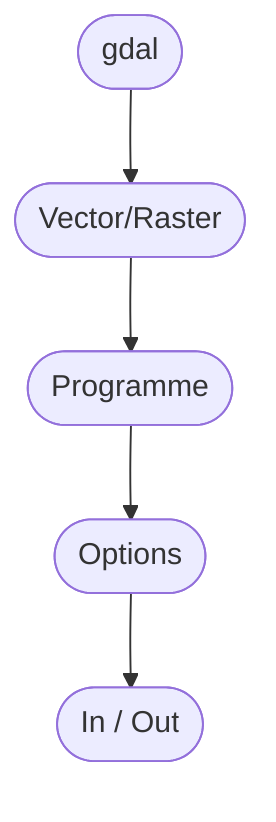
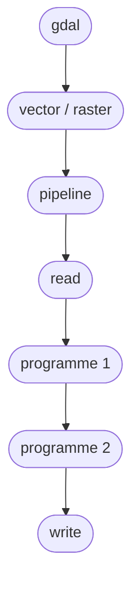

# La nouvelle CLI GDAL 3.11

:calendar: Date de publication initiale : {{ page.meta.date | date_localized }}

> "Oh non, pas gdal_translate ! C'était mon préféré !"
> *Un photogramètre anonyme en détresse*

Depuis sa version 3.11 (et son intégration à QGIS 3.44), la CLI (Command Line Interface / Interface en Ligne de Commande) de `GDAL` a été entièrement revue. On va ici présenter cette nouvelle interface et brosser un aperçu de ce qu'on peut réaliser avec `GDAL` dans un court article. *Nota bene : COURT on a dit.*

## Gdal qu'est ce que c'est ?

`GDAL` est une librairie de programmes open source en C/C++ permettant de réaliser des convertion de fichier vecteur/rasteur, et des traitements raster. Cette librairie se cache derrière à peu près tous les logiciels contenant "SIG" dans leur description. Quand vous demandez à QGIS d'enregistrer votre fichier `geopackage` en `flatgeobuf` ou en `geoparquet` pour les amateur.trices de formats modernes mais étranges (perso je ne travaille plus qu'en [DuckLake](https://duckdb.org/2025/05/27/ducklake.html) Spatial pour embêter mes collègues), en réalité QGIS *demande* à GDAL de réaliser l'opération.

Les anciens noms des programmes dédiés au vecteur font référence à ogr, une ancienne librairie depuis *absorbée* par GDAL.

On ne le répétera jamais assez mais sans GDAL, presque rien n'existerait dans le monde de la géomatique, qu'elle soit libre ou propriétaire. A tout ces égards, cette librairie fait partie de la sainte trinité [gdal](https://gdal.org/en/stable/)/[geos](https://libgeos.org/)/[proj](https://proj.org/en/stable/).

Maitriser `GDAL`, c'est être capable de remplacer des ~~interfaces graphiques~~ logiciels coutant des dizaines de milliers d'euros.

Cependant, historiquement les programmes `GDAL` étaient ... comment dire ... peut normés entre eux, par exemple `gdal_translate` (le programme servant aux conversions raster) demandait ses fichiers d'entrée / sortie dans cet ordre : in -> out alors qu'`ogr2ogr` (le programme servant aux conversions vecteur) lui demandait : out -> in. De plus les plus gros programmes, ceux qui "faisaient tout" on été supprimés et remplacés par des équivalents plus spécifiques.
Pas de panique, les anciennes commandes restent disponibles pour garder vos scripts existants en vie.

## Principes de la nouvelle CLI

- Les gros programmes sont divisés en plusieurs (au revoir `gdal_translate` qui convertissait mais faisait aussi tout pareil que `gdalwarp`, bonjour `gdal raster convert` et `gdal raster reproject`)
- Les positions des fichiers d'entrées et de sorties sont cohérentes entre les programmes et les noms des options sont normés !
- On fait appel aux nouvelles commandes GDAL *git style*.



Vous pourrez retrouver l'intégralité des programmes disponibles et leurs options [ici](https://gdal.org/en/stable/programs/index.html)

Exemple :

```sh
gdal raster convert --overwrite in.jp2 out.tif
```

Commande pour convertir un fichier in.jp2 au format geotiff en autorisant l'écrasement d'un potentiel fichier out.tif déjà existant.

Pour du vecteur on peut aussi importer un shape (beurk) dans une base Postgis

```sh
gdal vector convert --append in.shp PG:"dbname='my_db' user='me' password='admin123' schemas='my_schema'"
```

Une différence par rapport à l'ancienne CLI est l'obligation de l'utilisation de l'option `append`, même pour créer une table non existante.

On peut même copier le contenu d'un flux wms vers un geopackage.

```sh
gdal vector convert --overwrite --output-layer=arrondissement_municipal WFS:"https://data.geopf.fr/wfs/ows?SERVICE=WFS&REQUEST=GetFeature&VERSION=2.0.0&TYPENAMES=BDTOPO_V3:arrondissement_municipal" bdtopo.gpkg
```

On pourrait imaginer combiner les commandes précédantes pour importer le contenu d'un flux WFS vers une base PostgreSQL, mais pour ça on préfèrera utiliser le [Foreign Data Wrapper OGR](https://github.com/pramsey/pgsql-ogr-fdw) car Saint Paul Ramsey veille sur nous. (rejoignez moi dans mon culte esothérique secret vénérant la sainte trinité gdal/geos/proj, représentée par Saint Paul Ramsey, Saint Even Rouault et la Sainte papesse Anita Graser. Venez, on est pas méchant, ça vous coute juste une licence ESRI pour l'adhésion mais on pourra en discuter après la première réunion).

Si certain.nes d'entre vous ont envie de faire comme le bouton "calculer un indice radiométrique" d'un quelconque logiciel de télédétection, on peut appliquer des formules avec `gdal raster math`. On assigne les bandes/rasters à des lettres qu'on appellera ensuite dans la formule. Laissez bien sur toutes les options en *par défaut*.

```sh
gdal raster calc -i "A=ir.tif" -i "B=r.tif" --calc "(A-B)/(A+B)" -o out.tif
```

On peut s'en servir pour créer des [Cloud Optimized Geotiff](https://guide.cloudnativegeo.org/cloud-optimized-geotiffs/intro.html). Voir cet [article de geotribu par Nicolas Rochard](https://geotribu.fr/articles/2025/2025-02-11_bonnes-pratiques-generation-raster-cog-avec-gdal/) pour les options qui sont bien utilisées par la région Hauts de France.

```sh
gdal raster convert --ouput-format=COG -co COMPRESS=ZSTD -co BIGTIFF=IF_NEEDED in.tif out.tif
```

Avec les `-co` qui servent à passer les options spécifiques au driver de sortie. On retrouvera ces différents drivers [ici](https://gdal.org/en/stable/drivers/raster/index.html) pour le raster, et [ici](https://gdal.org/en/stable/drivers/vector/index.html) pour le vecteur.

Ou bien simplement pour demander des informations sur une couche :

```sh
gdal raster info ma_couche.tif
```

Voir même créer des ombrages :

```sh
gdal raster hillshade --zfactor=2 in.tif out.tif
```

## Les pipelines

Une autre nouveauté fait partie de cette mise à jour : les pipelines [vecteurs](https://gdal.org/en/stable/programs/gdal_vector_pipeline.html#gdal-vector-pipeline) ou [raster](https://gdal.org/en/stable/programs/gdal_raster_pipeline.html#gdal-raster-pipeline).
Ils permettent d'appeler un programme nommé `pipeline` qui va enchainer les traitements de plusieurs programmes `GDAL` avant d'écrire le fichier de sortie.

Les commandes utilisant un pipeline doivent toutes commencer par `read` et se terminer par `write`, les différentes opérations étant séparées par des `!`.



Exemple simple n'appliquant qu'une reprojection :

```sh
gdal vector pipeline --progress ! read in.gpkg ! reproject --dst-crs=EPSG:2154 ! write out.gpkg --overwrite
```

On peut aussi écrire le `pipeline` au format `gdalg.json` et son [driver dédié](https://gdal.org/en/stable/drivers/vector/gdalg.html). Attention, ne pas confondre `gdalg` et`gdalf` qui invoquera un magicien bourru et surtout ces cochoncettés de Hobbits qui vous viderons le frigo. Ce format rappelera le pipeline à chaque appel sur le fichier !

```sh
gdal vector pipeline --progress ! read in.gpkg ! reproject --dst-crs=EPSG:2154 ! write in_epsg_2154.gdalg.json --overwrite
```

Qu'on lira ensuite avec :

```sh
gdal vector info in_epsg_2154.gdalg.json
```

(exemple issu de la documentation officielle de GDAL)

On peut ainsi imaginer un pipeline qui reprojetera une couche, avant de la filtrer sur la valeur d'un de ses attributs.

```sh
gdal vector pipeline ! read in.gpkg ! reproject --dst-crs=EPSG:2154 ! filter --where "mon_champ = 'valeur'" ! write out.gdalg.json
```

Cette manière de faire est certes plus verbeuse qu'un classique :

```sh
ogr2ogr --t_srs=EPSG:2154 --sql "WHERE mon_champ='valeur'" --option_3 --option_4 --option_n -lco option1_diver=YES -lco option2_diver=NO out.gpkg in.shp
```

Mais bien plus claire, et surtout réemployable puisque le fichier `gdalg.json` n'est que la description d'une succession de traitements sur la couche source, et peut être appelé comme n'importe qu'elle autre entrée par n'importe quel programme de `GDAL` et non écrit sur un fichier qui devrait être mis à jour à chaque modification de la couche d'origine comme dans ce dernier exemple.

## L'Interface Système Virtuelle (VSI)

C'est ici le moment magique où votre schéma interne de pensée va être modifié. Désormais quand vous vous poserez la question "comment je fais pour *insert random bidule* ?", vous vous direz alors "en fait je vais le faire avec gdal, ça sera plus simple". On peut ainsi donc dire que `GDAL` est vecteur (ah ah ah !) de manipulations [mémétiques](https://fr.wikipedia.org/wiki/M%C3%A9m%C3%A9tique). C'est qu'on en apprend des trucs dans les [vieux bouquins de jdr](https://www.legrog.org/jeux/cops). Sur ce, l'interface système virtuelle de `GDAL` (VSI : Virtual System Interface).

`GDAL` possède une mécanique ([le VSI](https://gdal.org/en/stable/programs/index.html#virtual-system-interface-vsi-commands)) qui lui permet de lire des fichiers *à travers* un autre média (fichier zip, serveur http...).

Pour l'invoquer, on utilisera `vsi` à la place de `vector`/`raster` pour on ajoute le préfixe `/vsi*quelque_chose*/` devant notre fichier.

Exemple :

```sh
gdal vsi info /vsizip/my_file.zip/my_layer_in.shp
```

Lire un fichier contenu dans un zip et le convertir (on peut s'en servir juste pour dézipper) :

```sh
gdal vsi copy /vsizip/my_file.zip/my_layer_in.gpkg my_layer_out.gpkg
```

Convertir un fichier stocké sur un serveur http :

```sh
gdal vsi copy /vsicurl/https://www.ign.fr/bd_topo/my_layer_in.gpkg my_layer_out.gpkg
```

Et on peut combiner pour convertir un fichier zip stocké sur un serveur web ! (attention à chainer les `vsi` avec `//`) :

```sh
gdal vsi copy /vsizip//vsicurl/https://www.ign.fr/bd_topo/my_file.zip/my_layer_in.shp my_layer_out.gpkg
```

`GDAL` possède même des pilotes `S3` ou `AWS` pour son système VSI !

Enfin, on peut aussi profiter de `GDAL` pour générer des `SOzip` (Seek-Optimized Zips), grace au programme `sozip`. Des zips faits pour qu'on cherche vite à l'intérieur. C'est bizarre, ça parait être le penchant de "lire une donnée dans un zip sans avoir à le dézipper" vu juste haut dessus ;).

```sh
gdal vsi sozip create my_gpkg.zip my.gpkg
```

## l'API Python

Enfin, toute cette modernisation impacte evidemment les API, et celle qui nous interesse ici, l'[API Python](https://gdal.org/en/stable/programs/gdal_cli_from_python.html).

On rappelle que de façon curieuse, l'api Python de GDAL s'installe et s'importe comme ceci :

```sh
pip install gdal
```

```python
from osgeo import gdal

gdal.Run(...)
```

Chaque programme `GDAL` est implémenté sous forme d'instances de la classe `osgeo.gdal.Algorithm`, qu'on appelle en utilisant la méthode `osgeo.gdal.Run()` ou plutôt `gdal.Run()` si on a importé `GDAL` comme dans l'exemple ci-dessus.

Ensuite, c'est simple, ils s'appellent comme ceci :

```python
gdal.Run("vector"/"raster"/"vsi", "programme", option(s), input="in.tif", output="out.tif)
```

exemple pour importer un fichier csv dans une base Postgres (plutôt que d'utiliser `COPY` de postgres, plus fastidieux):

```python
gdal.Run("vector", "convert", append=True, format="PostgreSQL", lco="LAUNDER=NO", input=my_file.csv, output="PG:dbname='insee' schemas='wip' user='me' password='admin123'")
```

Le driver PostgreSQL possède une option **LAUNDER** activée par défaut qui va normaliser votre import (mettre les noms de champs en minuscule ...), que je désire désactiver ici.

Exemple pour dézipper un fichier car c'est pénible en Python sinon (ça necessite genre, au moins 3 lignes !), et où le nom du fichier et du zip sont contenus dans une variable `file` :

```python
gdal.Run("vsi", "copy", source=f"/vsizip/{file}_csv.zip/{file}.CSV", destination=f"{file}.csv")
```

(notez qu'avec le programme `copy`, entrée et sortie se nomment `source` et `destination`)

Sur ce, g la dahl de lentilles, alors bon appétit ! (au fond de moi j'ai honte, mais ça fait du bien).

<!-- geotribu:authors-block -->


