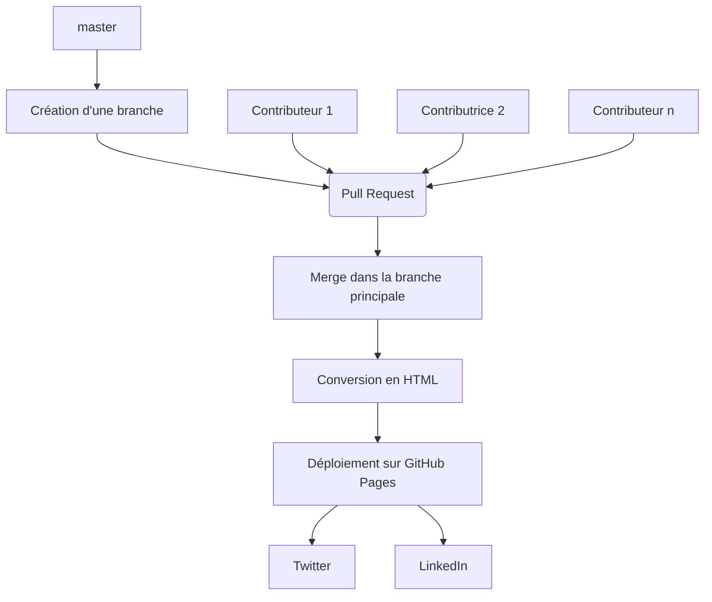
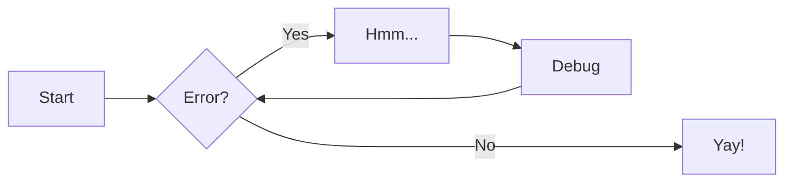

# Insérer des diagrammes

Le site intègre la bibliothèque [MermaidJS](https://mermaid-js.github.io/mermaid/#/) qui permet de générer des diagrammes en utilisant une extension de la syntaxe Markdown.

On utilise [l'intégration dans le thème Material for Mkdocs](https://squidfunk.github.io/mkdocs-material/reference/diagrams/).

## Syntaxe

Cela consiste en créant une balise de code pointant sur le langage `mermaid`, dans laquelle on insère notre syntaxe MermaidJS.

!!! tip
    Pour se faciliter les choses, il est conseillé d'utiliser [l'éditeur en ligne](https://mermaid-js.github.io/mermaid-live-editor/) pour préparer son diagramme.

### Exemple 1

````markdown

````

### Rendu 1


### Exemple 2

````markdown

````

### Rendu 2


