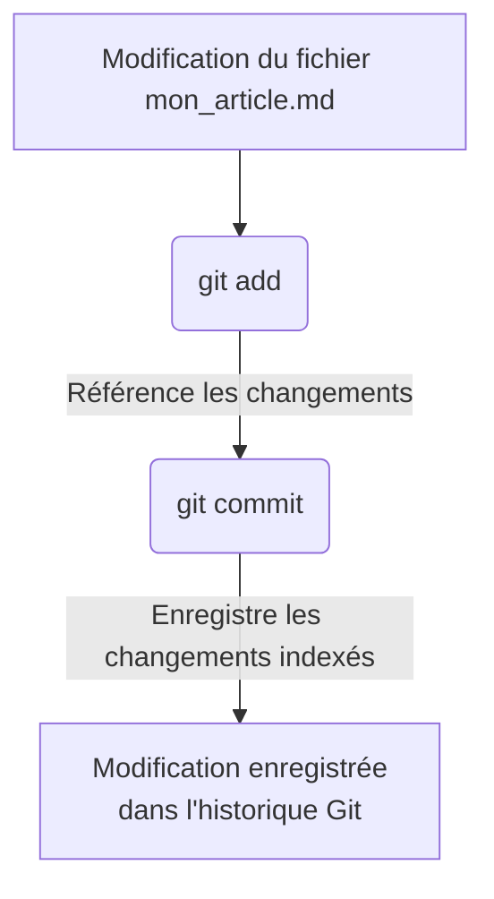
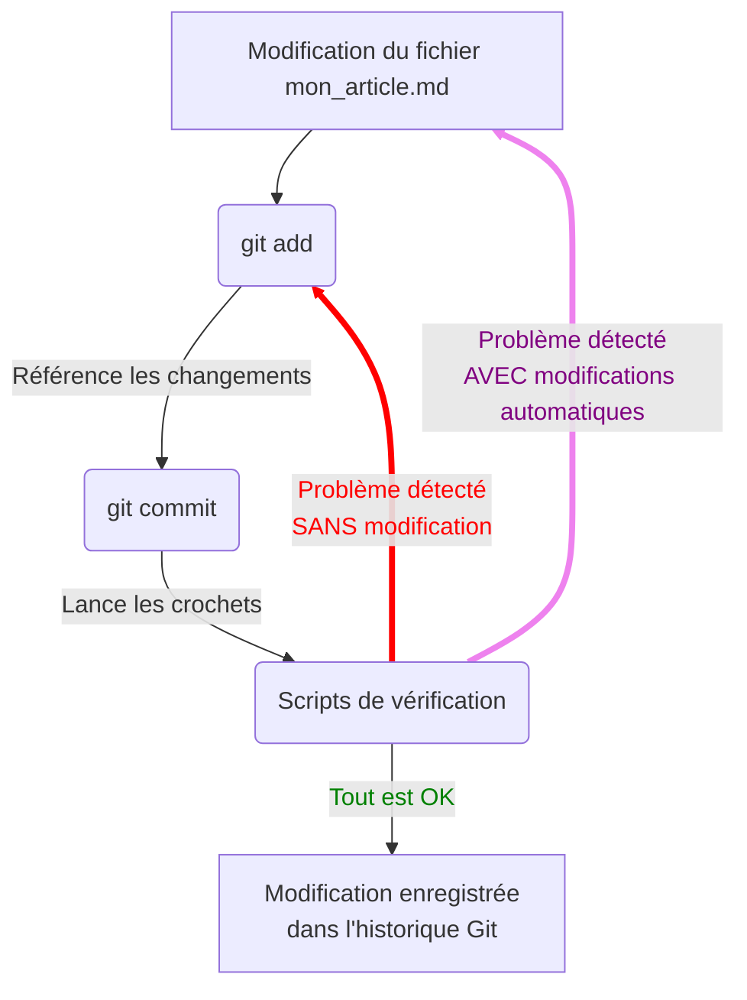

# Git Hooks : garde-fous de l'hétérogénéité de Geotribu

{: .img-rdp-news-thumb }

Afin de garantir un minimum de qualité et surtout de cohérence entre les différentes contributions (appelées _commits_ dans un contexte Git), une série de _git hooks_ est configurée sur le dépôt du site Geotribu.

Ils sont exécutés lors de chaque contribution (_commit_) :

- soit par l'auteur au moment du _commit_
- soit par l'intégration continue (CI) sur GitHub

## Définition

Un _git hook_ est l'une des possibilités offertes par Git pour personnaliser son utilisation. Concrètement c'est un script configuré pour se lancer automatiquement lors d'une étape du workflow de travail avec Git (typiquement au moment d'un _commit_), précisément entre le déclenchement de cette étape et son achèvement. On dit que cela fait faire un crochet (_hook_ en anglais :wink:).

Ressources externes sur le sujet :

- [les crochets Git dans le manuel officiel](https://git-scm.com/book/fr/v2/Personnalisation-de-Git-Crochets-Git)
- [Git Hooks ou la revanche du crochet Git](https://delicious-insights.com/fr/articles/git-hooks/)
- [Git Hooks pour s’assurer de la qualité du code produit](https://medium.com/@bluedme/git-hooks-pour-sassurer-de-la-qualit%C3%A9-du-code-produit-16920bdf6ad8)

----

## Fonctionnement

Sur Geotribu, les crochets sont configurés pour intervenir au moment du _commit_, c'est-à-dire entre le moment ou la commande `git commit` est lancée et l'inscription du _commit_ (= modification) dans l'historique. On parle donc de _pre-commit_. Cela permet d'effectuer les éventuelles corrections **avant** que les erreurs ne soient enregistrées et d'éviter ainsi un commit correctif.

Ils sont d'abord pensés pour s'utiliser côté client (lors de l'édition par un/e contributeur/ice) mais ils sont également exécutés automatiquement pendant la CI (voir plus bas).

### Sans les git crochets (_hooks_) activés

Voici le processus de commit normal :



### Avec les git crochets (_hooks_) activés

Lorsque que les _hooks_ sont activés, ils bloquent le _commit_ jusqu'à tant que le contenu passe les vérifications :



!!! warning "Modifications automatiques"
    Certains hooks peuvent directement modifier les fichiers. Ces modifications ne sont pas ajoutées automatiquement à l'index et il faut donc que l'auteur du commit les ajoute manuellement (`git add`).

----

## Installation et utilisation en local

{: .img-rdp-news-thumb }

Pour faciliter la maintenance, nous utilisons l'outil [pre-commit]((https://pre-commit.com/)) qui est une sorte de gestionnaire de _git hooks_. Il est développé en Python mais peut exécuter des _hooks_ dans de nombreux autres langages (NodeJS, shell, etc.).

Pour installer les _git hooks_, il faut donc disposer d'un interpréteur Python puis :

```bash
# installer pre-commit
pip install -U pre-commit
# installer les git hooks
pre-commit install
```

!!! tip "Astuce dont il ne faut pas abuser"
    Pour committer en outre-passant les git hooks ajouter l'option `--no-verify` à la commande `git commit`.

### Git crochets configurés sur Geotribu

Les _git hooks_ sont listés dans le fichier de configuration de pre-commit situé dans le dépôt du site : [.pre-commit-config.yaml]({{ config.repo_url }}/blob/master/.pre-commit-config.yaml).

Voici une liste non exhaustive :

- vérificateur de syntaxe Markdown ([voir la page dédiée](/contribuer/internal/markdown_linter/))
- correction automatique de l'encodage des fichiers, notamment les fins de ligne
- vérifie qu'il n'y a pas de conflit sur le nom des fichiers, y compris en gérant la casse des différents systèmes de fichiers
- empêche l'ajout de fichiers volumineux pour éviter que l'historique Git ne devienne obèse et ingérable
- supprime les espaces inutiles en fin de ligne
- vérifie que la syntaxe des fichiers YAML est correcte (utilisée pour Mkdocs, les GitHub Actions...)

----

## Exécution automatisée sur la CI

{: .img-rdp-news-thumb }

Etant donné que la très grande majorité des contributeur/ices n'utilisent pas [l'édition locale](/contribuer/edit/local_edition_setup/) ou n'installent pas les git hooks, ces derniers sont automatiquement exécutés dans l'intégration continue, via le service [pre-commit.ci](https://pre-commit.ci/) (du même auteur que l'outil).

Ainsi, pour chaque _commit_ publié sur le dépôt du site, le service exécute les git crochets sur l'ensemble du contenu du site et non pas seulement sur ce qui a été modifié dans le commit ou dans la Pull Request (ce qui équivaut à un `pre-commit run --all`).  
Dans l'interface de GitHub, cela se manifeste par un _check_ sur le _commit_, visible en bas d'une Pull Request :

{: .img-center loading=lazy }

Au clic sur `Details`, on accède au détail de l'exécution où l'on peut ce qui a été modifié :

{: .img-center loading=lazy }
