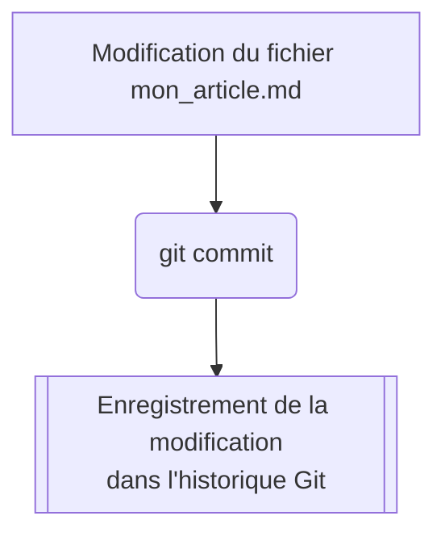
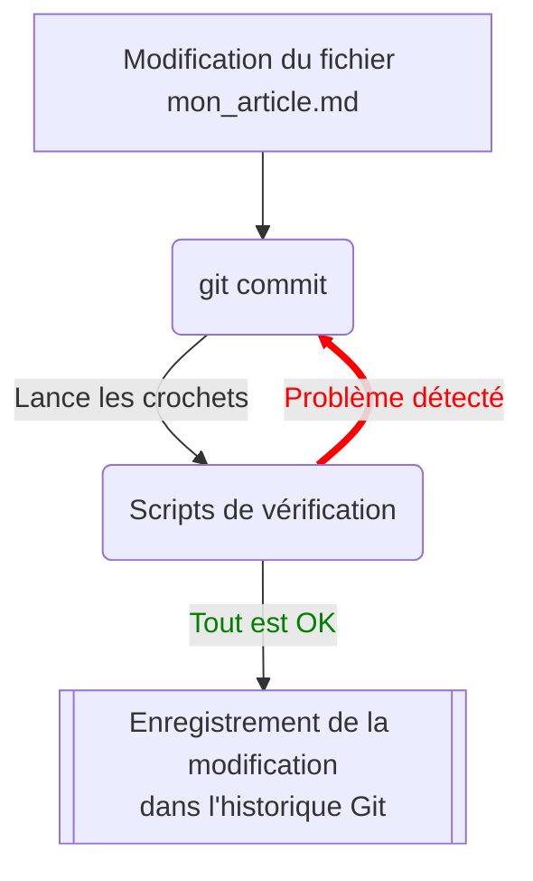

# Git Hooks : garde-fous de l'hétérogénéité de Geotribu

{: .img-rdp-news-thumb }

Afin de garantir un minimum de qualité et surtout de cohérence entre les différentes contributions (appelées _commits_ dans un contexte Git), une série de _git hooks_ est configurée sur le dépôt du site Geotribu.

## Définition

Un _git hook_ est l'une des possibilités offertes par Git pour personnaliser son utilisation. Concrètement c'est un script configuré pour se lancer automatiquement lors d'une étape du workflow de travail avec Git (typiquement au moment d'un _commit_), précisément entre le déclenchement de cette étape et son achèvement. On dit que cela fait faire un crochet (_hook_ en anglais :wink:).

Ressources externes sur le sujet :

- [les crochets Git dans le manuel officiel](https://git-scm.com/book/fr/v2/Personnalisation-de-Git-Crochets-Git)
- [Git Hooks ou la revanche du crochet Git](https://delicious-insights.com/fr/articles/git-hooks/)
- [Git Hooks pour s’assurer de la qualité du code produit](https://medium.com/@bluedme/git-hooks-pour-sassurer-de-la-qualit%C3%A9-du-code-produit-16920bdf6ad8)

----

## Fonctionnement

### Sans les git crochets (_hooks_) activés



### Avec les git crochets (_hooks_) activés



----

## Installation en local

Pour faciliter la maintenance, nous utilisons l'outil [pre-commit]((https://pre-commit.com/)) qui est une sorte de gestionnaire de git hooks. Il est développé en Python mais peut exécuter des hooks dans de nombreux autres langages (NodeJS, shell, etc.).

Pour installer les git hooks, il faut donc disposer d'un interpréteur Python puis :

```bash
# installer pre-commit
pip install -U pre-commit
# installer les git hooks
pre-commit install
```

Le vérificateur de la syntaxe Markdown ([markdownlint-cli](https://github.com/igorshubovych/markdownlint-cli), voir ci-dessous) est d'ailleurs configuré.

!!! tip "Astuce dont il ne faut pas abuser"
    Pour committer en outre-passant les git hooks ajouter l'option `--no-verify` à la commande `git commit`.

## Exécution automatisée

{: .img-center loading=lazy }
